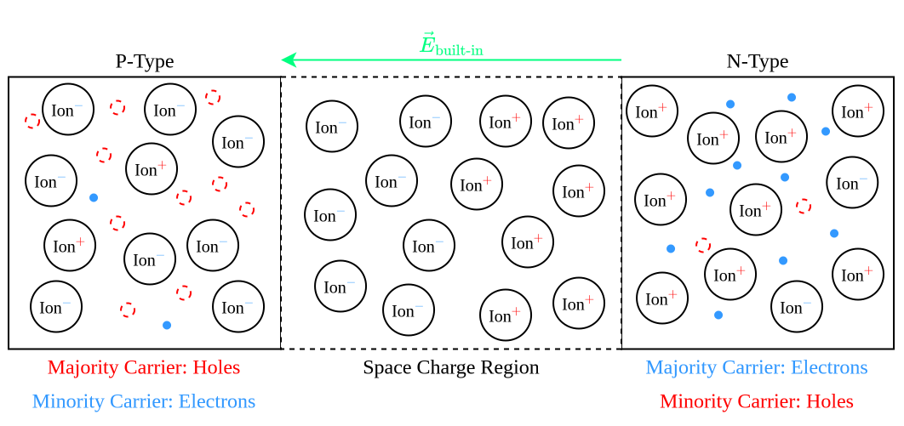
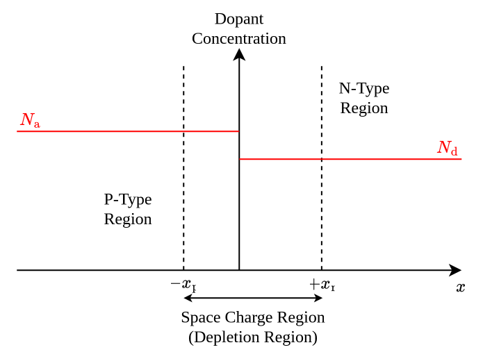
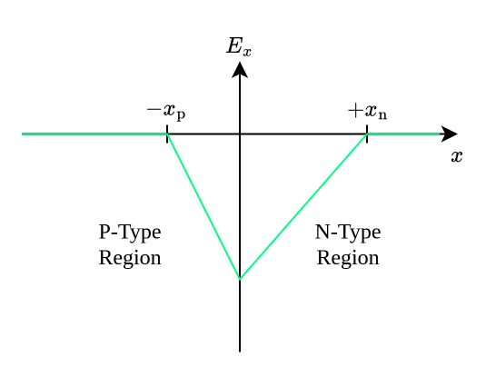
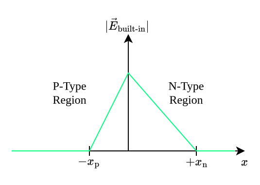
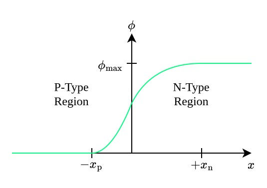
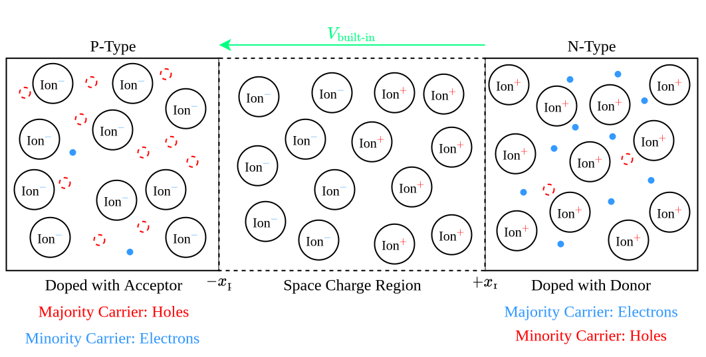

---
tags:
    - materials-science
    - chemistry
---

# P-N Junctions

A **P-N junction** is a physical region which forms when one region of a [semiconductor](TODO) is [doped](./Semiconductor%20Doping.md) with an [acceptor  dopant](./P-Type%20Semiconductors.md) while an adjacent region is [doped](./Semiconductor%20Doping.md) with a [donor dopant](./N-Type%20Semiconductors.md). The [N-type](./N-Type%20Semiconductors.md) region has an excess of free [electrons](TODO), while the [P-type](./N-Type%20Semiconductors.md) region possesses an excess of [holes](TODO). This concentration gradient causes [electrons](TODO) to flow towards the [P-type](./N-Type%20Semiconductors.md) region and [holes](TODO) to flow towards the [N-type](./N-Type%20Semiconductors.md) region. When an [electron](TODO) and a [hole](TODO) meet at the interface between the two regions, they recombine. Therefore, the concentration of free charge carriers in the intermediate region between the [P-type semiconductor](./N-Type%20Semiconductors.md) and the [N-type semiconductor](./N-Type%20Semiconductors.md) drops significantly, leaving behind a surplus of positively charged ions on the [N-type](./N-Type%20Semiconductors.md) side and a surplus of negatively charged ions on the [P-type](./P-Type%20Semiconductors.md) side. This slowly induces an [electric field](../Physics/Classical%20Electromagnetism/Electric%20Fields.md) pointing from the [N-type](./N-Type%20Semiconductors.md) region towards the [P-type](./N-Type%20Semiconductors.md) region. 

## Step Junction Model

The **step junction model** treats the [P-N junction](./P-N%20Junctions.md) as an abrupt boundary between a [P-type](./P-Type%20Semiconductors.md) region with a constant uniform [dopant](./Semiconductor%20Doping.md) concentration $N_{\text{acceptor}}$ and an [N-Type](./N-Type%20Semiconductors.md) region with a constant uniform [dopant](./Semiconductor%20Doping.md) concentration $N_{\text{donor}}$.

Measured from this abrupt boundary, the [depletion region](./P-N%20Junctions.md) extends a distance of $x_{\text{p}}$ into the [P-type](./P-Type%20Semiconductors.md) side and a distance of $x_{\text{n}}$ into the [N-Type](./N-Type%20Semiconductors.md) side.

### Built-In Electric Field

The [electric field](../Physics/Classical%20Electromagnetism/Electric%20Fields.md) arising within the [space charge region](./P-N%20Junctions.md) pushes free [electrons](TODO) towards the [N-Type](./N-Type%20Semiconductors.md) side and free [holes](TODO) towards the [P-type](./P-Type%20Semiconductors.md) side. In equilibrium, this effect turns out to be strong enough that, for all practical purposes, free [charge](../Physics/Classical%20Electromagnetism/Electric%20Charge.md) carriers are unable to cross into the [space charge region](./P-N%20Junctions.md) and so the [depletion region](./P-N%20Junctions.md) can be approximated as a space entirely devoid of free [charge](../Physics/Classical%20Electromagnetism/Electric%20Charge.md) carriers. 

Using this approximation, the [charge density](../Physics/Classical%20Electromagnetism/Electric%20Charge.md) $\rho$ inside the [space charge region](./P-N%20Junctions.md) is determined solely by the concentrations of the left-over [ions](TODO), which are fixed in place, since $\rho$ is simply the amount of [electric charge](../Physics/Classical%20Electromagnetism/Electric%20Charge.md) per unit of volume:

- On the [P-type](./P-Type%20Semiconductors.md) side, each [ion](TODO) has a total [electric charge](../Physics/Classical%20Electromagnetism/Electric%20Charge.md) $-e$ and there are $N_{\text{acceptor}}$ [ions](TODO) per unit volume. 
- On the [N-type](./N-Type%20Semiconductors.md) side, each [ion](TODO) has a total [electric charge](../Physics/Classical%20Electromagnetism/Electric%20Charge.md) $+e$ and there are $N_{\text{donor}}$ [ions](TODO) per unit volume. 

The [charge density](../Physics/Classical%20Electromagnetism/Electric%20Charge.md) $\rho$ is therefore the following:

$$\rho(x) = \begin{cases}-e \cdot N_{\text{acceptor}}, & -x_{\text{p}} \lt x \lt 0 \text{ (p-type side)} \\ +e \cdot N_{\text{donor}}, & 0 \lt x \lt x_{\text{n}} \text{ (n-type side)}\end{cases}$$

Due to symmetry reasons, the [electric field](../Physics/Classical%20Electromagnetism/Electric%20Fields.md) always points along the $x$-axis and depends only on the $x$ coordinate:

$$\vec{E}_{\text{built-in}}(x,y,z) = E_x(x) \vec{e}_x$$

We thus have $E_y = 0$ and $E_z = 0$ and so $\partial_y E_y = 0$ and $\partial_z E_z = 0$. 

[Gauss's law](../Physics/Classical%20Electromagnetism/Gauss's%20Law.md) yields the [divergence](../Mathematics/Analysis/Real%20Analysis/Real%20Vector%20Fields/Differentiation/Divergence%20(Real%20Vector%20Fields).md) of the [electric field](../Physics/Classical%20Electromagnetism/Electric%20Fields.md):

$$\nabla \cdot \vec{E}_{\text{built-in}} = \frac{\rho}{\varepsilon}$$

$$\frac{\partial E_x}{\partial x} + \frac{\partial E_y}{\partial y} + \frac{\partial E_z}{\partial z} = \frac{\rho}{\varepsilon}$$

$$\frac{\mathrm{d} E_x (x)}{\mathrm{d} x} = \frac{\rho(x)}{\varepsilon} = \begin{cases}\displaystyle \frac{-e \cdot N_{\text{acceptor}}}{\varepsilon}, & -x_{\text{p}} \lt x \lt 0 \text{ (p-type side)} \\ \displaystyle \frac{+e \cdot N_{\text{donor}}}{\varepsilon}, & 0 \lt x \lt x_{\text{n}} \text{ (n-type side)}\end{cases}$$

The [electric field](../Physics/Classical%20Electromagnetism/Electric%20Fields.md) outside the [space charge region](./P-N%20Junctions.md) is zero, since everything is electrically neutral there. We thus get $E_x(-x_{\text{p}}) = E_x(x_{\text{n}}) = 0$. 

On the [P-type](./P-Type%20Semiconductors.md) side of the [space charge region](./P-N%20Junctions.md), we have

$$\frac{\mathrm{d} E_x (x)}{\mathrm{d} x} = \frac{-e \cdot N_{\text{acceptor}}}{\varepsilon} \qquad \text{ for } \qquad -x_{\text{p}} \lt x \lt 0.$$

By [integrating](../Mathematics/Analysis/Real%20Analysis/Real%20Functions/Antidifferentiability%20(Real%20Functions).md), we get

$$E_x(x) = \int \frac{-e \cdot N_{\text{acceptor}}}{\varepsilon} \, \mathrm{d}x = \frac{-e \cdot N_{\text{acceptor}}}{\varepsilon}x + C_1$$

and the constant $C_1$ can be determined from the boundary condition $E_x(x_{\text{p}}) = 0$:

$$\frac{-e \cdot N_{\text{acceptor}}}{\varepsilon}x_{\text{p}} + C_1 = 0 \implies C_1 = \frac{e \cdot N_{\text{acceptor}}}{\varepsilon}x_{\text{p}}$$

Therefore:

$$E_x(x) = \frac{-e \cdot N_{\text{acceptor}}}{\varepsilon} (x_{\text{p}} + x) \qquad \text{ for } \qquad -x_{\text{p}} \le x \lt 0$$

Doing the same for the [N-type](./N-Type%20Semiconductors.md) side gives us

$$E_x(x) = \frac{-e \cdot N_{\text{donor}}}{\varepsilon} (x_{\text{n}} - x) \qquad \text{ for } \qquad 0 \lt x \le x_{\text{n}}$$

and, since the [electric field](../Physics/Classical%20Electromagnetism/Electric%20Fields.md) must be [continuous](../Mathematics/Analysis/Real%20Analysis/Real%20Vector%20Functions/Continuity%20(Real%20Vector%20Functions).md) at the exact boundary between the [P-type](./P-Type%20Semiconductors.md) region and the [N-type](./N-Type%20Semiconductors.md) region ($x = 0$), we can combine the two results into the following:

$$E_x(x) = \begin{cases}\displaystyle \frac{-e \cdot N_{\text{acceptor}}}{\varepsilon} (x_{\text{p}} + x), & -x_{\text{p}} \le x \le 0 \\ \displaystyle \frac{-e \cdot N_{\text{donor}}}{\varepsilon} (x_{\text{n}} - x), & 0 \le x \le x_{\text{n}}\end{cases}$$

Since $\vec{E}_{\text{built-in}} = E_x(x) \vec{e}_x$, we can easily determine the strength of the [electric field](../Physics/Classical%20Electromagnetism/Electric%20Fields.md):

$$|\vec{E}_{\text{built-in}}| = \begin{cases}\displaystyle \frac{e \cdot N_{\text{acceptor}}}{\varepsilon} (x_{\text{p}} + x), & -x_{\text{p}} \le x \le 0 \\ \displaystyle \frac{e \cdot N_{\text{donor}}}{\varepsilon} (x_{\text{n}} - x), & 0 \le x \le x_{\text{n}}\end{cases}$$

We see that $\vec{E}_{\text{built-in}}$ is strongest at the exact boundary between the two regions. Its maximum value $E_{\text{max}}$ is typically very large.

|Doping Level|Doping Range ($N_{\text{acceptor}}$, $N_{\text{donor}}$), $[\mathrm{cm}^{-3}]$|$E_{\text{max}}, [\mathrm{V\cdot cm}^{-3}]$|
|:--:|:--:|:--:|
|Light|$\approx 10^{14} - 10^{15}$|$\approx 5 \times 10^3 - 2 \times 10^4$|
|Moderate|$\approx 10^{16} - 10^{17}$|$\approx 5 \times 10^4 - 2 \times 10^5$|
|Heavy|$\approx 10^{18} - 10^{19}$|$\approx 5 \times 10^5 - 2 \times 10^6$|

### Built-In Potential

The [built-in electric field](#Step%20Junction%20Model) $\vec{E}_{\text{built-in}}$ can also be described by an [electric potential](../Physics/Classical%20Electromagnetism/Electric%20Potential.md).

$$\vec{E}_{\text{built-in}} = -\nabla \phi$$

$$\begin{bmatrix} E_x(x,y,z) \\ 0 \\ 0 \end{bmatrix} = \begin{bmatrix}- \frac{\partial \phi (x,y,z)}{\partial x} \\ -\frac{\partial \phi (x,y,z)}{\partial y} \\ -\frac{\partial \phi (x,y,z)}{\partial z}\end{bmatrix}$$

Since $-\partial_y \phi = 0$ und $-\partial_z \phi = 0$, the [potential](../Physics/Classical%20Electromagnetism/Electric%20Potential.md) must be independent of the $y$ and $z$ coordinates:

$$E_x(x) = -\frac{\mathrm{d}\phi(x)}{\mathrm{d}x}$$

$$\frac{\mathrm{d}\phi(x)}{\mathrm{d}x} = -E_x(x) = \begin{cases}\displaystyle \frac{e \cdot N_{\text{acceptor}}}{\varepsilon} (x_{\text{p}} + x), & -x_{\text{p}} \le x \le 0 \\ \displaystyle \frac{e \cdot N_{\text{donor}}}{\varepsilon} (x_{\text{n}} - x), & 0 \le x \le x_{\text{n}}\end{cases}$$

In the [P-type](./P-Type%20Semiconductors.md) region, [integration](../Mathematics/Analysis/Real%20Analysis/Real%20Functions/Antidifferentiability%20(Real%20Functions).md) gives 

$$\phi(x) = -\int E_x(x) \, \mathrm{d}x = \int \frac{e \cdot N_{\text{acceptor}}}{\varepsilon} (x_{\text{p}} + x) \, \mathrm{d}x =  \frac{e \cdot N_{\text{acceptor}}}{\varepsilon} \left(\frac{x^2}{2} + x_{\text{p}} \cdot x \right) + C_1$$

and by choosing the convention $\phi(-x_{\text{p}}) = 0$, we get

$$C_1 = \frac{e \cdot N_{\text{acceptor}}}{2 \varepsilon}$$

and

$$\phi(x) = \frac{e \cdot N_{\text{acceptor}}}{2 \varepsilon} (x + x_{\text{p}})^2 \qquad \text{for} \qquad -x_{\text{p}} \le x \lt 0.$$

Similarly, [integration](../Mathematics/Analysis/Real%20Analysis/Real%20Functions/Antidifferentiability%20(Real%20Functions).md) gives us

$$\phi(x) = \frac{e \cdot N_{\text{donor}}}{\varepsilon} \left(x_{\text{n}} \cdot x - \frac{x^2}{2}\right) + C_2$$

in the [N-type](./N-Type%20Semiconductors.md) region. The constant $C_2$ can be determined from the fact that $\phi$ must be [continuous](../Mathematics/Analysis/Real%20Analysis/Real-Valued%20Functions%20of%20Multiple%20Real%20Variables/Continuity%20(Real%20Scalar%20Fields).md) at $x = 0$ and the formula for $\phi$ on the [P-type](./P-Type%20Semiconductors.md) side:

$$\frac{e \cdot N_{\text{donor}}}{\varepsilon} \left(x_{\text{n}} \cdot 0 - \frac{x^2}{2}\right) + C_2 = \frac{e \cdot N_{\text{acceptor}}}{2 \varepsilon} (0 + x_{\text{p}})^2$$

$$C_2 = \frac{e \cdot N_{\text{acceptor}}}{2 \varepsilon}x_{\text{p}}^2$$

The [potential](../Physics/Classical%20Electromagnetism/Electric%20Potential.md) is thus

$$\phi(x) = \frac{e \cdot N_{\text{donor}}}{\varepsilon} \left( x_{\text{n}} \cdot x - \frac{x^2}{2} \right) + \frac{e \cdot N_{\text{acceptor}}}{2 \varepsilon} x_{\text{p}}^2$$

for $0 \le x \le x_{\text{n}}$. Combining the two results yields the following:

$$\phi(x) = \begin{cases} \displaystyle \frac{e \cdot N_{\text{acceptor}}}{2 \varepsilon} (x + x_{\text{p}})^2, & -x_{\text{p}} \le x \lt 0 \\ \displaystyle \frac{e \cdot N_{\text{donor}}}{\varepsilon} \left( x_{\text{n}} \cdot x - \frac{x^2}{2} \right) + \frac{e \cdot N_{\text{acceptor}}}{2 \varepsilon} x_{\text{p}}^2, & 0 \le x \le x_{\text{n}} \end{cases}$$

The [potential](../Physics/Classical%20Electromagnetism/Electric%20Potential.md) starts rising quadratically at $-x_{\text{p}}$ (the border between the [P-type](./P-Type%20Semiconductors.md) region and the [space charge region](./P-N%20Junctions.md)) and flattens out to a maximum value at $x_{\text{n}}$ (the border between the [space charge region](./P-N%20Junctions.md) and the [N-type](./N-Type%20Semiconductors.md) region). 

#### Built-In Voltage

The **built-in voltage** is the difference in the [built-in potential](#Step%20Junction%20Model) between the two ends of the [space charge region](./P-N%20Junctions.md):

$$V_{\text{built-in}} = \phi(x_{\text{n}}) - \phi(-x_{\text{p}}) = \frac{e}{2 \varepsilon} (N_{\text{acceptor}}\cdot x_{\text{p}}^2 + N_{\text{donor}} \cdot x_{\text{n}}^2)$$

The [built-in voltage](#Step%20Junction%20Model) can be calculated using the following formula:

$$V_{\text{built-in}} = \frac{k_B \cdot T}{e} \ln \left(\frac{N_{\text{acceptor}} \cdot N_{\text{donor}}}{N_{\text{intrinsic}}^2}\right)$$

- $k_B = 1.380\,649 \times 10^{-23} \,\mathrm{J\cdot K}^{-1}$ is the [Boltzmann constant](TODO);
- $T, [\mathrm{K}]$ is the [absolute temperature](TODO);
- $e = 1.602\,176\,634 \times 10^{-19}\,\mathrm{C}$ is the [elementary charge](../Physics/Classical%20Electromagnetism/Electric%20Charge.md);
- $N_{\text{acceptor}}, [\mathrm{cm}^{-3}]$ is the [dopant](./Semiconductor%20Doping.md) concentration of the [P-type](./P-Type%20Semiconductors.md) region;
- $N_{\text{donor}}, [\mathrm{cm}^{-3}]$ is the [dopant](./Semiconductor%20Doping.md) concentration of the [N-Type](./N-Type%20Semiconductors.md) region;
- $N_{\text{intrinsic}}, [\mathrm{cm}^{-3}]$ is the [intrinsic carrier concentration](TODO) of the [undoped](./Semiconductor%20Doping.md) [semiconductor](./Semiconductors.md).

>[!DEFINITION] Definition: Thermal Voltage
>
>The **thermal voltage** of a [P-N junction](./P-N%20Junctions.md) is defined as follows:
>
>$$\frac{k_B \cdot T}{e}$$
>

Typical values for $V_{\text{built-in}}$ lie in the range 0.6 V - 0.9 V.

### Space Charge Width

The [built-in electric field](#Step%20Junction%20Model) must be [continuous](../Mathematics/Analysis/Real%20Analysis/Real%20Vector%20Functions/Continuity%20(Real%20Vector%20Functions).md) at the exact boundary between the [P-type](./P-Type%20Semiconductors.md) region and the [N-type](./N-Type%20Semiconductors.md) region ($x = 0$):

$$\frac{-e \cdot N_{\text{acceptor}}}{\varepsilon} (0 + x_{\text{p}}) = \frac{-e \cdot N_{\text{donor}}}{\varepsilon} (x_{\text{n}} - 0)$$

$$N_{\text{acceptor}} \cdot x_{\text{p}} = N_{\text{donor}} \cdot x_{\text{n}}$$

This equation already gives a qualitative idea of how [doping concentrations](./Semiconductor%20Doping.md) affect the size of the [space charge region](./P-N%20Junctions.md). Specifically, the extent of the [space charge region](./P-N%20Junctions.md) into a given side is inversely proportional to its [doping concentration](./Semiconductor%20Doping.md):

- An increase in $N_{\text{acceptor}}$ reduces $x_{\text{p}}$, while a decrease in $N_{\text{acceptor}}$ increases $x_{\text{p}}$.
- An increase in $N_{\text{donor}}$ reduces $x_{\text{n}}$, while a decrease in $N_{\text{donor}}$ increases $x_{\text{n}}$.

By rearranging for $x_{\text{p}}$ and substituting in the formula for the [built-in voltage](#Step%20Junction%20Model), we can get an expression for $x_{\text{n}}$:

$$x_{\text{p}} = \frac{N_{\text{donor}}}{N_{\text{acceptor}}} x_{\text{n}}$$

$$\begin{aligned}V_{\text{built-in}} & = \frac{e}{2 \varepsilon} (N_{\text{acceptor}}\cdot x_{\text{p}}^2 + N_{\text{donor}} \cdot x_{\text{n}}^2) \\ & = \frac{e}{2 \varepsilon} (N_{\text{acceptor}}\cdot x_{\text{p}}^2 + N_{\text{donor}} \cdot x_{\text{n}}^2) \\ & = \frac{e}{2 \varepsilon} \times \frac{N_{\text{donor}}(N_{\text{donor}} + N_{\text{acceptor}})}{N_{\text{acceptor}}} \times x_{\text{n}}^2\end{aligned}$$

The extension $x_{\text{n}}$ of the [space charge region](#Step%20Junction%20Model) within the [N-type](./N-Type%20Semiconductors.md) region is thus the following:

$$x_{\text{n}} = \sqrt{\frac{2 \cdot \varepsilon \cdot V_{\text{built-in}}}{e} \times \frac{N_{\text{acceptor}}}{N_{\text{donor}}} \times \frac{1}{N_{\text{acceptor}} + N_{\text{donor}}}}$$

Similarly, the extension $x_{\text{p}}$ of the [space charge region](#Step%20Junction%20Model) within the [P-type](./P-Type%20Semiconductors.md) region is the following:

$$x_{\text{p}} = \sqrt{\frac{2 \cdot \varepsilon \cdot V_{\text{built-in}}}{e} \times \frac{N_{\text{donor}}}{N_{\text{acceptor}}} \times \frac{1}{N_{\text{acceptor}} + N_{\text{donor}}}}$$

Therefore, the total width $W$ of the [depletion region](./P-N%20Junctions.md) is the following:

$$W = x_{\text{p}} + x_{\text{n}} = \sqrt{\frac{2 \cdot \varepsilon \cdot V_{\text{built-in}}}{e}\times \frac{N_{\text{acceptor}} + N_{\text{donor}}}{N_{\text{acceptor}} \cdot N_{\text{donor}}}}$$
