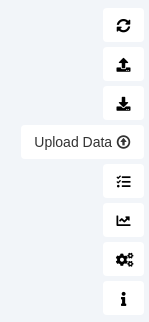
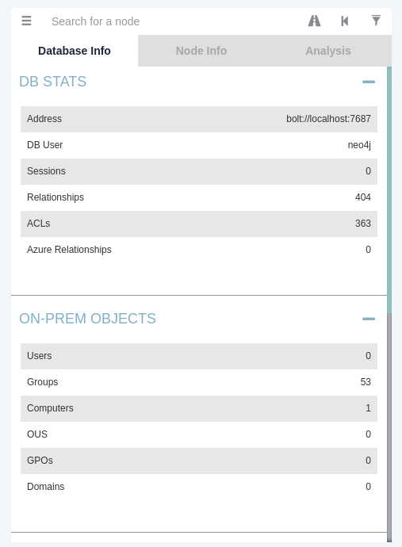
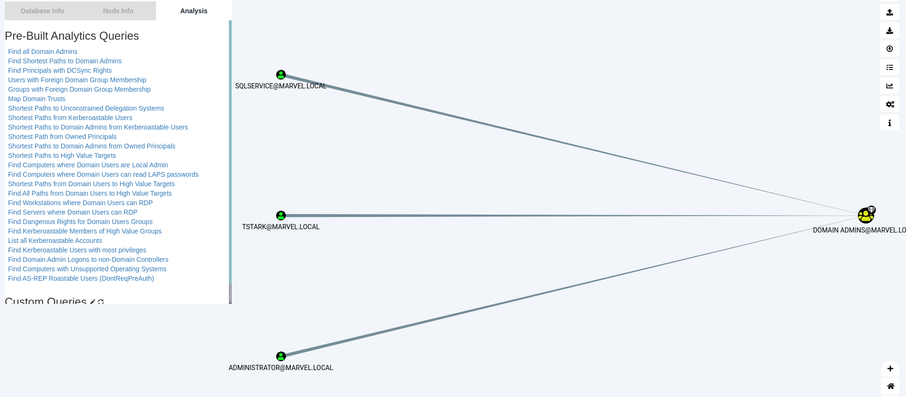

# Overview
Bloodhound is a tool used for finding relationships and patterns within data from an Active Directory environment. It is run on the attacker's machine and accessed through a web interface. Bloodhound operates on data and this data comes from a *collector* which is executed on the target machine.

# Setup

1. Install Bloodhound
```bash
sudo apt install bloodhound
```

2. Configure neo4j - Bloodhound relies on a different tool called neo4j. It is best to change its default credentials.
	- run neo4j - `sudo neo4j console`
	- open the link it gives you and use the credentials neo4j:neo4j to login
	- change the password

# Collecting Data for Bloodhound

Data is obtained through a collector. There are different ones available. You can get SharpHound from the Bloodhound GitHub repo - https://github.com/BloodHoundAD/BloodHound/blob/master/Collectors/SharpHound.ps1.

Start neo4j and bloodhound:

```bash
sudo neo4j console
```
```bash
sudo bloodhound
```

Run the collector on the target machine:

```powershell
powershell -ep bypass
```

```powershell
. .\SharpHound.ps1
```

```powershell
Invoke-BloodHound -CollectionMethod All -Domain <domain> -ZipFileName <output file>
```


Now, move the files to the attacker machine.

# Viewing the Data

In Bloodhound, on the right you should see a button for `Upload Data`. Select the previously obtained zip file and wait for Bloodhound to process it.



In the top left, click on the three dashes and you should see a summary of the data imported:



# Finding Relationships in the Data

Through the analysis tab, you can see a bunch of pre-made queries. Their names are usually self-describing. Clicking on any of them will generate a particular graph expressing a specific relationship within the AD environment:



You are also able to create custom queries.