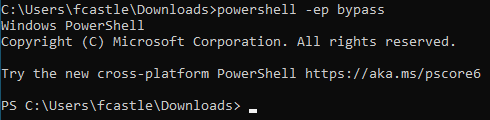
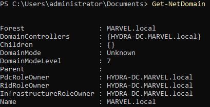
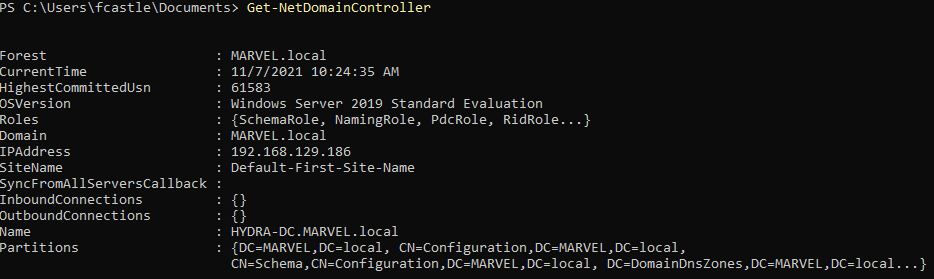
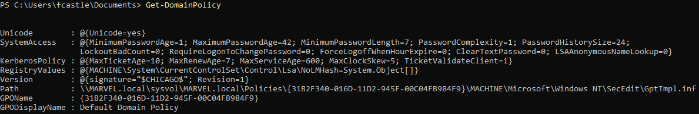
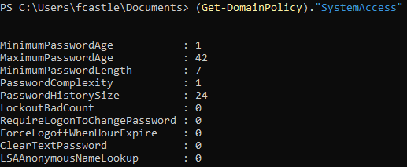
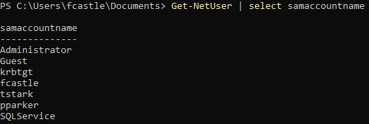
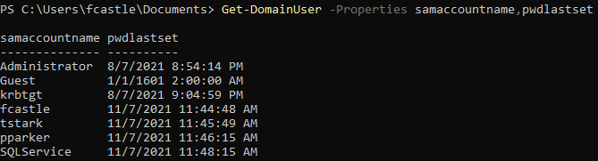
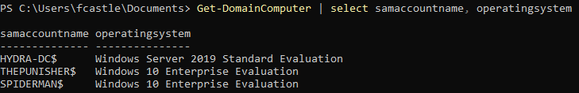
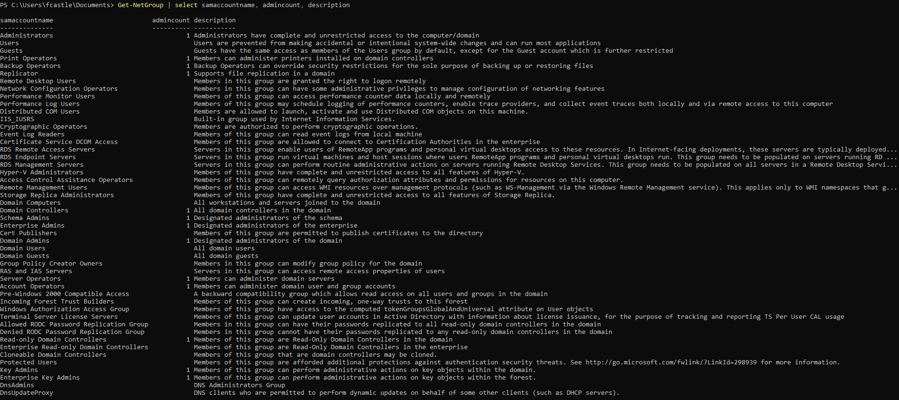
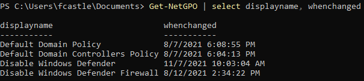

# Overview

PowerView is a PowerShell tool for the enumeration of Windows domains. The script can be downloaded from https://github.com/PowerShellMafia/PowerSploit/blob/master/Recon/PowerView.ps1.

Before running, you need to bypass PowerShell's execution policy:

```powershell
powershell -ep bypass
```



Load the script using

```powershell
. .\PowerView.ps1
```

Normally, you'd be running these commands through some sort of shell, but for the sake of simplicity, I will show them all run locally.

# Get Domain Information

```powershell
Get-NetDomain
```



# Get Domain Controller Information

```powershell
Get-NetDomainController
```



# Retrieve Domain Policy Information

```powershell
Get-DomainPolicy
```



You can also get information about a specific policy with the following syntax:

```powershell
(Get-DomainPolicy)."policy name"
```



# Get Users Information

```powershell
Get-NetUser
```

The output of this command is rather messy, but you can pull specific information with the following syntax:

```powershell
Get-NetUser | select <property>
```



However, there is an even better way to do that.

# Get User Property Information

Get a specific properties of all the users:
```powershell
Get-DomainUser -Properties <property1>,<property2>,...
```

It is useful to always have the `samaccountname` as the first property selected, so that you can easily match properties with specific users.



# Get Domain Machines

```powershell
Get-DomainComputer | select samaccountname, operatingsystem
```



# Get Groups

```powershell
Get-NetGroup | select samaccountname, admincount, description
```



# Get Group Policy Information

```powershell
Get-NetGPO | select <property1>,<property2>,...
```




