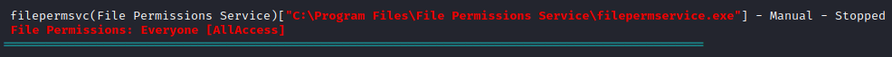
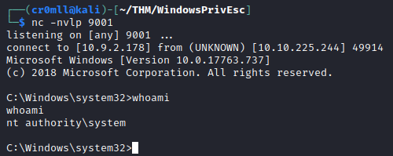

# Introduction

The binary application executed by a service is considered *insecure* when an adversary has write access to it when they shouldn't. This means that an attacker can simply replace the file with a malicious executable. If the service is configured to run with system privileges, then those privileges will be inherited by the attacker's executable!

All we need to do is simply replace the legitimate executable with a malicious one and then start the service.

