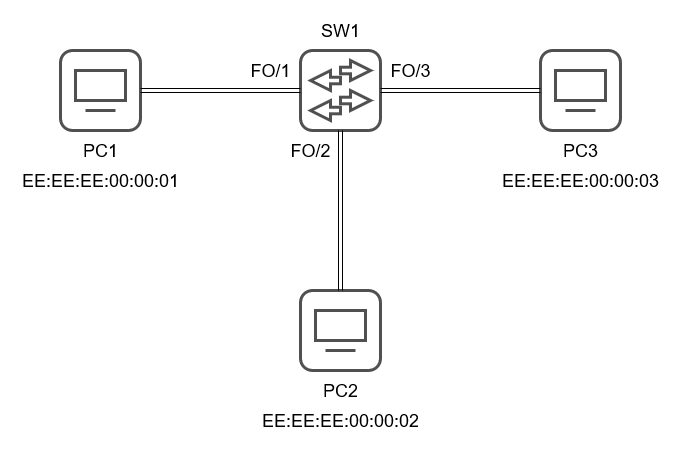
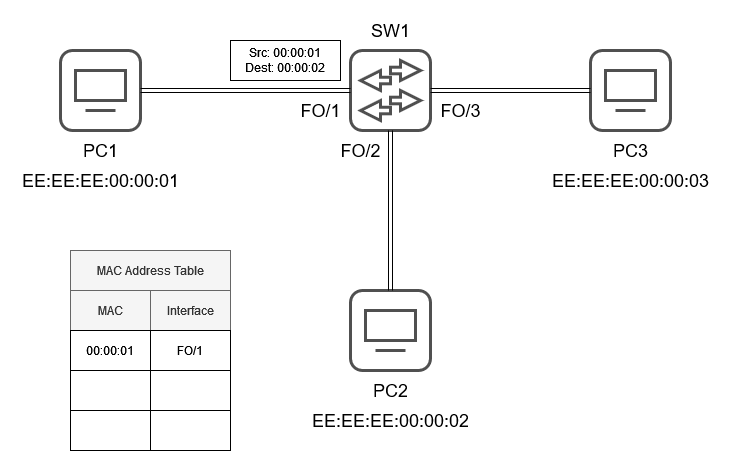
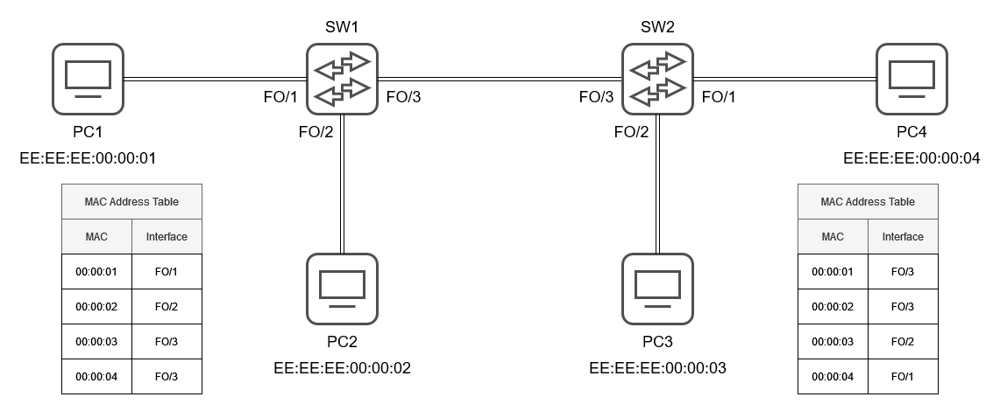

# Introduction

The Ethernet protocol defines how data moves in wired LANs. Its packets are referred to as *Ethernet frames*. 

An Ethernet frame looks like the following:


Each frame is preceded by a *preamble* and a *start frame delimiter (SFD)*. The preamble is a 56-bit long (7 bytes) sequence of alternating 1s and 0s like this 10101010... and allows devices to synchronise their clocks in order to prepare for the receipt of the incoming frame. The preamble is followed by a 1-byte start frame delimiter which is of the same form as the preamble, but ends in a 1: `10101011`. It signifies the end of the preamble and the start of the actual Ethernet frame. It should be noted that the preamble and SFD are typically *not* considered part of the frame.

Following are two 6-byte fields which contain the [MAC addresses](../The%20TCP-IP%20Suite%20and%20the%20OSI%20Model/(2)%20The%20Datalink%20Layer.md) of the frame's destination and its source. These are the MAC address of the device for which the frame is intended and the MAC address of the device which sent the frame, respectively.

The last member of the Ethernet header is the Length / Type field. It is 2 bytes long. If it has a value $\leq 1500$, then it denotes the length (in bytes) of the frame's payload. A value $\geq 1536$ is used to signify the layer 3 protocol used in the encapsulated packet. Here is a table of some common protocols and there EtherType values:

|Protocol|Value|
|:--------:|:------:|
|ARP|`0x0806`|
|IPv4|`0x0800`|
|IPv6|`0x86DD`|

There is a minimum size of 64 bytes (encapsulating header, payload, and trailer) for any Ethernet frame. This means that the payload must be at least 46 bytes in length. If it is shorter, then it will be padded with null bytes.

Following the payload of the frame is the *Ethernet trailer*. It is comprised of a single 4-byte member called either the *Frame Check Sequence (FCS)* or the *Cyclic Redundancy Check (CRC)*. It renders the service of detecting corrupted data by running a CRC algorithm over the received data.

# Ethernet LAN Switching
Imagine the following network where below each PC is an example MAC address. The switch interfaces `FO/i` denote *fast ethernet*.



Suppose now that PC1 wishes to send a frame to PC2. Such a frame is called a *unicast frame*, since it is destined for a single target. The frame is sent to the switch and once it is received there, the switch inspects its *source* MAC address and adds it to its *MAC address table* together with the corresponding interface. That way, the switch is now cognisant of the fact that the MAC address `00:00:01` (shortened here for simplicity) can be found at interface `FO/1`. Such a MAC address is referred to as *dynamically-learnt*, or simply *dynamic*. MAC addresses are removed from the switch's MAC address table after a certain period of inactivity, typically 5 minutes. This is known as *aging*.



SW1 now inspects the destination MAC address of the frame. If the destination MAC is in the switch's table, then the frame is called a *known unicast frame* and is simply forwarded to its destination on the appropriate interface. Otherwise, the frame is an *unknown unicast frame* and the switch has only one option - to forward the frame through *all* of its channels, save for the the frame's provenance. The PCs whose MAC address does not match the frame's destination simply ignore it, but the intended recipient processes it up the full OSI stack. 

If the recipient does not send a response, then the exchange ends here. Otherwise, the response frame is sent to sender of the original frame. Once the frame receives it, it records the source MAC address in its table. Since the new destination (PC1) is already present in this table, the frame is subsequently forwarded only to PC1.

The process is pretty much the same when multiple switches are connected to together. In this case, however, multiple PCs may share the same interface in a switch's MAC address table.



In a Cisco switch, you can use the following command to inspect a switch's MAC address table:

```
show mac address-table
```


`Type` indicates whether or not the MAC address was statically configured or dynamically-learnt. `Ports` here means interfaces.

# 802.1Q Encapsulation
When multiple VLANs with trunking are supported in a LAN, they are typically distinguished by dint of the IEEE 802.1Q Encapsulation standard. This standard inserts a 4-byte (32-bit) field, called the *802.1Q tag*, between the source MAC and type/length fields of the Ethernet header.


This tag is separated into two main fields - the Tag Protocol Identifier (TPID) and the Tag Control Information (TCI). Each field is two bytes in length.

The TPID is constant and always has the value of `0x8100`. It is typically located where the type/length field would and is what identifies the frame as a *802.1Q-tagged frame*.

The TCI is further subdivided into 3 fields. The Priority Code Point (PCP) is 3 bits in length and is utilised for Class of Service (CoS) which assigns different priority to traffic in congested networks. Following is the 1-bit Drop Eligible Indicator (DEI) and it specifies whether or not the frame is allowed to be dropped if the network is congested. The last 12 bits are the VLAN ID (VID) which actually identifies the VLAN that the frame pertains to.