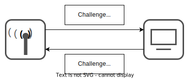
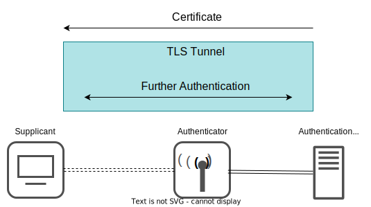

# Introduction

Before a device can send traffic to an AP it needs to be authenticated and associated with that access point. This is done via a *4-way handshake*:

First, the client sends an Authentication Request frame. The AP then returns an Authentication Response. If authentication is allowed by the AP, the client can now send the Association Request, to which the AP will response with an Association Response stating whether or not the association was successful.

# Authentication

Authentication refers to the verification of a device's identity, but does *not* include encryption. There are multiple possible protocols for authentication.

## Open Authentication
Open Authentication is fairly simple and absolutely insecure. A device needs only send a request to the AP telling it that it wants to authenticate to the network.. If this is allowed, then the client will be associated with the network, no questions asked. When WEP is enabled, however, the client will still need the WEP key in order to encrypt and decrypt traffic. 

## Shared Key Authentication

This is also sometimes referred to as WEP authentication and [isn't secure either](../../../Hardware%20Hacking/Wireless%20Attacks/Hacking%20WEP%20Networks.md).  In shared key authentication, a client needs to already have the WEP key in order to authenticate. When connecting to the network, the AP sends a *challenge* (random bytes), in clear text, to the client. The client must encrypt the sent challenge with the WEP key and send it back to the AP. When the AP receives the encrypted challenge, it attempts to decrypt it using the WEP key and if the decrypted challenge matches what was originally sent in cleartext, then the client is authenticated.

## The Extensible Authentication Protocol (EAP)

This is not an authentication protocol per se, but is rather a *framework* and defines a set of functions which are utilised by various authentication protocols, called *EAP Methods*. EAP is integrated with another protocol, 802.1X, which provides *port-based network access control* and is used in both wired and wireless networks to limit access. This framework is typically used in enterprises.

There are three main entities in 802.1X:
- **Supplicant** - the device which wants to join the network
- **Authenticator** - the device providing access to the network
- **Authentication Server (AS)** - the device receiving credentials and allowing/denying access to the network and 

The authentication required to associate with the AP is simply Open Authentication, however, the device does not get full access to the network. Instead, only traffic for further EAP Authentication is allowed.

### Lightweight EAP (LEAP)

This EAP method was developed by Cisco as an improvement over WEP. Clients are required to provide a username and password for authentication. Additionally, *mutual authentication* is actuated by both the client and server sending a challenge to each other. From then on, the process of authentication is the same as with Shared Key Authentication. LEAP, however, also avails itself of *dynamic WEP keys* which change frequently in order to make cracking encryption harder. Unfortunately, LEAP suffers from vulnerabilities like WEP and is insecure.

### EAP Flexible Authentication via Secure Tunnelling (EAP-FAST)

This method was also developed by Cisco and consists of three phases:
- the generation and provision of a *Protected Access Credential (PAC)* from the server to the client
- the establishment of a secure TLS tunnel between the authentication server and the client
- further authentication by using the TLS tunnel

### Protected EAP (PEAP)

PEAP is similar to EAP-FAST insofar as it also involves the establishment of a TLS tunnel between the client and the server. However, instead of a PAC, a digital certificate is used. The server is authentication by the client using this certificate and is used for the establishment of the TLS tunnel. However, further authentication is still necessary inside the tunnel in order to authenticate the client to the server.

### EAP Transport Layer Security (EAP-TLS)

In comparison with PEAP, EAP is quite similar but, in addition to the server, it requires that every client has a certificate of its own. This is considered as the most secure EAP authentication method, but is gruelling to implement due to its complexity. 

Since both the client and the server are authenticated to each other using the certificates, there is no need for further authentication within a TLS tunnel. Nevertheless, this tunnel is still established for the exchange of encryption key information.

