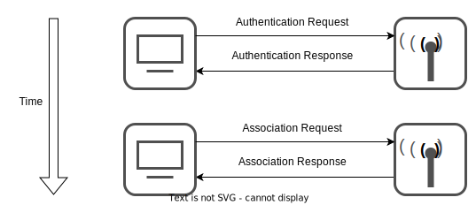

# Introduction

When 802.11 [authentication](../Authentication%20&%20Association.md) is complete, the station and AP will move onto to the association phase. The purpose of this exchange is for the station to obtain an Association Identifier (AID). This is achieved by the client sending an *Association Request* to the AP which then responds with an *Association Response*.

After the association phase, a second authentication may occur depending on whether a protocol like WPA is set up.

# Management Frame Fields & Information Elements

## Listen Interval

This 2-byte field is sent in Association and Reassociation Request in order to signal to the AP how often a station wakes up in order to listen to beacon management frames. Its value is in beacon interval units - a value of $n$ indicates that the station wakes up every $n$ beacons.

# Association Request

If the [authentication phase](Authentication%20Frames.md) was successful, then the station willing to join the network will issue an *association request*.

The following elements may be present in an association request:

|Order|Name|Status|Description|
|:-----:|:------:|:-----:|------------|
|1|[Capability Information](./index.md#capability%20information)|Mandatory||
|2|[Listen Interval](Association%20Frames.md)|Mandatory||
|3|[Service Set Identifier (SSID)](./index.md#ssid)|Mandatory||
|4|[Supported Rates](./index.md)|Mandatory||
|5|[Extended Supported Rates](./index.md)|Optional|See Supported Rates.|
|6|[Power Capability](./index.md)|Optional|Used with 802.11h.|
|7|[Supported Channels](./index.md)|Optional|Used with 802.11h.|
|8|[RSN](./index.md)|Optional|Used with 802.11i.|
|9|[QoS Capability](./index.md)|Optional|Used with 802.11e QoS when the EDCA Parameter element is missing.|
|10|RRM Enabled Capabilities|Optional|Used with 802.11k.|
|11|Mobility Domain|Optional|Used with 802.11r Fast BSS Transition.|
|12|Supported Regulatory Classes|Optional|Used with 802.11r.|
|13|HT Capabilities|Optional|Used with 802.11n.|
|14|20/40 BSS Coexistence|Optional|Used with 802.11n.|
|15|Extended Capabilities|Optional|See Capability Information.|
|Last|Vendor-Specific|Optional||

# Association Response

After the association request is acknowledged by the AP, it is examined to verify that its parameters match those of the AP. If differences are found, then the AP must decide whether or not the discrepancy is significant enough to deny association. 

If the station can join the network, then the `Status Code` will contain 0. Otherwise, it will contain the reason for the failure. Additionally, the AP sends its own parameters in the response. A station who is denied association can examine the parameters sent by the AP in the response and try to tweak its own parameters and attempt association anew.

If the association is successful, then the response will contain the association ID for the station. The station can now proceed with sending data or undergoing further authentication. Notwithstanding the 2-byte size of this field, only the 14 less significant bits are used in practice, with the rest of the bits being set to 1. 

|Order|Name|Status|Description|
|:-----:|:------:|:-----:|------------|
|1|[Capability Information](./index.md#capability-information)|Mandatory||
|2|[Status Code](./index.md#status-code-field)|Mandatory||
|3|[Association ID](./index.md#ssid)|Mandatory||
|4|[Supported Rates](./index.md#supported-rates--extended-supported-rates)|Mandatory||
|5|[Extended Supported Rates](./index.md#supported-rates--extended-supported-rates)|Optional|See Supported Rates.|
|6|[EDCA Parameter](./index.md#enhanced-distributed-channel-access-edca-parameter)|Optional|Used with 802.11e QoS when the QoS Capability element is missing.|
|7|RCPI|Optional|Used with 802.11k.|
|8|RSNI|Optional|Used with 802.11k.|
|9|RRM Enabled Capabilities|Optional|Used with 802.11k.|
|10|Mobility Domain|Optional|Used with 802.11r. Fast BSS Transition|
|11|Fast BSS Transition|Optional|Used with 802.11r.|
|12|DSE Registered Location|Optional|Used with 802.11y.|
|13|Timeout Interval (Association Comeback Time)|Optional|Used with 802.11w.|
|14|HT Capabilities|Optional|Used with 802.11n.|
|15|HT Operation|Optional|Used with 802.11n.|
|16|20/40 BSS Coexistence|Optional|Used with 802.11n.|
|17|Overlapping BSS Scan Parameters|Optional||Used with 802.11n.|
|18|Extended Capabilities|Optional|See Capability Information.|
|Last|Vendor-Specific|Optional||

# Reassociation Request

This frame may be sent only from a station to an AP and is used when the station is already connected to the ESS and wishes to connect to another AP within the same ESS. Furthermore, a station may avail itself of this frame when it wants to rejoin the network after it left for a short duration. If the authentication timer has expired, then the station will need to begin anew from the authentication phase and then proceed to issuing a reassociation request. Finally, a station already associated with the network may use a reassociation request in order to tweak some parameters which were exchanged during the original association phase.

The following elements may be present in a reassociation request:

|Order|Name|Status|Description|
|:-----:|:------:|:-----:|------------|
|1|[Capability Information](./index.md#capability-information)|Mandatory||
|2|[Listen Interval](Association%20Frames.md#listen-interval)|Mandatory||
|3|Current AP MAC Address|Mandatory||
|4|[Service Set Identifier (SSID)](./index.md#ssid)|Mandatory||
|5|[Supported Rates](./index.md#supported-rates--extended-supported-rates)|Mandatory||
|6|[Extended Supported Rates](./index.md#supported-rates--extended-supported-rates)|Optional|See Supported Rates.|
|7|[Power Capability](./index.md#power-capability)|Optional|Used with 802.11h.|
|8|[Supported Channels](./index.md#supported-channels)|Optional|Used with 802.11h.|
|9|[RSN](./index.md#robust-security-network-rsn)|Optional|Used with 802.11i.|
|10|[QoS Capability](./index.md#qos-capability)|Optional|Used with 802.11e QoS when the EDCA Parameter element is missing.|
|11|RRM Enabled Capabilities|Optional|Used with 802.11k.|
|12|Mobility Domain|Optional|Used with 802.11r Fast BSS Transition.|
|13|Fast Transition|Optional|Used with 802.11r.|
|14|Resource Information Container|Optional|Used with 802.11r.|
|15|Supported Regulatory Classes|Optional|Used with 802.11r.|
|16|HT Capabilities|Optional|Used with 802.11n.|
|17|20/40 BSS Coexistence|Optional|Used with 802.11n.|
|18|Extended Capabilities|Optional|See Capability Information.|
|Last|Vendor-Specific|Optional||

# Reassociation Response

The response to a reassociation request has the exact same format as the [Association Response Frame](Association%20Frames.md#association-response).

# Disassociation Frame

Association can be terminated by either side at any time by sending a disassociation frame. A station could send such a frame, for  example, because it leaves the cell to roam to another AP. An AP could send this frame for  example because the station tries to use invalid parameters.

A disassociated station, however, retains its authentication status and may attempt to associate anew without going through the authentication phase.

The `Destination MAC` for this type of frame may be the MAC address of the target station/AP, or the broadcast address if the AP needs to disassociate all clients.

A deassociation frame typically contains only a [Reason Code](./index.md#reason-code-field) field, although it may be augmented by vendor-specific MFIEs following this reason code. The last element (if present and if it is not the reason code itself) is used with 802.11w.