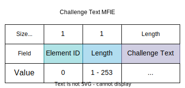

# Introduction
The authentication phase follows the discovery phase. Note that this is not the same authentication phase as the one which establishes encryption in WPA2. The latter is built on top of this system, which in turn only pertains to [Open System Authentication](../Authentication%20and%20Association.md#open%20authentication) and [Shared Key Authentication](../Authentication%20and%20Association.md#shared%20key%20authentication).

The purpose of this phase is to only check and confirm and the station which wants to join the network matches the capabilities required. Shared-Key Authentication was introduced as an extension to this phase in order to enable [WEP encryption](../Encryption%20and%20Integrity.md#wireless-equivalent-privacy-wep).

It is paramount to note that if more complex authentication, such as that required by WPA, is used, then OSA is used first and any advanced authentication procedures occur after the association phase.

# Authentication Frame

The authentication phase avails itself of only a single type of frame which may be used either 2 or 4 times for Open System Authentication and Shared-Key Authentication, respectively. 

The `Authentication Algorithm Number` field value describes which authentication system  
is used - 0 for Open System and 1 for Shared-Key.

The `Authentication Transaction Sequence Number` indicates the stage at which the authentication process is.

The last frame of an authentication exchange bears the ultimate [Status Code](../../../../index.md#status-code-field) field. The values 2-9 are reserved and are used when there is no actual status to report (the authentication frame isn't the last in the exchange, e.g. it is an authentication request).

Finally, the `Challenge Text` element field may or may not be present, depending on the purpose of the authentication frame.

|Authentication Algorithm| Authentication Transaction Sequence Number|Status Code|Challenge Text|
|:---------------------------:|:----------------------------------------------:|:-------:|:-----:|
|Open System|1|Reserved|Absent|
|Open System|2|Status|Absent|
|Shared-Key|1|Reserved|Absent|
|Shared-Key|2|Status|Present|
|Shared-Key|3|Reserved|Present|
|Shared-Key|4|Status|Absent

# Deauthentication Frame

The AP is also capable of sending a *deauthentication frame* which terminates all communications between the AP and the station. For example, if a station attempts to send data in the network before being authenticated, then the AP will respond with a deauth frame, signifying that authentication is required first.

A deauthentication frame typically contains only a [Reason Code](../../../../index.md#reason-code-field) field, although it may be augmented by vendor-specific MFIEs following this reason code. The last element (if present and if it is not the reason code itself) is used with 802.11w.

