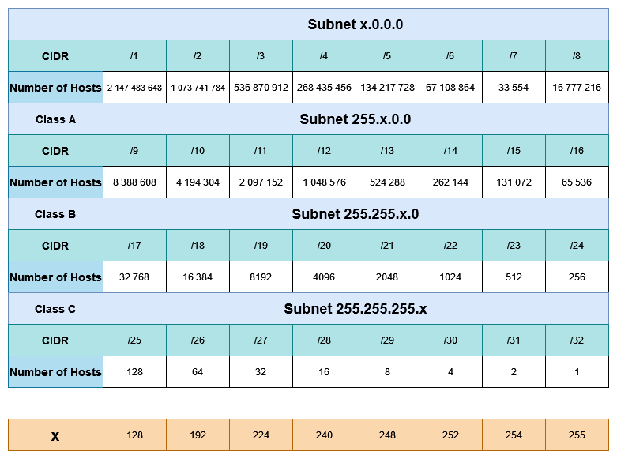

# Introduction
Subnetting is a way to logically divide a network into smaller subnetworks. The devices that belong to the same subnet are identified by identical most-significant bits in their local IP addresses. 

A local IP address is divided into two parts - the *network number (routing prefix)* and the *host identifier (rest field).* The former is what identifies the network that the IP address belongs to and is shared by devices in the same subnet. The rest field identifies the actual host on the network.

Every IPv4 address is 32 bits in length, however, the size of the network number and the host identifier is variable and is defined for each subnet by the *subnet mask*. The subnet mask also takes the form of an IPv4 address which is read entirely left to right. Essentially, the bits from the subnet mask that are set to 1 indicate the bits from the IP address are the network number. The bits in the subnet mask that are set to 0 indicate the bits from the IP address which represent the host identifier.

For example, for the IP address `192.168.0.123` a subnet mask of `11111111.11111111.11111111.00000000` (`255.255.255.0`) would indicate that `192.168.0` is the network number and that `123` is the host identifier. Since the last 8 bits are used for the host identifier, this particular subnet can have a total of $2^8 - 2 = 254$ devices - where one IP is reserved for the actual network's address (`192.168.0.0`) and one is reserved for the broadcast address.

Typically, subnet masks would be nice and split the network at the octets of the IP address, but this is not always the case. It is then less intuitive how to read and IP address in terms of its octets, so you would typically need to understand it in terms of bits. For example, you could be given the subnet mask of `11111111.11111111.11111111.10000000` (`255.255.255.128`). In this case, the network would only have  $2^7 - 2 = 126$ possible hosts. In general for each bit the subnet mask added, the number of possible hosts is halved, while for every bit taken away, it is doubled and the number of possible hosts is given by $2^n - 2$, where $n = 32 - \text{the number of active bits in the subnet mask}$.

Subnets are divided into classes depending on the number of bits that they have set to 1. Class A has anywhere between 9 and 16 bits set, Class B has between 17 and 24 bits set, and class C has between 25 and 32 bits set.

There is also a short-hand notation for specifying the subnet mask of a particular network - CIDR notation. You simply specify the network address followed by a `/` and the number of active bits in the subnet mask. So, a subnet with a network address of `192.168.0.0` and a subnet mask of `255.255.255.0` will be written as `192.168.0./24`.

Following is a chart of these classes together with their CIDR notations and the possible number of hosts (you should subtract 2 from the corresponding entry).

To get the IP notation for the subnet mask, simply replace `x` with the value from the column which pertains to the chosen CIDR notation.

You might notice the existence of `/31` and `/32` subnets. The rule for subtracting 2 from the number of hosts isn't applied since these networks are too small to require a broadcast address. Typically, a `/31` subnet is used in a point-to-point network (usually between two routers).