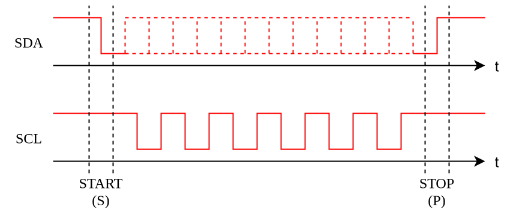
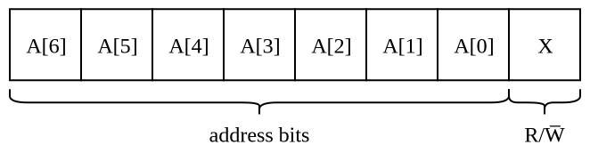
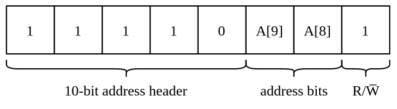

---
tags:
    - electrical-engineering
---

# Inter-Integrated Circuit Bus

The **inter-integrated circuit bus** (**I²C-bus**, **I2C-bus** or **IIC-bus**) is a [serial communication](TODO) [bus](TODO) for data sharing between [integrated circuits](./Integrated%20Circuits.md). It is a [synchronous](TODO), [multi-master-multi-slave](TODO) which uses [single-ended signaling](./Single-Ended%20Signaling.md) system to allow low-speed communication up to 5 Mbit/s.

[I²C-bus](./Inter-Integrated%20Circuit%20Bus.md) supports five modes based on the maximum speed of communication.

|Mode|Maximum Speed|Data Flow|Compatibility|
|:--:|:--:|:--:|:--:|
|Standard-mode (Sm)|100 kbit/s|Bidirectional|Sm|
|Fast-mode (Fm)|400 kbit/s|Bidirectional|Sm, Fm|
|Fast-mode Plus (Fm+)|1 Mbit/s|Bidirectional|Sm, Fm, Fm+|
|High-speed mode (Hs-mode)|3.4 Mbit/s|Bidirectional|Sm, Fm, Fm+, Hs-mode|
|Ultra Fast-mode (UFm)|5 Mbit/s|Unidirectional|UFm|

[Standard-mode](./Inter-Integrated%20Circuit%20Bus.md), [Fast-mode](./Inter-Integrated%20Circuit%20Bus.md) and [Fast-mode Plus](./Inter-Integrated%20Circuit%20Bus.md) can all run on the same physical hardware, but [High-speed mode](./Inter-Integrated%20Circuit%20Bus.md) and [Ultra Fast-mode](./Inter-Integrated%20Circuit%20Bus.md) each require different hardware. Moreover, [Ultra Fast-mode](./Inter-Integrated%20Circuit%20Bus.md) can only be used with [Ultra Fast-mode](./Inter-Integrated%20Circuit%20Bus.md), but the rest are all downwards compatible, meaning that a device which supports a given mode can also use all slower modes.

[I²C-bus](./Inter-Integrated%20Circuit%20Bus.md) uses two serial channels for data transmissions: a clock line (SCL) and a data line (SDA). Data is sampled on the SDA line during the HIGH period of SCL. Depending on the mode used, these may also be labelled SCLH and SDAH (for Hs-mode) and USCL and USDA (for UFm).

## Addressing

Every device is assigned a 7-bit or a 10-bit address which is used for its identification during communication. There is a total of 112 assignable 7-bit address ranging from 0x08 through 0x77 with the rest being reserved by the specification:

|Reserved 7-Bit Addresses|Reason|
|:--:|:--:|
|0000 000|Broadcast to all devices.|
|0000 001|Legacy bus compatibility.|
|0000 010|Reserved for different bus formats.|
|0000 011|Reserved for future purposes.|
|0000 1XX|High-Speed Mode transfer code.|
|1111 0XX|10-bit address header.|
|1111 1XX|Reserved for device ID readouts and future expansion.|

In comparison, there are no reserved 10-bit address which yields a total of 1024 usable 10-bit addresses. However, the vast majority of devices only support 7-bit addressing, since 10-bit addresses require more hardware and are more expensive to implement. 

The first few bits of the address are typically burnt in the hardware of the device during manufacturing, while breakout pins are left for the rest. This allows engineers to manually configure addresses by pulling these pins either LOW or HIGH to set the corresponding pins. 

## Standard-mode, Fast-mode and Fast-mode Plus

### Transactions

Data transmission is organized into **transactions**. The device which initiates a transaction is known as its **controller**. During a transaction, the controller can either send data to or receive data from a specific target device. Transactions are atomic units: once a device has initiated a transaction, the controller becomes a master and all other devices become slaves. No one is allowed to initiate another transaction until the controller explicitly terminates the current one.

When SDA and SCL are in their idle state, a transaction can be initiated by any device via the **START condition**: a HIGH-to-LOW transition on [SDA](./Inter-Integrated%20Circuit%20Bus.md) while [SCL](./Inter-Integrated%20Circuit%20Bus.md) is held HIGH. The transaction is terminated by the controller via the **STOP condition**: a LOW-to-HIGH transition on [SDA](./Inter-Integrated%20Circuit%20Bus.md) while [SCL](./Inter-Integrated%20Circuit%20Bus.md) is held HIGH.

During a transaction, all data is transmitted in 8-bit bytes with the most significant bit being sent first. Every byte is followed by an acknowledgement bit (0 for ACK and 1 for NACK).

Before communication can take place, the controller must indicate the target device it wants to communicate with via a [target announcement](#Target%20Announcement). At any point in the communication, the controller can choose a new target device without having to terminate the entire [transaction](#Transactions). This is done by directly issuing a new [START condition](#Transactions) (**repeated START condition (Sr)**) followed by a new [target announcement](#Target%20Announcement).

### Target Announcement

The controller sends a byte containing 7 address bits followed by a read-write bit (R/W̅). If the address bits do not constitute a [reserved address](#Addressing), then they directly represent the 7-bit address of the target device and the R/W̅ bit indicates whether the controller wants to send or receive information.

|R/W̅ Bit|Meaning|
|:--:|:--:|
|0|The controller wants to send information to the target device.|
|1|The controller wants to receive information from the target device.|

After this byte, the controller releases SDA in a HIGH state. The target device then pulls SDA to LOW, effectively issuing an ACK bit. If there is no device with the target address, then SDA remains HIGH, effectively issuing a NACK bit. After an ACK, the controller can send data to the target device (if R/W̅ was set to 0) or the target device is free to send data to the controller (if R/W̅ was set to 0).

If the first five address bits are 11110, then the controller wishes to communicate with a device with a 10-bit address. The two most significant bits $A[9]$ and $A[8]$ of the target address are the two subsequent bits and the R/W̅ bit *must* be set to zero:

All devices with a 10-bit address whose most significant bits match $A[9]$ and $A[8]$ respond by setting SDA to LOW to signal an ACK, while all other devices simply ignore the communication. The remaining 8 address bits are sent by the controller in the next frame. The device with the matching 10-bit address then sets SDA to LOW to signal an ACK bit, while all other devices do nothing. Now the controller is free to send data to the target device.

If the controller wants to receive data from the target device with a 10-bit address, then it must subsequently issue a [repeated START](./Inter-Integrated%20Circuit%20Bus.md) and then send another byte identical to the 10-bit address header but this time with R/W̅ set to 1.

### Arbitration

It is possible that multiple devices try to initiate a [transaction](#Transactions) at the same time. In these situations, all contending devices proceed as they normally would. If a contestant controller tries to set SDA to LOW, while it is actively being held HIGH, then this controller loses the arbitration. 

## Hs-mode

## Ultra Fast-mode