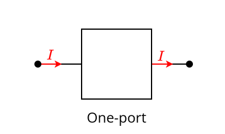

---
tags:
    - network-analysis
    - electrical-engineering
---

# One-Ports

>[!DEFINITION] Definition: One-Port
>
>A **one-port** is a [port](../Ports/index.md) with only two [terminals](../Network%20Analysis.md).
>
>
>

By convention, we arbitrarily assign the names "positive" (+) and "negative" (-) to the [terminals](../Network%20Analysis.md) of each such [one-port](./One-Ports.md):

These names do not necessarily reflect which [terminal](../Network%20Analysis.md) is at a lower or higher [electric potential](TODO), they are just labels. We could have just as easily called them "apple" and "banana". Once we have made this choice, we assign the [reference direction](./One-Ports.md) of the [voltage](TODO) across each [one-port](./One-Ports.md) to point from its [positive terminal](../Ports.md) towards its [negative terminal](../Ports.md):

There are two possible conventions for the [reference direction](./One-Ports.md) of the [current](../../Current.md) flowing through each [one-port](./One-Ports.md):
- In the **passive sign convention (PSC)**, the [reference arrow](./One-Ports.md) of the [current](../../Current.md) is such that [current](../../Current.md) flows *into* the [positive terminal](./One-Ports.md) and *out of* the [negative terminal](./One-Ports.md).
- In the **active sign convention (ASC)**, the [reference arrow](./One-Ports.md) of the [current](../../Current.md) is such that [current](../../Current.md) flows *into* the [negative terminal](./One-Ports.md) and *out of* the [positive terminal](./One-Ports.md).

## Resistive Characteristic

>[!DEFINITION] Definition: Resistive Characteristic
>
>The **resistive characteristic** of a [one-port](./One-Ports.md) with [general characteristic](TODO) $\mathcal{F}$ is the following [set](../../../Mathematics/Set%20Theory/Sets.md):
>
>$$\mathcal{F}_R \overset{\text{def}}{=} \{(v, i) \in \mathbb{R}^2 \mid \exists q, \Phi \in \mathbb{R} \text{ such that } (v, i, q, \Phi) \in \mathcal{F}\}$$
>

### Resistance and Conductance

>[!DEFINITION] Definition: Static Resistance
>
>Let $\mathcal{F}$ be the [I-V characteristic](#I-V%20Characteristic) of a [one-port](./One-Ports.md) and let $(v, i) \in \mathcal{F}$.
>
>The **static resistance**  or **chordal resistance** of the [one-port](./One-Ports.md) at $(v, i)$ is the ratio of the [voltage](TODO) $v$ and the [current](../../Current.md) $i$:
>
>$$
>\frac{v}{i}
>$$
>
>>[!NOTATION]
>>
>>[Static resistance](../../../index.md#Resistance%20and%20Conductance) is typically denoted by $R$.
>>
>
>>[!UNIT] Unit: Ohm
>>
>>[Static resistance](../../../index.md#Resistance%20and%20Conductance) is measured in **ohms** with one ohm being equal to the ratio of one [volt](TODO) to one [ampere](../../Current.md):
>>
>>$$
>>1 \mathop{\Omega} = \frac{1 \mathop{\mathrm{V}}}{1 \mathop{\mathrm{A}}}
>>$$
>>
>

>[!DEFINITION] Definition: Static Conductance
>
>Let $\mathcal{F}$ be the [I-V characteristic](#I-V%20Characteristic) of a [one-port](./One-Ports.md) and let $(v, i) \in \mathcal{F}$.
>
>The **static conductance** or **chordal conductance** of the [one-port](../../../index.md) at $(v, v)$ is the ratio of the [current](../../Current.md) $i$ flowing and the [voltage](TODO) $v$:
>
>$$
>\frac{i}{v}
>$$
>
>>[!NOTATION]
>>
>>[Static conductance](../../../index.md#Resistance%20and%20Conductance) is typically denoted by $G$.
>>
>
>>[!UNIT] Unit: Siemens
>>
>>[Static conductance](../../../index.md#Resistance%20and%20Conductance) is measured in **siemens** with one siemens being equal to the ratio of one [ampere](../../Current.md) to one [volt](TODO):
>>
>>$$
>>1 \mathop{\mathrm{S}} = \frac{1 \mathop{\mathrm{A}}}{1 \mathop{\mathrm{V}}}
>>$$
>>
>

[Static resistance](../../../index.md#Resistance%20and%20Conductance) and [static conductance](../../../index.md#Resistance%20and%20Conductance) are thus reciprocals:

$$
R = \frac{1}{G} \qquad G = \frac{1}{R}
$$

>[!DEFINITION] Definition: Dynamic Resistance
>
>Let $\mathcal{F}$ be the [I-V characteristic](#I-V%20Characteristic) of a [one-port](./One-Ports.md) which has an [implicit representation](../../../index.md#I-V%20Characteristic) $f(V, I) = 0$ and let $(v, i) \in \mathcal{F}$.
>
>The **dynamic resistance** or **differential resistance** of the [one-port](./One-Ports.md) at $(v, i)$ is the negative of the ration of $f$'s [partial derivative](../../../Mathematics/Analysis/Real%20Analysis/Real%20Scalar%20Fields/Differentiation%20of%20Real%20Scalar%20Fields.md#Partial%20Differentiability) with respect to $I$ to $f$'s [partial derivative](../../../Mathematics/Analysis/Real%20Analysis/Real%20Scalar%20Fields/Differentiation%20of%20Real%20Scalar%20Fields.md#Partial%20Differentiability) with respect to $V$:
>
>$$
>-\frac{\frac{\partial f}{\partial I} (v,i)}{\frac{\partial f}{\partial V} (v, i)}
>$$
>
>>[!NOTATION]
>>
>>[Dynamic resistance](../../../index.md#Resistance%20and%20Conductance) is typically denoted in one of the following ways:
>>
>>$$
>>r \qquad r_{\text{dyn}} \qquad r_{\text{diff}}
>>$$
>>
>
>>[!UNIT] Unit: Ohm
>>
>>[Dynamic resistance](../../../index.md#Resistance%20and%20Conductance) is also measured in [ohms](../../../index.md#Resistance%20and%20Conductance), just like [static resistance](../../../index.md#Resistance%20and%20Conductance).
>>
>

>[!DEFINITION] Definition: Dynamic Conductance
>
>Let $\mathcal{F}$ be the [I-V characteristic](#I-V%20Characteristic) of a [one-port](./One-Ports.md) which has an [implicit representation](../../../index.md#I-V%20Characteristic) $f(V, I) = 0$ and let $(v, i) \in \mathcal{F}$.
>
>The **dynamic conductance** or **differential conductance** of the [one-port](./One-Ports.md) is the negative of the ration of $f$'s [partial derivative](../../../Mathematics/Analysis/Real%20Analysis/Real%20Scalar%20Fields/Differentiation%20of%20Real%20Scalar%20Fields.md#Partial%20Differentiability) with respect to $V$ to $f$'s [partial derivative](../../../Mathematics/Analysis/Real%20Analysis/Real%20Scalar%20Fields/Differentiation%20of%20Real%20Scalar%20Fields.md#Partial%20Differentiability) with respect to $I$:
>
>$$
>-\frac{\frac{\partial f}{\partial V} (v,i)}{\frac{\partial f}{\partial I} (v,i)}
>$$
>
>>[!NOTATION]
>>
>>[Dynamic conductance](../../../index.md#Resistance%20and%20Conductance) is typically denoted in one of the following ways:
>>
>>$$
>>g \qquad g_{\text{dyn}} \qquad g_{\text{diff}}
>>$$
>>
>
>>[!UNIT] Unit: Ohm
>>
>>[Dynamic conductance](../../../index.md#Resistance%20and%20Conductance) is also measured in [siemens](../../../index.md#Resistance%20and%20Conductance), just like [static conductance](../../../index.md#Resistance%20and%20Conductance).
>>
>

[Dynamic resistance](../../../index.md#Resistance%20and%20Conductance) and [dynamic conductance](../../../index.md#Resistance%20and%20Conductance) are thus reciprocals:

$$
r = \frac{1}{g} \qquad g = \frac{1}{r}
$$

>[!THEOREM] Theorem: Dynamic Resistance of Current-Driven One-Ports
>
>The [dynamic resistance](../../../index.md#Resistance%20and%20Conductance) of a [current-driven](../../../index.md#I-V%20Characteristic) [one-port](../../../index.md) is $V$'s [derivative](../../../Mathematics/Analysis/Real%20Analysis/Real%20Functions/Differentiability%20(Real%20Functions).md) with respect to $I$:
>
>$$
>r = \frac{\mathrm{d}V}{\mathrm{d}I}
>$$
>
>>[!PROOF]-
>>
>>TODO
>>
>

>[!THEOREM] Theorem: Dynamic Conductance of Voltage-Driven One-Ports
>
>The [dynamic conductance](../../../index.md#Resistance%20and%20Conductance) of a [voltage-driven](../../../index.md#I-V%20Characteristic) [one-port](../../../index.md) is $I$'s [derivative](../../../Mathematics/Analysis/Real%20Analysis/Real%20Functions/Differentiability%20(Real%20Functions).md) with respect to $V$:
>
>$$
>g = \frac{\mathrm{d}I}{\mathrm{d}V}
>$$
>
>>[!PROOF]-
>>
>>TODO
>>
>

## Capacitive Characteristic

>[!DEFINITION] Definition: Capacitive Characteristic
>
>The **capacitive characteristic** of a [one-port](./One-Ports.md) with [general characteristic](TODO) $\mathcal{F}$ is the following [set](../../../Mathematics/Set%20Theory/Sets.md):
>
>$$\mathcal{F}_C \overset{\text{def}}{=} \{(v, q) \in \mathbb{R}^2 \mid \exists i, \Phi \in \mathbb{R} \text{ such that } (v, i, q, \Phi) \in \mathcal{F}\}$$
>
>>[!DEFINITION] Definition: Voltage-Controlled Capacitive Characteristic
>>
>>We say that $\mathcal{F}$ is **voltage-controlled** if there exists some [real function](../../../Mathematics/Analysis/Real%20Analysis/Real%20Functions/Real%20Functions.md) $c$ such that
>>
>>$$q = c(v) \qquad \forall(v, q) \in \mathcal{F}_C.$$
>>
>
>>[!DEFINITION] Definition: Charge-Controlled Capacitive Characteristic
>>
>>We say that $\mathcal{F}$ is **charge-controlled** if there exists some [real function](../../../Mathematics/Analysis/Real%20Analysis/Real%20Functions/Real%20Functions.md) $\chi$ such that
>>
>>$$v = \chi(q) \qquad \forall (v, q) \in \mathcal{F}_C.$$
>>
>

## Inductive Characteristic

>[!DEFINITION] Definition: Inductive Characteristic
>
>The **inductive characteristic** of a [one-port](./One-Ports.md) with [general characteristic](TODO) $\mathcal{F}$ is the following [set](../../../Mathematics/Set%20Theory/Sets.md):
>
>$$\mathcal{F}_L \overset{\text{def}}{=} \{(i, \Phi) \in \mathbb{R}^2 \mid \exists v, q \in \mathbb{R} \text{ such that } (v, i, q, \Phi) \in \mathcal{F}\}$$
>
>>[!DEFINITION] Definition: Current-Controlled Inductive Characteristic
>>
>>We say that $\mathcal{F}_L$ is **current-controlled** if there exists some [real function](../../../Mathematics/Analysis/Real%20Analysis/Real%20Functions/Real%20Functions.md) $l$ such that
>>
>>$$\Phi = l(i) \qquad \forall(i, \Phi) \in \mathcal{F}_L.$$
>>
>
>>[!DEFINITION] Definition: Flux-Controlled Inductive Characteristic
>>
>>We say that $\mathcal{F}_L$ is **flux-controlled** if there exists some [real function](../../../Mathematics/Analysis/Real%20Analysis/Real%20Functions/Real%20Functions.md) $\lambda$ such that
>>
>>$$i = \lambda(\Phi) \qquad \forall (i, \Phi) \in \mathcal{F}_L.$$
>>
>

## Memristive Characteristic

>[!DEFINITION] Definition: Memristive Characteristic
>
>The **memristive characteristic** of a [one-port](./One-Ports.md) with [general characteristic](TODO) $\mathcal{F}$ is the following [set](../../../Mathematics/Set%20Theory/Sets.md):
>
>$$\mathcal{F}_M \overset{\text{def}}{=} \{(\Phi, q) \in \mathbb{R}^2 \mid \exists v, i \in \mathbb{R} \text{ such that } (v, i, q, \Phi) \in \mathcal{F}\}$$
>

## Polarity

Some electronic components cannot operate when their [terminals](../Network%20Analysis.md) are not connected in a specific manner to the circuit. These are are known as **polarized components**

>[!DEFINITION] Definition: Unpolarized One-Port
>
>A [resistive](#Resistive%20Characteristic) [one-port](./One-Ports.md) $\mathcal{F}_R$ is **unpolarized** or **bilateral** if 
>
>$$(-v, -i) \in \mathcal{F}_R \qquad \forall (v, i) \in \mathcal{F}_R$$
>

>[!DEFINITION] Definition: Unpolarized One-Port
>
>A [resistive](#Resistive%20Characteristic) [one-port](./One-Ports.md)  $\mathcal{F}_R$ is **polarized** or **unilateral** if it is not [unpolarized](../../../index.md#Polarity):
>
>$$\exists (v, i) \in \mathcal{F}_R \qquad \text{ such that } \qquad (-v, -i) \notin \mathcal{F}_R$$
>

When the [terminals](../Network%20Analysis.md) of a [one-port](../../../index.md#One-Ports) are switched around, the mathematical descriptions of its [voltage](TODO) and [current](../../Current.md) switch signs. If the [one-port](../../../index.md#One-Ports) can operate at those new [voltage](TODO) and [current](../../Current.md), then it is [unpolarized](../../../index.md#Polarity). If, however, there is a [voltage](TODO) and [current](../../Current.md) such that the [one-port](../../../index.md#One-Ports) *cannot* operate when their signs are switched, i.e. when the [terminals](../Network%20Analysis.md) of a [one-port](../../../index.md#One-Ports) are switched around, then the [one-port](../../../index.md#One-Ports) is [polarized](../../../index.md#Polarity).

## Power

When $P(t) \gt 0$, then component is drawing energy. Conversely, when $P(t) \lt 0$, the component is giving off energy. If $P(t) = 0$, then the component is neither drawing nor giving off energy.

>[!THEOREM] Theorem: Power of Resistive One-Ports
>
>The [power](TODO) $P(t)$ of [resistive](#Resistive%20Characteristic) [one-port](./One-Ports.md) at $t$ is equal to the product of the [current](../../Current.md) and [voltage](TODO) across it:
>
>$$P(t) = v(t) \cdot i(t)$$
>
>>[!PROOF]-
>>
>>TODO
>>
>

>[!DEFINITION] Definition: Lossless Ports
>
>A [one-port](../../../index.md#One-Ports) with [I-V characteristic](../../../index.md#One-Ports) $\mathcal{F}$ is **lossless** if it does not draw or give off energy at any [current](../../Current.md) and [voltage](TODO) configuration:
>
>$$VI = 0 \qquad \forall (V, I) \in \mathcal{F}$$
>
>>[!TIP]
>>
>>The [I-V characteristic](../../../index.md#One-Ports) of a [lossless port](../../../index.md#Power) is restricted to one of the two axes because the [current](../../Current.md) or the [voltage](TODO) must always be zero.
>>
>>
>>
>

>[!DEFINITION] Definition: Lossy Ports
>
>A [one-port](../../../index.md#One-Ports) with [I-V characteristic](../../../index.md#One-Ports) $\mathcal{F}$ is **lossy** if it there exists a [current](../../Current.md) and [voltage](TODO) configuration at which it either draws or gives off energy:
>
>$$
>\exists (V, I) \qquad \text{such that} \qquad VI \ne 0
>$$
>

>[!DEFINITION] Definition: Active Ports
>
>A [one-port](../../../index.md#One-Ports) with [I-V characteristic](../../../index.md#One-Ports) $\mathcal{F}$ is **active** if it can be operated at a [current](../../Current.md) and a [voltage](TODO) so as to give off energy:
>
>$$
>\exists (V, I) \in \mathcal{F} \qquad \text{such that} \qquad V I \lt 0
>$$
>

>[!DEFINITION] Definition: Passive Ports
>
>A [one-port](../../../index.md#One-Ports) with [I-V characteristic](../../../index.md#One-Ports) $\mathcal{F}$ is **passive** if it cannot be operated at a [current](../../Current.md) and a [voltage](TODO) so as to give off energy:
>
>$$
>V I \ge 0 \qquad \forall (V, I) \in \mathcal{F}
>$$
>
>>[!TIP]
>>
>>The [I-V characteristic](../../../index.md#One-Ports) of a [passive port](../../../index.md#Power) is restricted to the first and third quadrants because [current](../../Current.md) and [voltage](TODO) must always have the same sign:
>>
>>
>>
>

## Duality

>[!DEFINITION] Definition: Duality
>
>We say that two [one-ports](./One-Ports.md) with [general characteristics](TODO) $\mathcal{F}$ and $\mathcal{F}^d$ are **dual** if there exists some $R_d \in \mathbb{R}$ such that
>
>$$(q, \Phi, i, v) \in \mathcal{F} \iff (q^d, \Phi^d, i^d, v^d) \in \mathcal{F}^d,$$
>
>where
>
>$$q^d = \frac{1}{R_d}\Phi \qquad \Phi^d = R_d\cdot q \qquad i^d = \frac{1}{R_d}v \qquad v^d = R_d \cdot i.$$
>

>[!DEFINITION] Definition: Duality
>
>We say that two [resistive characteristics](#Resisive%20Characteristics) $\mathcal{F}_R$ and $\mathcal{F}_{R}^{d}$ are **dual** if there exists some $k \in \mathbb{R}$ such that
>
>$$(v, i) \in \mathcal{F}_R \iff (v^d, i^d) \in \mathcal{F}_{R}^{d},$$
>
>where $v^d = k\cdot I$ and $i^d = \frac{1}{k}v$.
>

>[!DEFINITION] Definition: Duality
>
>We say that a [capacitive characteristic](#Resisive%20Characteristics) $\mathcal{F}_C$ and $\mathcal{F}_{R}^{d}$ are **dual** if there exists some $k \in \mathbb{R}$ such that
>
>$$(v, i) \in \mathcal{F}_R \iff (v^d, i^d) \in \mathcal{F}_{R}^{d},$$
>
>where $v^d = k\cdot I$ and $i^d = \frac{1}{k}v$.
>

>[!THEOREM] Theorem: Current-Driven and Voltage-Driven Dual Ports
>
>Let $\mathcal{F}$ and $\mathcal{F}_d$ be [dual](../../../index.md#Duality) [one-ports](../../../index.md#One-Ports):
>
>- If $\mathcal{F}$ is [current-driven](../Ports/index.md#I-V%20Characteristic), then $\mathcal{F}_d$ is [voltage-driven](../Ports/index.md#I-V%20Characteristic) with $I_d = \frac{1}{D} f\left(\frac{1}{D}V_d\right)$.
>- If $\mathcal{F}$ is [voltage-driven](../Ports/index.md#I-V%20Characteristic), then $\mathcal{F}_d$ is [current-driven](../Ports/index.md#I-V%20Characteristic) with $V_d = D f(D I_d)$.
>
>>[!PROOF]-
>>
>>We need to prove two things:
>>- (1) If $\mathcal{F}$ is [current-driven](../Ports/index.md#I-V%20Characteristic), then $\mathcal{F}_d$ is [voltage-driven](../Ports/index.md#I-V%20Characteristic).
>>- (2) If $\mathcal{F}$ is [voltage-driven](../Ports/index.md#I-V%20Characteristic), then $\mathcal{F}_d$ is [current-driven](../Ports/index.md#I-V%20Characteristic).
>>
>>**Proof of (1):**
>>
>>Since $\mathcal{F}$ is [current-driven](../Ports/index.md#I-V%20Characteristic), we know that
>>
>>$$
>>V = f(I).
>>$$
>>
>>Since $V_d = D I$ and $I_d = \frac{1}{D} V$, we know that $V = D I_d$ and $I = \frac{1}{D} V_d$. We thus get
>>
>>$$
>>D I_d = f\left(\frac{1}{D}V_d\right)
>>$$
>>
>>$$
>>I_d = \frac{1}{D} f\left(\frac{1}{D}V_d\right)
>>$$
>>
>>If we define $g(V_d) = \frac{1}{D} f\left(\frac{1}{D}V_d\right)$, then
>>
>>$$
>>I_d = g(V_d),
>>$$
>>
>>which makes $\mathcal{F}_d$ [voltage-driven](../Ports/index.md#I-V%20Characteristic).
>>
>>**Proof of (2):**
>>
>>Since $\mathcal{F}$ is [voltage-driven](../Ports/index.md#I-V%20Characteristic), we know that
>>
>>$$
>>I = f(V).
>>$$
>>
>>Since $V_d = D I$ and $I_d = \frac{1}{D} V$, we know that $V = D I_d$ and $I = \frac{1}{D} V_d$. We thus get
>>
>>$$
>>\frac{1}{D}V_d = f(D I_d)
>>$$
>>
>>$$
>>V_d = D f(D I_d)
>>$$
>>
>>If we define $g(I_d) = D f(D I_d)$, then
>>
>>$$
>>I_d = g(V_d),
>>$$
>>
>>which makes $\mathcal{F}_d$ [current-driven](../Ports/index.md#I-V%20Characteristic).
>>
>

>[!THEOREM] Theorem: Polarity of Dual Ports
>
>Let $\mathcal{F}$ and $\mathcal{F}_d$ be [dual](../../../index.md#Duality) [one-ports](../../../index.md#One-Ports):
>- If $\mathcal{F}$ is [polarized](../../../index.md#Polarity), then so is $\mathcal{F}_d$.
>- If $\mathcal{F}$ is [unpolarized](../../../index.md#Polarity), then so is $\mathcal{F}_d$.
>
>>[!PROOF]-
>>
>>**Proof of (1):**
>>
>>TODO
>>
>>**Proof of (2):**
>>
>>Since $\mathcal{F}$ is [unpolarized](../../../index.md#Polarity), we know that $(-V, -I) \in \mathcal{F}$ for all $(V, I) \in \mathcal{F}$. Since $V_d = DI$ and $I_d = \frac{1}{D} V$, we know that $-V_d = D(-I)$ and $-I_d = \frac{1}{D}(-V)$. Therefore, $-V_d$ is the [dual](../../../index.md#Duality) of $-I$ and $-I_d$ is the [dual](../../../index.md#Duality) of $-V$, i.e. $(-V_d, -I_d) \in \mathcal{F}$.
>>
>>
>

>[!THEOREM] Theorem: Power of Dual Ports
>
>Let $\mathcal{F}$ and $\mathcal{F}_d$ be [dual](../../../index.md#Duality) [one-ports](../../../index.md#One-Ports):
>- If $\mathcal{F}$ is [lossless](../../../index.md#Power) or [lossy](../../../index.md#Power), then so is $\mathcal{F}_d$.
>- If $\mathcal{F}$ is [passive](../../../index.md#Power) or [active](../../../index.md#Power), then so is $\mathcal{F}_d$.
>
>>[!PROOF]-
>>
>>We need to prove four things:
>>- If $\mathcal{F}$ is [lossless](../../../index.md#Power), then so is $\mathcal{F}_d$.
>>- If $\mathcal{F}$ is [lossy](../../../index.md#Power), then so is $\mathcal{F}_d$.
>>- If $\mathcal{F}$ is [passive](../../../index.md#Power), then so is $\mathcal{F}_d$.
>>- If $\mathcal{F}$ is [active](../../../index.md#Power), then so is $\mathcal{F}_d$.
>>
>>**Proof of (1):**
>>
>>If $\mathcal{F}$ is [lossless](../../../index.md#Power), either $V$ or $I$ must always be zero. If $V$ is always zero, then $I_d$ will be always zero, since $I_d = \frac{1}{D}V$. If $I$ is always zero, then $V_d$ will be always zero, since $V_d = DI$. Therefore, $I_d V_d$ will always be zero and so $\mathcal{F}_d$ is also [lossless](../../../index.md#Power).
>>
>>**Proof of (2):**
>>
>>If $\mathcal{F}$ is [lossy](../../../index.md#Power), there exist $(V, I) \in \mathcal{F}$ such that neither $V$ nor $I$ is zero. Since $V_d = DI$ and $I_d = \frac{1}{D}V$, we know that $V_d$ and $I_d$ would also be different from zero in this case and so $V_d I_d \ne 0$, thus making $\mathcal{F}_d$ also [lossy](../../../index.md#Power).
>>
>>**Proof of (3):**
>>
>>If $\mathcal{F}$ is [passive](../../../index.md#Power), then $V I \ge 0$. Since $V_d = DI$ and $I_d = \frac{1}{D}V$, we know that
>>
>>$$
>>V_d I_d = DI \frac{1}{D}V = IU = UI \ge 0,
>>$$
>>
>>thus making $\mathcal{F}_d$ also [passive](../../../index.md#Power).
>>
>>**Proof of (4):**
>>
>>If $\mathcal{F}$ is [active](../../../index.md#Power), then there exist $(V, I) \in \mathcal{F}$ such that $UI \lt 0$. Since $V_d = DI$ and $I_d = \frac{1}{D}V$, in this case we would have
>>
>>$$
>>V_d I_d = DI \frac{1}{D}V = IU = UI \lt 0,
>>$$
>>
>>thus making $\mathcal{F}_d$ also [active](../../../index.md#Power).
>>
>