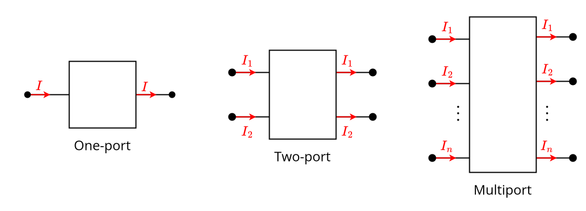

---
tags:
    - electrical-engineering
---

# Ports

In the [lumped-element model](./Lumped%20Circuits.md), [Kirchhoff's current law](./Lumped%20Circuits.md) often gives rise to situations where [currents](../Current.md) occur in pairs of equal magnitude. Essentially, a certain amount of current enters some region and the same amount of current exits it somewhere else at the same time. This is especially common at the [terminals](../Electronic%20Components.md) of [electronic components](../Electronic%20Components.md) and allows us to greatly simplify their modelling because it reduces the number of things which need to be taken into account (two currents for the price of one).

>[!DEFINITION] Definition: Port
>
>Two [terminals](./Lumped%20Elements.md) in a [lumped](./Lumped%20Circuits.md) [network](./Lumped%20Networks.md) are said to satisfy the **port condition** if the [[funda]]
>
>A **port** in a [lumped](./Lumped%20Circuits.md) is any pair of [terminals](../Electronic%20Circuits.md) such that the [current](../Current.md) flowing out of one terminal is equal to the [current](../Current.md) flowing into the other.
>

Many electronic components can be modeled as ports. When a device has multiple [terminals](../Electronic%20Circuits.md) which can be arranged into pairs which satisfy the [port condition](./One-Ports/One-Ports.md), we call it a **multiport** or an $n$**-port**, where $n$ is the number of [ports](./One-Ports/One-Ports.md).

## I-V Characteristic

We analyze every $n$[-port](./Ports.md) as a collection of $n$ [one-ports](./One-Ports/One-Ports.md). 

>[!DEFINITION] Definition: Current Vector
>
>The **current vector** of an $n$[-port](./Ports.md) at time $t$ is the [column vector](../../Mathematics/Algebra/Linear%20Algebra/Real%20Vectors/Real%20Vectors.md) whose components are the [currents](../Current.md) through each of its [one-ports](./One-Ports/One-Ports.md) at $t$:
>
>$$\begin{bmatrix}i_1(t) \\ \vdots \\ i_n(t) \end{bmatrix}$$
>
>
>
>>[!NOTATION]
>>
>>$$\mathbf{i}(t) \qquad \boldsymbol{i}(t)$$
>>
>

>[!DEFINITION] Definition: Voltage Vector
>
>The **voltage vector** of an $n$[-port](./Ports.md) at time $t$ is the [column vector](../../Mathematics/Algebra/Linear%20Algebra/Real%20Vectors/Real%20Vectors.md) whose components are the [voltages](TODO) across its [one-ports](./One-Ports/One-Ports.md) at $t$:
>
>$$
>\begin{bmatrix}v_1(t) \\ \vdots \\ v_n(t)\end{bmatrix}
>$$
>
>
>
>>[!NOTATION]
>>
>>$$
>>\mathbf{v}(t) \qquad \boldsymbol{v}(t)
>>$$
>>
>

When analyzing a [port](./Ports.md), we are interested in what [currents](../Current.md) and [voltages](TODO) it can be operated at.

>[!DEFINITION] Definition: Current-Voltage Characteristic
>
>The **current-voltage characteristic** of an $n$[-port](./Ports.md) is the [set](../../Mathematics/Set%20Theory/Sets.md) of all admissible [voltage](TODO) and [current](../Current.md) vector pairs:
>
>$$
>\mathcal{F} \subseteq \mathbb{R}^{2n}
>$$
>
>where any $\begin{bmatrix} \boldsymbol{v} \\ \boldsymbol{i} \end{bmatrix} \in \mathcal{F}$ represents a state in which the multiport can physically exist.
>

>[!EXAMPLE]-
>
>For example, a [one-port](./One-Ports/One-Ports.md) could have the following [current-voltage characteristic](./One-Ports/One-Ports.md#I-V%20Characteristic):
>
>$$
>\mathcal{F} = \left\{(9 \mathop{\mathrm{V}}, 0.011 \mathop{\mathrm{A}}), (12 \mathop{\mathrm{V}}, 0.024 \mathop{\mathrm{A}}), (9 \mathop{\mathrm{V}}, 0.013 \mathop{\mathrm{A}}), (12 \mathop{\mathrm{V}}, 0.018 \mathop{\mathrm{A}}) \right\}
>$$
>
>This means that the [one-port](./One-Ports/One-Ports.md) can function only under one of the following conditions:
>- a [voltage](TODO) of $9 \mathop{\mathrm{V}}$ and a [current](../Current.md) of $0.011 \mathop{\mathrm{A}}$;
>- a [voltage](TODO) of $12 \mathop{\mathrm{V}}$ and a [current](../Current.md) of $0.024 \mathop{\mathrm{A}}$;
>- a [voltage](TODO) of $9 \mathop{\mathrm{V}}$ and a [current](../Current.md) of $0.013 \mathop{\mathrm{A}}$;
>- a [voltage](TODO) of $12 \mathop{\mathrm{V}}$ and a [current](../Current.md) of $0.018 \mathop{\mathrm{A}}$.
>

### Representations

Since [I-V characteristics](#I-V%20Characteristic) can be very complicated and dealing with [sets](../../Mathematics/Set%20Theory/Sets.md) directly is tedious, we are interested in finding mathematical formulas which describe the relationships between [voltage](TODO) and [current](../Current.md).

>[!DEFINITION] Definition: Implicit Representation
>
>An **implicit representation** of the [I-V characteristic](#I-V%20Characteristic) $\mathcal{F}$ of an $n$[-port](./Ports.md) is any [function](../../Mathematics/Analysis/Real%20Analysis/Real%20Vector%20Functions/Real%20Vector%20Functions.md) $f: \mathbb{R}^{n} \times \mathbb{R}^{n} \to \mathbb{R}^{n}$ such that
>
>$$
>f \left(\begin{bmatrix}\boldsymbol{v} \\ \boldsymbol{i}\end{bmatrix}\right) = \boldsymbol{0}
>$$
>
>if and only if $\begin{bmatrix}\boldsymbol{v} \\ \boldsymbol{i} \end{bmatrix} \in \mathcal{F}$.
>

>[!DEFINITION] Definition: Parametric Representation
>
>A **parametric representation** of the [I-V characteristic](#I-V%20Characteristic) $\mathcal{F}$ of an $n$[-port](./Ports.md) is a [functions](../../Mathematics/Analysis/Real%20Analysis/Real%20Vector%20Fields/Real%20Vector%20Fields.md) $f: \mathbb{R}^n \to \mathbb{R}^{2n}$ such that
>
>$$
>\begin{bmatrix}\boldsymbol{v} \\ \boldsymbol{i}\end{bmatrix} \in \mathcal{F}
>$$
>
>if and only if there exists some $\boldsymbol{\lambda} \in \mathbb{R}^{n}$ such that
>
>$$
>\begin{bmatrix}\boldsymbol{v} \\ \boldsymbol{i}\end{bmatrix} = f(\boldsymbol{\lambda})
>$$
>

There are also the following explicit representations:

>[!DEFINITION] Definition: Admittance Representation
>
>An **admittance representation** of the [I-V characteristic](#I-V%20Characteristic) $\mathcal{F}$ of an $n$[-port](./Ports.md) is any [function](../../Mathematics/Analysis/Real%20Analysis/Real%20Vector%20Fields/Real%20Vector%20Fields.md) $g: \mathcal{D} \subseteq \mathbb{R}^n \to \mathbb{R}^n$ such that
>
>$$
>\begin{bmatrix}\boldsymbol{v} \\ \boldsymbol{i}\end{bmatrix} \in \mathcal{F}
>$$
>
>if and only if
>
>$$
>\boldsymbol{i} = g(\boldsymbol{v}).
>$$
>
>>[!DEFINITION] Definition: Voltage-Controlled Multiport
>>
>>If the [I-V characteristic](#I-V%20Characteristic) of a [multiport](./Ports.md) has an [admittance representation](#Representations), then the [multiport](./Ports.md) is said to be **voltage-controlled**.
>>
>

>[!DEFINITION] Definition: Impedance Representation
>
>An **Impedance representation** of the [I-V characteristic](#I-V%20Characteristic) $\mathcal{F}$ of an $n$[-port](./Ports.md) is any [function](../../Mathematics/Analysis/Real%20Analysis/Real%20Vector%20Fields/Real%20Vector%20Fields.md) $r: \mathcal{D} \subseteq \mathbb{R}^n \to \mathbb{R}^n$ such that
>
>$$
>\begin{bmatrix}\boldsymbol{v} \\ \boldsymbol{i}\end{bmatrix} \in \mathcal{F}
>$$
>
>if and only if
>
>$$
>\boldsymbol{v} = r(\boldsymbol{i}).
>$$
>
>>[!DEFINITION] Definition: Current-Controlled Multiport
>>
>>If the [I-V characteristic](#I-V%20Characteristic) of a [multiport](./Ports.md) has an [impedance representation](#Representations), then the [multiport](./Ports.md) is said to be **current-controlled**.
>>
>

>[!DEFINITION] Definition: Hybrid Representation
>
>A **hybrid representation** of the [I-V characteristic](#I-V%20Characteristic) $\mathcal{F}$ of an $n$[-port](./Ports.md) is any [function](../../Mathematics/Analysis/Real%20Analysis/Real%20Vector%20Functions/Real%20Vector%20Functions.md) $H: \mathbb{R}^n \to \mathbb{R}^n$ such that
>
>$$\begin{bmatrix}\boldsymbol{v}_a \\ \boldsymbol{i}_b\end{bmatrix} = H\left( \begin{bmatrix}\boldsymbol{i}_a \\ \boldsymbol{v}_b\end{bmatrix} \right),$$
>
>where
>
>$$\boldsymbol{i}_a = \begin{bmatrix} i_1 \\ \vdots \\ i_m\end{bmatrix} \qquad \boldsymbol{v}_a = \begin{bmatrix} v_1 \\ \vdots \\ v_m\end{bmatrix} \qquad \boldsymbol{i}_b = \begin{bmatrix} i_{m+1} \\ \vdots \\ i_n \end{bmatrix} \qquad \boldsymbol{v}_b = \begin{bmatrix} v_{m+1} \\ \vdots \\ v_n\end{bmatrix}$$
>
>for some $m \in \{1, \dotsc, n\}$.
>

>[!DEFINITION] Definition: Inverse Hybrid Representation
>
>An **inverse hybrid representation** of the [I-V characteristic](#I-V%20Characteristic) $\mathcal{F}$ of an $n$[-port](./Ports.md) is any [function](../../Mathematics/Analysis/Real%20Analysis/Real%20Vector%20Functions/Real%20Vector%20Functions.md) $H': \mathbb{R}^n \to \mathbb{R}^n$ such that
>
>$$\begin{bmatrix}\boldsymbol{i}_a \\ \boldsymbol{v}_b\end{bmatrix} = H'\left(\begin{bmatrix}\boldsymbol{v}_a \\ \boldsymbol{i}_b\end{bmatrix}\right),
>$$
>
>where
>
>$$\boldsymbol{i}_a = \begin{bmatrix} i_1 \\ \vdots \\ i_m\end{bmatrix} \qquad \boldsymbol{v}_a = \begin{bmatrix} v_1 \\ \vdots \\ v_m\end{bmatrix} \qquad \boldsymbol{i}_b = \begin{bmatrix} i_{m+1} \\ \vdots \\ i_n \end{bmatrix} \qquad \boldsymbol{v}_b = \begin{bmatrix} v_{m+1} \\ \vdots \\ v_n\end{bmatrix}$$
>
>for some $m \in \{1, \dotsc, n\}$.
>

>[!DEFINITION] Definition: Forwards Transmission Representation
>
>A **forwards transmission representation** of the [I-V characteristic](#I-V%20Characteristic) $\mathcal{F}$ of an $n$[-port](./Ports.md) with $n = 2m$ is any [function](../../Mathematics/Analysis/Real%20Analysis/Real%20Vector%20Functions/Real%20Vector%20Functions.md) $T: \mathbb{R}^n \to \mathbb{R}^n$ such that 
>
>$$\begin{bmatrix}\boldsymbol{v} \\ \boldsymbol{i}\end{bmatrix} \in \mathcal{F} \qquad \iff \qquad \begin{bmatrix}\boldsymbol{v}_1 \\ \boldsymbol{i}_1\end{bmatrix} = T \left( \begin{bmatrix}\boldsymbol{v}_2 \\ -\boldsymbol{i}_2\end{bmatrix} \right),$$
>
>where
>
>$$\begin{bmatrix} \boldsymbol{v}_1 \\ \boldsymbol{i}_1 \end{bmatrix} = \begin{bmatrix}v_1 \\ \vdots \\ v_m \\ i_1 \\ \vdots \\ i_m\end{bmatrix} \qquad \begin{bmatrix} \boldsymbol{v}_2 \\ -\boldsymbol{i}_2 \end{bmatrix} = \begin{bmatrix}v_{m+1} \\ \vdots \\ v_n \\ -i_{m+1} \\ \vdots \\ -i_n\end{bmatrix}.$$
>

## Power

>[!DEFINITION] Definition: Lossless Multiport
>
>A [multiport](./Ports.md) with [I-V characteristic](#I-V%20Characteristic) $\mathcal{F}$ is **lossless** if
>
>$$
>\boldsymbol{v} \cdot \boldsymbol{i} = 0
>$$
>
>for all $\begin{bmatrix}\boldsymbol{v} \\ \boldsymbol{i} \end{bmatrix} \in \mathcal{F}$. 
>

>[!DEFINITION] Definition: Lossy Multiport
>
>A [multiport](./Ports.md) with [I-V characteristic](#I-V%20Characteristic) $\mathcal{F}$ is **lossy** if
>
>$$
>\boldsymbol{v} \cdot \boldsymbol{i} \ne 0
>$$
>
>for some $\begin{bmatrix}\boldsymbol{v} \\ \boldsymbol{i} \end{bmatrix} \in \mathcal{F}$. 
>

>[!DEFINITION] Definition: Passive Multiport
>
>A [multiport](./Ports.md) with [I-V characteristic](#I-V%20Characteristic) $\mathcal{F}$ is **passive** if
>
>$$
>\boldsymbol{v} \cdot \boldsymbol{i} \ge 0
>$$
>
>for all $\begin{bmatrix}\boldsymbol{v} \\ \boldsymbol{i} \end{bmatrix} \in \mathcal{F}$.
>

>[!DEFINITION] Definition: Active Multiport
>
>A [multiport](./Ports.md) with [I-V characteristic](#I-V%20Characteristic) $\mathcal{F}$ is **active** if
>
>$$
>\boldsymbol{v} \cdot \boldsymbol{i} \lt 0
>$$
>
>for some $\begin{bmatrix}\boldsymbol{v} \\ \boldsymbol{i} \end{bmatrix} \in \mathcal{F}$.
>

## Duality

>[!DEFINITION] Definition: Duality
>
>Two $n$[-ports](./Ports.md) $\mathcal{F}$ and $\mathcal{F}^d$ are **dual** if there exists a [constant](../../Mathematics/Algebra/Fields/The%20Real%20Numbers/The%20Real%20Numbers.md) $R_d \in \mathbb{R}$ such that
>
>$$
>(\boldsymbol{v}, \boldsymbol{i}) \in \mathcal{F} \iff (\boldsymbol{v}^d, \boldsymbol{i}^d) \in \mathcal{F}^d,
>$$
>
>where
>
>$$
>\boldsymbol{v}^d = R_d \boldsymbol{i} \qquad \boldsymbol{i}^d = \frac{1}{R_d}\boldsymbol{v}.
>$$
>