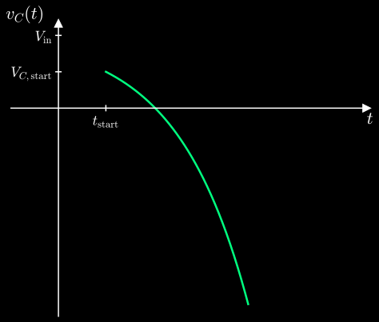
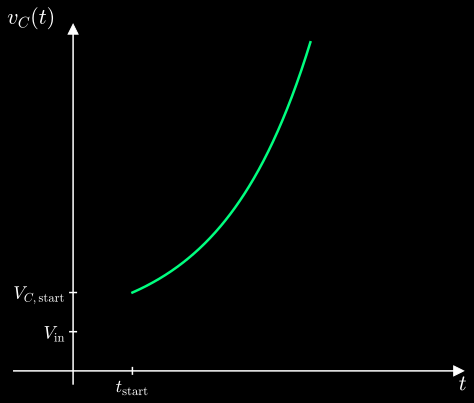
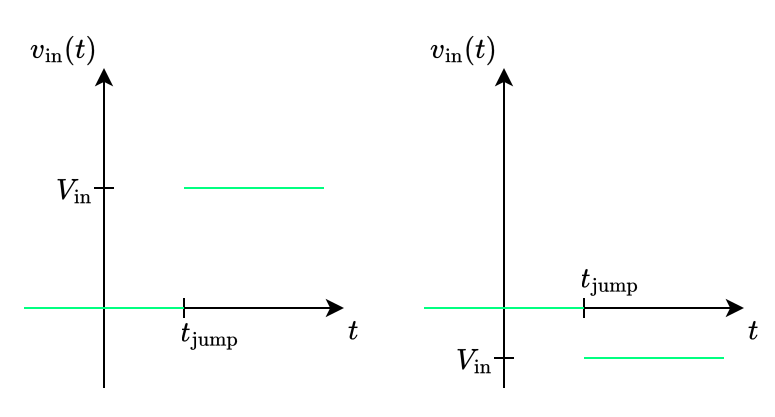

---
tags:
    - network-analysis
    - electrical-engineering
---

# RC Series Circuits

>[!DEFINITION] Definition: RC Series Circuit
>
>An **RC series circuit** is a [series circuit](./One-Ports/One-Port%20Series%20Circuits.md) of a [time-invariant](./One-Ports/Resistive%20One-Ports.md) [strictly linear resistive one-port](./One-Ports/Strictly%20Linear%20Resistive%20One-Ports.md) and a [time-invariant](./One-Ports/Capacitive%20One-Ports.md) [strictly linear capacitive one-port](./One-Ports/Strictly%20Linear%20Capacitive%20One-Ports.md).
>
>
>

We are interested in how $v_C(t)$ and $v_R(t)$ respond to various inputs $v(t) = v_{\text{in}}(t)$.

>[!THEOREM] Theorem: Governing Equation for $v_C(t)$
>
>The governing equation for $v_C(t)$ in an [RC series circuit](./RC%20Series%20Circuits.md) is the following:
>
>$$\frac{\mathrm{d}v_C}{\mathrm{d}t}(t) = -\frac{1}{RC} v_C(t) + \frac{1}{RC}v_{\text{in}}(t)$$
>
>>[!PROOF]-
>>
>>
>>
>>Using [Kirchhoff's voltage law](./Lumped%20Circuits.md#Kirchhoff's%20Voltage%20Law), we get:
>>
>>$$v_R(t) + v_C(t) = v_{\text{in}}(t)$$
>>
>>The [strictly linear resistive one-port](./One-Ports/Strictly%20Linear%20Resistive%20One-Ports.md) gives us the folliwng:
>>
>>$$v_R(t) = R i(t)$$
>>
>>The [strictly linear capacitive one-port](./One-Ports/Strictly%20Linear%20Capacitive%20One-Ports.md) tells us that $i(t)$ is the [derivative](../../Mathematics/Analysis/Real%20Analysis/Real%20Functions/Differentiability%20(Real%20Functions).md) of $v_C (t)$ multiplied by $C$:
>>
>>$$i(t) = C \frac{\mathrm{d}v_C}{\mathrm{d}t}(t)$$
>>
>>Plugging this into the [KVL](./Lumped%20Circuits.md#Kirchhoff's%20Voltage%20Law), we get:
>>
>>$$-v_{\text{in}}(t) + RC \frac{\mathrm{d}v_C}{\mathrm{d}t}(t) + v_C(t) = 0$$
>>
>>$$\frac{\mathrm{d}v_C}{\mathrm{d}t}(t) = -\frac{1}{RC} v_C(t) + \frac{1}{RC}v_{\text{in}}(t)$$
>>
>

>[!THEOREM] Theorem: Governing Equation for $v_R(t)$
>
>The governing equation for $v_R(t)$ in an [RC series circuit](./RC%20Series%20Circuits.md) is the following:
>
>$$\frac{\mathrm{d}v_R}{\mathrm{d}t}(t) = -\frac{1}{RC} v_R(t) + \frac{\mathrm{d}v_{\text{in}}}{\mathrm{d}t}(t)$$
>
>>[!PROOF]-
>>
>>
>>
>>Using [Kirchhoff's voltage law](./Lumped%20Circuits.md#Kirchhoff's%20Voltage%20Law), we get:
>>
>>$$v_R(t) + v_C(t) = v_{\text{in}}(t)$$
>>
>>Taking the [derivative](../../Mathematics/Analysis/Real%20Analysis/Real%20Functions/Differentiability%20(Real%20Functions).md) of both sides with respect to $t$, we obtain:
>>
>>$$\frac{\mathrm{d}v_R}{\mathrm{d}t}(t) + \frac{\mathrm{d}v_C}{\mathrm{d}t}(t) = \frac{\mathrm{d}v_{\text{in}}}{\mathrm{d}t}(t)$$
>>
>>The [strictly linear capacitive one-port](./One-Ports/Strictly%20Linear%20Capacitive%20One-Ports.md) gives us the following:
>>
>>$$i(t) = C \frac{\mathrm{d}v_C}{\mathrm{d}t}(t) \implies \frac{\mathrm{d}v_C}{\mathrm{d}t}(t) = \frac{1}{C} i(t)$$
>>
>>The [strictly linear resistive one-port](./One-Ports/Strictly%20Linear%20Resistive%20One-Ports.md) tells us that $v_R(t)$ is $i(t)$ multiplied by $R$:
>>
>>$$v_R(t) = R i(t) \implies i(t) = \frac{v_R(t)}{R}$$
>>
>>Substituting $i(t)$ into the capacitance equation gives:
>>
>>$$\frac{\mathrm{d}v_C}{\mathrm{d}t}(t) = \frac{1}{RC} v_R(t)$$
>>
>>Plugging this back into the differentiated [KVL](./Lumped%20Circuits.md#Kirchhoff's%20Voltage%20Law) equation, we get:
>>
>>$$\frac{\mathrm{d}v_R}{\mathrm{d}t}(t) + \frac{1}{RC} v_R(t) = \frac{\mathrm{d}v_{\text{in}}}{\mathrm{d}t}(t)$$
>>
>>$$\frac{\mathrm{d}v_R}{\mathrm{d}t}(t) = -\frac{1}{RC} v_R(t) + \frac{\mathrm{d}v_{\text{in}}}{\mathrm{d}t}(t)$$
>>
>

>[!DEFINITION] Definition: Time Constant
>
>We call $RC$ the **time constant** of the [RC series circuit](./RC%20Series%20Circuits.md).
>
>>[!NOTATION]
>>
>>$$\tau$$
>>
>

## General Input Response

The governing equations for $v_C(t)$ and $v_R(t)$ are a [first-order](../../Mathematics/Analysis/Real%20Analysis/Differential%20Equations/Ordinary%20Differential%20Equations/Real%20Ordinary%20Differential%20Equations.md), [autonomous](../../Mathematics/Analysis/Real%20Analysis/Differential%20Equations/Ordinary%20Differential%20Equations/Autonomous%20Systems/Autonomous%20Systems.md) [linear](../../Mathematics/Analysis/Real%20Analysis/Differential%20Equations/Ordinary%20Differential%20Equations/Linear%20Ordinary%20Differential%20Equations.md) [ordinary differential equations](../../Mathematics/Analysis/Real%20Analysis/Differential%20Equations/Ordinary%20Differential%20Equations/Real%20Ordinary%20Differential%20Equations.md). However, on their own, they are actually insufficient for determining $v_C(t)$ and $v_R(t)$ in response to $v_{\text{in}}(t)$. To determine $v_C(t)$ or $v_R(t)$ for all $t$ we also need to know the value $v_C(t_{\text{initial}}) = V_{C, \text{initial}}$ or $v_R(t_{\text{initial}}) = V_{R, \text{initial}}$ at least at one time $t_{\text{initial}}$. Since the [series circuit](./One-Ports/One-Port%20Series%20Circuits.md) relates $v_C(t)$ and $v_R(t)$ by $v_C(t) + v_R(t) = v_{\text{in}}(t)$, we actually need just one of $v_R(t_{\text{initial}})$ or $v_C(t_{\text{initial}})$ and can then easily calculate the other. The convention is to always use $v_C(t_{\text{initial}})$ and occasionally use $V_{R, \text{initial}}$ as a shortcut for $v_{\text{in}}(t_{\text{initial}}) - v_C(t_{\text{initial}})$. 

>[!THEOREM] Theorem: General Input Response for $v_C(t)$
>
>Under the [initial condition](../../Mathematics/Analysis/Real%20Analysis/Differential%20Equations/Ordinary%20Differential%20Equations/Initial%20Value%20Problems.md) $v_C(t_{\text{initial}}) = V_{C, \text{initial}}$, the [solution](../../Mathematics/Analysis/Real%20Analysis/Differential%20Equations/Ordinary%20Differential%20Equations/Initial%20Value%20Problems.md) for $v_C(t)$ is the following:
>
>$$v_C(t) = V_{C, \text{initial}} \exp\left(-\frac{t - t_{\text{initial}}}{RC}\right) + \int_{t_{\text{initial}}}^t \frac{1}{RC} v_{\text{in}}(t') \exp \left(-\frac{t - t'}{RC} \right) \, \mathrm{d}t'$$
>
>>[!PROOF]-
>>
>>TODO
>>
>

>[!THEOREM] Theorem: General Input Response for $v_R(t)$
>
>Under the [initial condition](../../Mathematics/Analysis/Real%20Analysis/Differential%20Equations/Ordinary%20Differential%20Equations/Initial%20Value%20Problems.md) $v_R(t_{\text{initial}}) = V_{R, \text{initial}}$, the [solution](../../Mathematics/Analysis/Real%20Analysis/Differential%20Equations/Ordinary%20Differential%20Equations/Initial%20Value%20Problems.md) for $v_R(t)$ is the following:
>
>$$v_R(t) = V_{R, \text{initial}} \exp\left(-\frac{t - t_{\text{initial}}}{RC}\right) + \int_{t_{\text{initial}}}^t \frac{\mathrm{d}v_{\text{in}}(t')}{\mathrm{d}t'} \exp \left(-\frac{t - t'}{RC} \right) \, \mathrm{d}t'$$
>
>>[!PROOF]-
>>
>>TODO
>>
>

Mathematically, the [solutions](../../Mathematics/Analysis/Real%20Analysis/Differential%20Equations/Ordinary%20Differential%20Equations/Initial%20Value%20Problems.md) are valid for all $t$. However, they are physically meaningful only for $t \ge t_{\text{initial}}$ because the history of the [RC series circuit](./RC%20Series%20Circuits.md) is generally unknown before $t_{\text{initial}}$.

### Zero-State Response

>[!DEFINITION] Definition: Zero-State Response
>
>The **zero-state response** of $v_C(t)$ is its response to $v_{\text{in}}(t)$ when $V_{C, \text{initial}}$ is zero.
>

>[!THEOREM] Theorem: Zero-State Response
>
>The [zero-state response](#Zero-State%20Response) of $v_C(t)$ is the following:
>
>$$v_C(t) = \int_{t_0}^t \frac{1}{RC} v_{\text{in}}(t') \exp\left(-\frac{t - t'}{RC}\right) \, \mathrm{d}t'$$
>
>>[!PROOF]-
>>
>>TODO
>>
>

We see that the [zero-state response](#Zero-State%20Response) of $v_C(t)$ is just the second term of the [general input response](#General%20Input%20Response).

## DC Input Response

Suppose that $v_{\text{in}}(t)$ remains constant starting at some moment $t_{\text{start}}$:

$$v_{\text{in}}(t) = V_{\text{in}} \qquad t \ge t_{\text{start}}$$

For $t \ge t_{\text{start}}$, the state equation reduces to a [first-order linear ordinary differential equation with constant coefficients](../../Mathematics/Analysis/Real%20Analysis/Differential%20Equations/Ordinary%20Differential%20Equations/First-Order%20Linear%20Ordinary%20Differential%20Equations.md#Constant%20Coefficients):

$$\frac{\mathrm{d}v_C}{\mathrm{d}t}(t) = -\frac{1}{RC} v_C(t) + \frac{V_{\text{in}}}{RC}$$

If the [voltage](./One-Ports/One-Ports.md) across $C$ at $t_{\text{start}}$ is $V_{C, \text{start}}$, we obtain the following [first-order linear initial value problem](../../Mathematics/Analysis/Real%20Analysis/Differential%20Equations/Ordinary%20Differential%20Equations/First-Order%20Linear%20Initial%20Value%20Problems.md)

$$\frac{\mathrm{d}v_C}{\mathrm{d}t}(t) = -\frac{1}{RC} v_C(t) + \frac{V_{\text{in}}}{RC} \qquad v_C(t_{\text{start}}) = V_{C, \text{start}}$$

with the following unique [solution](../../Mathematics/Analysis/Real%20Analysis/Differential%20Equations/Ordinary%20Differential%20Equations/Initial%20Value%20Problems.md) for all $t \ge t_{\text{start}}$:

$$v_C(t) = V_{\text{in}} + \left( V_{C, \text{start}} - V_{\text{in}} \right) \exp\left(-\frac{t - t_{\text{start}}}{RC}\right)$$

If $V_{C, \text{start}} = V_{\text{in}}$, then $v_C(t)$ remains at $V_{C, \text{start}}$ for all $t \ge t_{\text{start}}$. For $V_{C, \text{start}} \ne V_{\text{in}}$, the overall behavior of $v_C(t)$ for $t \ge t_{\text{start}}$ is dictated by the algebraic sign of $RC$.

### Stable Case

The **stable case** occurs when $RC \gt 0$. The [exponential](../../Mathematics/Analysis/Real%20Analysis/Real%20Functions/Real%20Exponentiation.md) starts at $1$ and goes towards $0$ as $t$ increases. The result is that $v_C(t)$ moves away from $V_{C, \text{start}}$ and [approaches](../../Mathematics/Analysis/Real%20Analysis/Real%20Functions/Limits%20(Real%20Functions).md) $V_{\text{in}}$ for $t \to \infty$:

$$\lim_{t \to \infty} v_C(t) = V_{\text{in}}$$

This process is [exponential](../../Mathematics/Analysis/Real%20Analysis/Real%20Functions/Real%20Exponentiation.md) and happens very quickly. Within a period of just one $RC$ from $t_{\text{start}}$, $v_C(t)$ has moved approximately two-thirds of $|V_{\text{in}} - V_{C, \text{start}}|$ away from $V_{C, \text{start}}$ and towards $V_{\text{in}}$:

$$\begin{aligned} v(t_{\text{start}} + RC) & = V_{\text{in}} + (V_{C, \text{start}} - V_{\text{in}}) \exp\left(-\frac{t_{\text{start}} + RC - t_{\text{start}}}{RC}\right) \\ & = V_{\text{in}} + (V_{C, \text{start}} - V_{\text{in}}) \mathrm{e}^{-1} \\ & \approx V_{\text{in}} + (V_{C, \text{start}} - V_{\text{in}}) \cdot 0.37 \\ & \approx V_{\text{in}} + (V_{C, \text{start}} - V_{\text{in}})\left( 1 - \frac{2}{3} \right) \\ & = V_{C, \text{start}} + \frac{2}{3}(V_{\text{in}} - V_{C, \text{start}})\end{aligned}$$

For practical purposes, we can consider this value to be reached after a period of just $7$ [time constants](./RC%20Series%20Circuits.md), since the error then is just $10^{-3} |V_{C, t_0} - V_{\text{in}}|$.

>[!EXAMPLE]-
>
>Consider the following model for an [operational amplifier](../Analog%20Circuits/Amplifiers/Operational%20Amplifiers.md) in its [amplification region](../Analog%20Circuits/Amplifiers/Operational%20Amplifiers.md) using a [strictly linear resistive one-port](./One-Ports/Strictly%20Linear%20Resistive%20One-Ports.md), a [strictly linear capacitive one-port](./One-Ports/Strictly%20Linear%20Capacitive%20One-Ports.md) and a [VCVS](../Analog%20Circuits/Sources.md) such that $RC \gt 0$:
>
>
>
>Consider the following [network](./Lumped%20Networks.md) using this model:
>
>
>
>By using [Kirchhoff's voltage law](./Lumped%20Circuits.md) and the [strictly linear resistive one-port](./One-Ports/Strictly%20Linear%20Resistive%20One-Ports.md), we get:
>
>$$v_d(t) = V_{\text{in}} - v(t)$$
>
>$$-A v_d(t) + R i(t) + v(t) = 0$$
>
>By substituting the first result into the second, we obtain:
>
>$$-A (V_{\text{in}} - v(t)) + R i(t) + v(t) = 0$$
>
>The [strictly linear capacitive one-port](./One-Ports/Strictly%20Linear%20Capacitive%20One-Ports.md) yields the following:
>
>$$i(t) = C \frac{\mathrm{d}v}{\mathrm{d}t}(t)$$
>
>Substituting this into the previous result, we get:
>
>$$-A (V_{\text{in}} - v(t)) + R C \frac{\mathrm{d}v}{\mathrm{d}t}(t) + v(t) = 0$$
>
>$$-A V_{\text{in}} + Av(t) + R C \frac{\mathrm{d}v}{\mathrm{d}t}(t) + v(t) = 0$$
>
>$$\frac{\mathrm{d}v}{\mathrm{d}t}(t) = -\frac{A + 1}{RC} v(t) + \frac{A}{RC} V_{\text{in}}$$
>
>For values of $A$ which are much bigger than $1$, we know that $\frac{A + 1}{RC}$ and $\frac{A}{RC}$ are approximately equal because of the following [limit](../../Mathematics/Analysis/Real%20Analysis/Real%20Functions/Limits%20(Real%20Functions).md):
>
>$$\lim_{A \to \infty} \left( \frac{A + 1}{RC} : \frac{A}{RC} \right) = \lim_{A \to \infty} \frac{A + 1}{A} = 1$$
>
>Therefore, we get the following for $A \gg 1$:
>
>$$\frac{\mathrm{d}v}{\mathrm{d}t}(t) = -\frac{A}{RC} v(t) + \frac{A}{RC} V_{\text{in}}$$
>
>This is again a [first-order linear ordinary differential equation with constant coefficients](../../Mathematics/Analysis/Real%20Analysis/Differential%20Equations/Ordinary%20Differential%20Equations/First-Order%20Linear%20Ordinary%20Differential%20Equations.md#Constant%20Coefficients) and it yields the following [solution](../../Mathematics/Analysis/Real%20Analysis/Differential%20Equations/Ordinary%20Differential%20Equations/Initial%20Value%20Problems.md) combined with the [initial condition](../../Mathematics/Analysis/Real%20Analysis/Differential%20Equations/Ordinary%20Differential%20Equations/Initial%20Value%20Problems.md) $v(t_0) = V_{C, t_0}$:
>
>$$v(t) = V_{\text{in}} + (V_{C, t_0} - V_{\text{in}}) \exp\left(-\frac{A}{RC}(t-t_0)\right)$$
>
>Essentially, this [network](./Lumped%20Networks.md) behaves like an [RC series circuit](./RC%20Series%20Circuits.md) but with $RC = \frac{RC}{A}$ instead of $RC = RC$.
>

### Unstable Case

The **unstable case** occurs when $RC \lt 0$. The [exponential](../../Mathematics/Analysis/Real%20Analysis/Real%20Functions/Real%20Exponentiation.md) starts at $1$ and blows off either to $-\infty$ or $+\infty$ as $t$ increases. The result is that $v_C(t)$ moves away from both $V_{\text{in}}$ and $V_{C, \text{start}}$ and [approaches](../../Mathematics/Analysis/Real%20Analysis/Real%20Functions/Limits%20(Real%20Functions).md) either $-\infty$ or $+\infty$ for $t \to \infty$:

- If $V_{C, \text{start}} \lt V_{\text{in}}$, then $v_C$ [approaches](../../Mathematics/Analysis/Real%20Analysis/Real%20Functions/Limits%20(Real%20Functions).md) $-\infty$ for $t \to \infty$.

$$V_{C, \text{start}} \lt V_{\text{in}} \implies \lim_{t \to \infty} v_C(t) = -\infty$$

- If $V_{C, \text{start}} \gt V_{\text{in}}$, then $v_C$ [approaches](../../Mathematics/Analysis/Real%20Analysis/Real%20Functions/Limits%20(Real%20Functions).md) $+\infty$ for $t \to \infty$.

$$V_{C, \text{start}} \gt V_{\text{in}} \implies \lim_{t \to \infty} v_C(t) = +\infty$$

>[!EXAMPLE]- 
>
>Consider the following model for an [operational amplifier](../Analog%20Circuits/Amplifiers/Operational%20Amplifiers.md) in its [amplification region](../Analog%20Circuits/Amplifiers/Operational%20Amplifiers.md) using a [strictly linear resistive one-port](./One-Ports/Strictly%20Linear%20Resistive%20One-Ports.md), a [strictly linear capacitive one-port](./One-Ports/Strictly%20Linear%20Capacitive%20One-Ports.md) and a [VCVS](../Analog%20Circuits/Sources.md) such that $RC \gt 0$:
>
>
>
>Consider the following [network](./Lumped%20Networks.md) using this model:
>
>
>
>By using [Kirchhoff's voltage law](./Lumped%20Circuits.md) and the [strictly linear resistive one-port](./One-Ports/Strictly%20Linear%20Resistive%20One-Ports.md), we get:
>
>$$v_d(t) = v(t) - V_{\text{in}}$$
>
>$$-A v_d(t) + R i(t) + v(t) = 0$$
>
>By substituting the first result into the second, we obtain:
>
>$$-A (v(t) - V_{\text{in}}) + R i(t) + v(t) = 0$$
>
>The [strictly linear capacitive one-port](./One-Ports/Strictly%20Linear%20Capacitive%20One-Ports.md) yields the following:
>
>$$i(t) = C \frac{\mathrm{d}v}{\mathrm{d}t}(t)$$
>
>Substituting this into the previous result, we get:
>
>$$-A (v(t) - V_{\text{in}}) + R C \frac{\mathrm{d}v}{\mathrm{d}t}(t) + v(t) = 0$$
>
>$$-A v(t) + A V_{\text{in}} + R C \frac{\mathrm{d}v}{\mathrm{d}t}(t) + v(t) = 0$$
>
>$$\frac{\mathrm{d}v}{\mathrm{d}t}(t) = \frac{A - 1}{RC} v(t) - \frac{A}{RC} V_{\text{in}}$$
>
>For values of $A$ which are much bigger than $1$, we know that $\frac{A - 1}{RC}$ and $\frac{A}{RC}$ are approximately equal because of the following [limit](../../Mathematics/Analysis/Real%20Analysis/Real%20Functions/Limits%20(Real%20Functions).md):
>
>$$\lim_{A \to \infty} \left( \frac{A - 1}{RC} : \frac{A}{RC} \right) = \lim_{A \to \infty} \frac{A - 1}{A} = 1$$
>
>Therefore, we get the following for $A \gg 1$:
>
>$$\frac{\mathrm{d}v}{\mathrm{d}t}(t) = \frac{A}{RC} v(t) - \frac{A}{RC} V_{\text{in}}$$
>
>This is again a [first-order linear ordinary differential equation with constant coefficients](../../Mathematics/Analysis/Real%20Analysis/Differential%20Equations/Ordinary%20Differential%20Equations/First-Order%20Linear%20Ordinary%20Differential%20Equations.md#Constant%20Coefficients) and it yields the following [solution](../../Mathematics/Analysis/Real%20Analysis/Differential%20Equations/Ordinary%20Differential%20Equations/Initial%20Value%20Problems.md) combined with the [initial condition](../../Mathematics/Analysis/Real%20Analysis/Differential%20Equations/Ordinary%20Differential%20Equations/Initial%20Value%20Problems.md) $v(t_0) = V_{C, t_0}$:
>
>$$v(t) = V_{\text{in}} + (V_{C, t_0} - V_{\text{in}}) \exp\left(\frac{A}{RC}(t-t_0)\right)$$
>
>Essentially, this [network](./Lumped%20Networks.md) behaves like an [RC series circuit](./RC%20Series%20Circuits.md) but with $RC = -\frac{RC}{A}$ instead of $RC = RC$. Since $RC \gt 0$ and $A \gt 0$, we have $RC \lt 0$.
>

### Zero-Input Response

>[!DEFINITION] Definition: Zero-Input Response
>
>The **zero-input response** of $v_C(t)$ and $v_R(t)$ is their response when $v_{\text{in}}(t)$ is zero.
>

The [zero-input response](#Zero-Input%20Response) is just a special case of the [DC input response](#DC%20Input%20Response) where $v_{\text{in}}(t) = 0$ for all $t$.

>[!THEOREM] Theorem: Zero-Input Response of $v_C(t)$ and $v_R(t)$
>
>Under the [initial condition](../../Mathematics/Analysis/Real%20Analysis/Differential%20Equations/Ordinary%20Differential%20Equations/Initial%20Value%20Problems.md) $v_C(t_{\text{initial}}) = V_{C, \text{initial}}$, the [zero-input response](#Zero-Input%20Response) of $v_C(t)$ and $v_R(t)$ are the following:
>
>$$v_C(t) = V_{C, \text{initial}} \exp\left(-\frac{t - t_{\text{initial}}}{RC}\right)$$
>
>$$v_R(t) = -V_{C, \text{initial}} \exp\left(-\frac{t - t_{\text{initial}}}{RC}\right)$$
>
>>[!PROOF]-
>>
>>This is obtained directly by substitution $0\, \mathrm{V}$ into the [DC input response](#DC%20Input%20Response).
>>
>

We see that $v_C(t)$ and $v_R(t)$ exhibit the exact opposite behavior with respect to each other. Furthermore, the [zero-input response](#Zero-Input%20Response) is just the first term of the respective [general input response](#General%20Input%20Response).

## Step Response

The **step response** occurs when $v_{\text{in}}(t)$ is initially a constant zero and then jumps to some $V_{\text{in}}$ at some moment $t_{\text{jump}}$ and remains there:

$$v_{\text{in}}(t) = \begin{cases} V_{\text{in}}, & t \ge t_{\text{jump}} \\ 0 \, \mathrm{V}, & t \lt t_{\text{jump}} \end{cases}$$

This can be alternatively written using the [Heaviside step function](../../Mathematics/Analysis/Real%20Analysis/Real%20Functions/Heaviside%20Step%20Function.md) $\sigma$ with the convention that $\sigma(0) = 1$:

$$v_{\text{in}}(t) = V_{\text{in}} \cdot \sigma(t)$$

Suppose that the [voltage](./One-Ports/One-Ports.md) across $C$ at $t_{\text{jump}}$ is $V_{C, \text{jump}}$. We have the following for $v_C(t)$:

$$v_C(t) = \begin{cases} V_{\text{in}} + \left(V_{C, \text{jump}} -V_{\text{in}}\right) \exp\left(-\frac{t - t_{\text{jump}}}{RC}\right), & t \ge t_{\text{jump}} \\ V_{C, \text{jump}} \exp\left(-\frac{t -t_{\text{jump}}}{RC}\right), & t \lt t_{\text{jump}} \end{cases}$$

For the special case where $V_{C, \text{jump}} = 0\,\mathrm{V}$, this reduces to the following:

$$v_C(t) = V_{\text{in}} \left( 1 - \exp\left(-\frac{t - t_{\text{jump}}}{RC}\right) \right) \sigma(t - t_{\text{jump}})$$

## Finite Pulse Response

Consider an input $v_{\text{in}}(t)$ which is a rectangular pulse of height $V_{\text{in}}$ starting at time $t_{\text{PS}}$ and ending at time $t_{\text{PE}}$ and is zero otherwise. Its duration is $\Delta = t_{\text{PE}} - t_{\text{PS}}$:

$$v_{\text{in}}(t) = \begin{cases} 0, & t \lt t_{\text{PS}} \\ V_{\text{in}}, & t_{\text{PS}} \le t \le t_{\text{PE}} \\ 0, & t \ge t_{\text{PE}} \end{cases}$$

Before the pulse, $v_{\text{in}}(t)$ is just a [constant](#Constant%20Input%20Response) $0 \, \mathrm{V}$. For $t \lt t_{\text{PS}}$, $v_C(t)$ evolves accordingly and reaches some [voltage](./One-Ports/One-Ports.md) $V_{C, \text{PS}}$ at $t_{\text{PS}}$.

During the pulse, we have a [constant input](#Constant%20Input%20Response) $v_{\text{in}}(t) = V_{\text{in}}$ and $v_C(t)$ evolves as follows:

$$v_C(t) = V_{\text{in}} + \left( V_{C, \text{PS}} - V_{\text{in}} \right) \exp\left(-\frac{t - t_{\text{PS}}}{RC}\right) \qquad t_{\text{PS}} \le t \lt t_{\text{PE}}$$

The sign of $V_{\text{in}}$ is irrelevant, but the signs of $RC$ and $V_{C, \text{PS}} - V_{\text{in}}$ matter a lot.

For $RC \gt 0$ and $V_{C, \text{PS}} \lt V_{\text{in}}$:
- The term $V_{C, \text{PS}} - V_{\text{in}}$ is negative.
- The [exponential](../../Mathematics/Analysis/Real%20Analysis/Real%20Functions/Real%20Exponentiation.md) begins at $1$ and decays towards $0$ as $t$ increases.
- Therefore, the entire negative offset term decays towards $0$.
- The result is that $v_C(t)$ rises from $V_{C, \text{PS}}$ towards $V_{\text{in}}$ in an exponentially decaying manner as $t$ increases.

For $RC \gt 0$ and $V_{C, \text{PS}} \gt V_{\text{in}}$:
- The term $V_{C, \text{PS}} - V_{\text{in}}$ is positive.
- The [exponential](../../Mathematics/Analysis/Real%20Analysis/Real%20Functions/Real%20Exponentiation.md) begins at $1$ and decays towards $0$ as $t$ increases.
- Therefore, the entire positive offset term decays towards $0$.
- The result is that $v_C(t)$ falls from $V_{C, \text{PS}}$ towards $V_{\text{in}}$ in an exponentially decaying manner as $t$ increases.

For $RC \lt 0$ and $V_{C, \text{PS}} \lt V_{\text{in}}$:
- The term $V_{C, \text{PS}} - V_{\text{in}}$ is negative.
- The [exponential](../../Mathematics/Analysis/Real%20Analysis/Real%20Functions/Real%20Exponentiation.md) begins at $1$ and grows towards $\infty$ as $t$ increases.
- Therefore, the entire negative offset term grows towards $-\infty$.
- The result is that $v_C(t)$ falls from $V_{C, \text{PS}}$ towards $-\infty$ in an exponentially growing manner as $t$ increases.

For $RC \lt 0$ and $V_{C, \text{PS}} \gt V_{\text{in}}$:
- The term $V_{C, \text{PS}} - V_{\text{in}}$ is positive.
- The [exponential](../../Mathematics/Analysis/Real%20Analysis/Real%20Functions/Real%20Exponentiation.md) begins at $1$ and grows towards $\infty$ as $t$ increases.
- Therefore, the entire positive offset term grows towards $\infty$.
- The result is that $v_C(t)$ rises from $V_{C, \text{PS}}$ towards $\infty$ in an exponentially growing manner as $t$ increases.

## Unit Impulse Response

The **unit impulse response** is what happens when $v_{\text{in}}(t)$ is a very powerful but very short positive spike occuring around $t = 0$. Modelling this is a bit different because there is no [function](../../Mathematics/Analysis/Real%20Analysis/Real%20Functions/Real%20Functions.md) which perfectly describes such a thing. Instead, we model $v_{\text{in}}(t)$ as a specific [finite pulse response](#Finite%20Pulse%20Response)

$$v_{\text{in}}(t) = \delta_{\Delta}(t) = \begin{cases} 0, & t \lt 0 \\ \frac{1}{\Delta}, & 0 \le t \lt + \Delta \\ 0, & t \ge\Delta \end{cases}$$

of height $\frac{1}{\Delta}$ and duration $\Delta$ and then analyze what happens as $\Delta$ becomes smaller and smaller.

If the [voltage](./One-Ports/One-Ports.md) across $C$ at $t_{\text{PS}}$ is $V_{C, \text{PS}}$