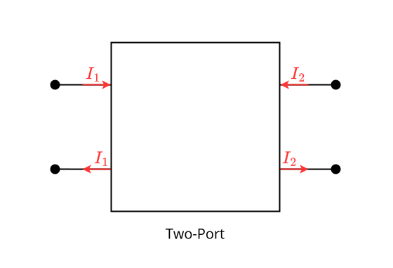

# Two-Ports

>[!DEFINITION] Definition: Two-Port
>
>A **two-port** is a [port](../Ports.md) with four [terminals](../Network%20Analysis.md).
>
>
>
>>[!DEFINITION] Definition: Input Port
>>
>>The [port](../Ports.md) with $i_1$ is known as the **input port**.
>>
>
>>[!DEFINITION] Definition: Output Port
>>
>>The [port](../Ports.md) with $i_2$ is known as the **output port**. 
>>
>

## I-V Characteristic

The [I-V characteristic](../Ports.md#I-V%20Characteristic) of a [two-port](./Two-Ports.md) reduces to the following [set](../../../Mathematics/Set%20Theory/Sets.md), where $\mathcal{F}_1$ and $\mathcal{F}_2$ are the [I-V characteristics](../One-Ports/One-Ports.md#I-V%20Characteristic.md) of the constituent [one-ports](../One-Ports/One-Ports.md):

$$
\mathcal{F} \overset{\text{def}} = \left\{ \left( \begin{bmatrix} v_1 \\ v_2 \end{bmatrix}, \begin{bmatrix}i_1 \\ i_2\end{bmatrix}\right) : (v_1, i_1) \in \mathcal{F}_1 \text{ and } (v_2, i_2) \in \mathcal{F}_2 \right\}
$$

### Representations

We define four additional [explicit representations](../Ports.md#Representations) of the [I-V characteristic](#I-V%20Characteristic) $\mathcal{F}$ of a [two-port](./Two-Ports.md):

>[!DEFINITION] Definition: Hybrid Representation
>
>A **hybrid representation** is any [function](../../../Mathematics/Analysis/Real%20Analysis/Real%20Vector%20Fields/Real%20Vector%20Fields.md) $h$ with the following property:
>
>$$
>\begin{bmatrix}v_1 \\ i_2\end{bmatrix} = H\left(\begin{bmatrix} i_1 \\ v_2 \end{bmatrix}\right)
>$$
>
>>[!DEFINITION] Definition: Hybrid Matrix
>>
>>If $H$ is a [linear transformation](../../../Mathematics/Analysis/Functional%20Analysis/Linearity/Linearity%20(Functions).md), then its [standard matrix representation](../../../Mathematics/Analysis/Functional%20Analysis/Linearity/Linearity%20(Functions).md) is known as a **hybrid matrix** and its components as **hybrid parameters**.
>>
>

>[!DEFINITION] Definition: Inverse Hybrid Representation
>
>An **inverse hybrid representation** is any [function](../../../Mathematics/Analysis/Real%20Analysis/Real%20Vector%20Fields/Real%20Vector%20Fields.md) $H^{-1}$ with the following property:
>
>$$
>\begin{bmatrix}i_1 \\ v_2\end{bmatrix} = H'\left(\begin{bmatrix} v_1 \\\ i_2 \end{bmatrix}\right)
>$$
>
>>[!NOTATION]
>>
>>Sometimes, we also denote $H'$ by $H^{-1}$.
>>
>
>>[!DEFINITION] Definition: Inverse Hybrid Matrix
>>
>>If $H^{-1}$ is a [linear transformation](../../../Mathematics/Analysis/Functional%20Analysis/Linearity/Linearity%20(Functions).md), then its [standard matrix representation](../../../Mathematics/Analysis/Functional%20Analysis/Linearity/Linearity%20(Functions).md) is known as an **inverse hybrid matrix** and its components as **inverse hybrid parameters**.
>>
>

>[!DEFINITION] Definition: Forwards Transmission Representation
>
>A **forwards transmission representation** is any [function](../../../Mathematics/Analysis/Real%20Analysis/Real%20Vector%20Fields/Real%20Vector%20Fields.md) $T$ with the following property:
>
>$$
>\begin{bmatrix} v_1 \\ i_1 \end{bmatrix} = T\left(\begin{bmatrix}v_2 \\ -i_2\end{bmatrix}\right)
>$$
>
>>[!DEFINITION] Definition: Forwards Transmission Matrix
>>
>>If $T$ is a [linear transformation](../../../Mathematics/Analysis/Functional%20Analysis/Linearity/Linearity%20(Functions).md), then its [standard matrix representation](../../../Mathematics/Analysis/Functional%20Analysis/Linearity/Linearity%20(Functions).md) is known as a **forwards transmission matrix** and its components as **forwards transmission parameters**.
>>
>

>[!DEFINITION] Definition: Backwards Transmission Representation
>
>An **backwards transmission representation** is any [function](../../../Mathematics/Analysis/Real%20Analysis/Real%20Vector%20Fields/Real%20Vector%20Fields.md) $T^{-1}$ with the following property:
>
>$$
>\begin{bmatrix} v_2 \\ -i_2 \end{bmatrix} = T'\left(\begin{bmatrix}v_1 \\ i_1\end{bmatrix}\right)
>$$
>
>>[!NOTATION]
>>
>>Sometimes, we also denote $T'$ by $T^{-1}$.
>>
>
>>[!DEFINITION] Definition: Backwards Transmission Matrix
>>
>>If $T$ is a [linear transformation](../../../Mathematics/Analysis/Functional%20Analysis/Linearity/Linearity%20(Functions).md), then its [standard matrix representation](../../../Mathematics/Analysis/Functional%20Analysis/Linearity/Linearity%20(Functions).md) is known as a **backwards transmission matrix** and its components as **backwards transmission parameters**.
>>
>
>>[!WARNING] Warning:
>>
>>Some questionable people define the [backwards transmission representation](#I-V%20Characteristic) in the following ***non-equivalent*** way:
>>
>>$$
>>\begin{bmatrix} v_2 \\ i_2 \end{bmatrix} = T'\left(\begin{bmatrix}v_1 \\ -i_1\end{bmatrix}\right)
>>$$
>>
>

# Symmetry

>[!DEFINITION] Definition: Symmetry
>
>A [two-port](./Two-Ports.md) with  [I-V characteristic](#I-V%20Characteristic) $\mathcal{F}$ is **symmetrical** or **reversible** if is has the following property:
>
>$$
>\begin{bmatrix}v_1 \\ v_2 \\ i_1 \\ i_2\end{bmatrix} \in \mathcal{F} \implies \begin{bmatrix}v_2 \\ v_1 \\ i_2 \\ i_1\end{bmatrix} \in \mathcal{F} 
>$$
>

Intuitively, a [symmetrical](#Symmetry) [two-port](./Two-Ports.md) is one for which the [input](./Two-Ports.md) and [output](./Two-Ports.md) are indistinguishable. It behaves the same way if you "turn it around".

>[!DEFINITION] Definition: Antisymmetry
>
>A [two-port](./Two-Ports.md) with  [I-V characteristic](#I-V%20Characteristic) $\mathcal{F}$ is **antisymmetrical** if it is [dual](../Ports.md#Duality) to some [two-port](./Two-Ports.md) $\mathcal{F}^d$ with the following property:
>
>$$
>\begin{bmatrix}v_1 \\ v_2 \\ i_1 \\ i_2\end{bmatrix} \in \mathcal{F} \implies \begin{bmatrix}v_2 \\ v_1 \\ i_2 \\ i_1\end{bmatrix} \in \mathcal{F}_d 
>$$
>

Intuitively, an [antisymmetrical](#Symmetry) [two-port](./Two-Ports.md) is one for which the reversing the [input](./Two-Ports.md) and [output](./Two-Ports.md) results in one of its [dual](../Ports.md#Duality) [two-ports](./Two-Ports.md), i.e. it behaves as one of its [duals](../Ports.md#Duality) when you "turn it around".