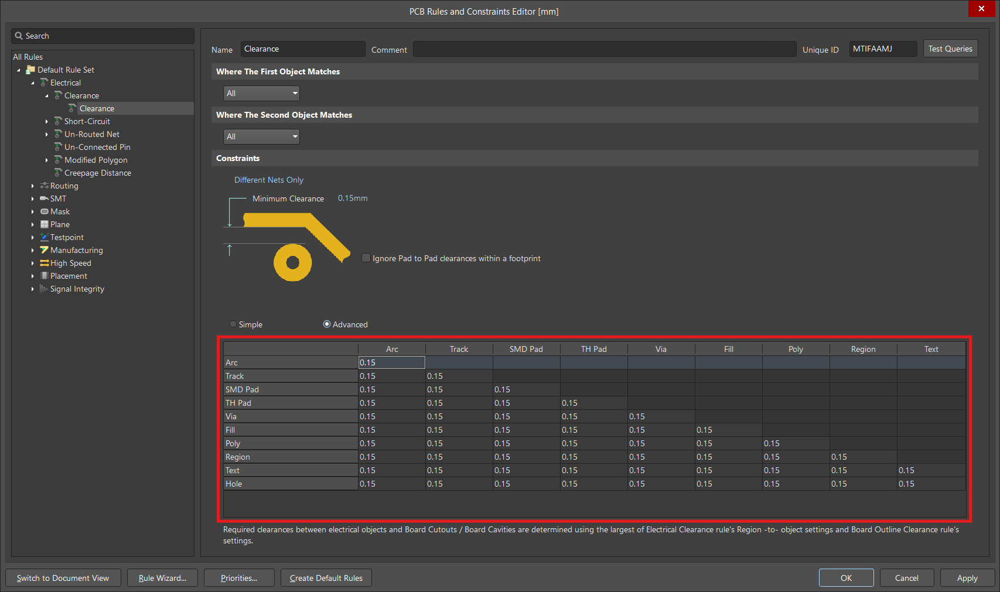

---
tags:
    - printed-circuit-boards
    - electrical-engineering
---

# PCB Design Rules

**PCB design rules** are the set of constraints one must adhere to when designing and laying out a [PCB](./Printed%20Circuit%20Board.md). Setting up [PCB design rules](./PCB%20Design%20Rules.md) should be the first step in the design process after specifying the [stack-up](./Printed%20Circuit%20Board.md#Stack-Up). The vast majority of these rules will be based on the manufacturer's capabilities, since they pertain to physical constraints, while the rest of the rules are a consequence of the desired functionality.

>[!TIP] Tip: Avoid Absolute Limits
>
>Manufacturers always specify the absolute limits which they are capable of. However, one should avoid these as much as possible because they come with lower yields and increased costs.
>

## Clearance Constraints

**Clearance constraints** are the minimum allowable distances between various things on a [PCB](./Printed%20Circuit%20Board.md). These are based on the manufacturer's capabilities. Unless strictly required by the design, one should always add a safety margin on top of the limits listed by the manufacturer. 

>[!TIP] Tip: Safety Margin Rule of Thumb
>
>- [Trace](./Traces.md) / [pad](./Pads.md) / [polygon pour](./Polygon%20Pours.md) to [trace](./Traces.md) / [pad](./Pads.md) / [polygon pour](./Polygon%20Pours.md): +0.025 to +0.05 mm (+1 to +2 mils).
>- [Trace](./Traces.md) / [pad](./Pads.md) / [polygon pour](./Polygon%20Pours.md) to [via](./Via.md) / hole: +0.075 to +0.125mm (+3 to +5 mils).
>- Exposed copper to [silkscreen](./Silkscreen.md): +0.05 to +0.075 mm (+2 to +3 mils).
>- Copper to board edge: +0.25 to +0.50 mm. 
>

One common way to specify [clearance constraints](#Clearance%20Constraints) in CAD software is using a table known as a **clearance matrix**. Each type of object which the constraint can apply to is assigned both a row and a column. The value inside a cell is what specifies the constraint for the minimum allowed distance between the types of objects corresponding to the cell's row and column.

>[!EXAMPLE]- Example: Altium Clearance Matrix
>
>Following is a clearance matrix inside [Altium Designer](https://www.altium.com/altium-designer) (values should not be taken seriously).
>
>
>

## Size Constraints

**Size constraints** are the allowable sizes for the various things on a [PCB](./Printed%20Circuit%20Board.md). These are based on the manufacturer's capabilities and are typically specified as a minimum and often also a maximum value. Most CAD software also have offer the option to specify a "preferred" value in the range between the minimum and maximum. This is then used simply as the default for various operations like placing new [traces](./Traces.md) or [vias](./Via.md). A safety margin should be added to the manufacturer's minimum or subtracted from the maximum, respectively. 

>[!TIP] Tip: Safety Margin Rule of Thumb
>
>- Minimum [trace width](./Traces.md): +0.025 to +0.05 mm (+1 to +2 mils).
>- Minimum diameter of mechanically drilled hole: +0.10 mm (+4 mils).
>- Minimum [annular ring size](./Via.md): +0.05 mm (+2 mils).
>- Minimum [SMD pad](./Pads.md) size: +0.05 mm per edge (+2 mils per edge).
>

