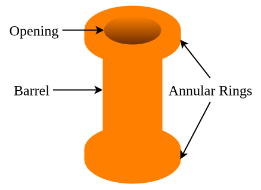

---
tags:
    - printed-circuit-boards
    - electrical-engineering
---

# Via

A **vertical interconnect access** (**via**) is a tunnel inside the structure of a [PCB](./Printed%20Circuit%20Board.md) which connects two or more conductive layers. 

The outline of the tunnel is called the **barrel** and is made of copper. Connections to conductive layers happen via rings of copper around the barrel known as an **annular rings**.

The most main mechanical characteristics of a [via](./Via.md) are the following:

- **via diameter** / **drill diameter**- the diameter of the opening inside the tunnel;
- **annular ring width** (often just called **annular ring**) - the distance between the inner and the outer edge of an [annular ring](./Via.md);
- **pad diameter** - the distance from the center of the opening to the outer edge of an [annular ring](./Via.md).

## Tenting

**Tenting** is the process of covering an exposed [via](./Via.md) opening and its [annular ring](./Via.md) with [solder mask](./Solder%20Mask.md). 

The main advantage of tenting is that it isolates the [via](./Via.md) from the external environment, thus preventing solder bridges and short circuits. It is very common in production boards. However, tenting is usually avoided during prototyping to allow [vias](./Via.md) to serve as testing pads.

On its own, tenting does not involve additional costs and is generally reliable for [vias](./Via.md) with a [drill diameter](./Via.md) of up to $0.38\,\mathrm{mm}$ ($15 \,\mathrm{mil}$). Some manufacturers may be able to tent larger [vias](./Via.md), but the process becomes increasingly error prone because [solder mask](./Solder%20Mask.md) can drip into the [barrel](./Via.md) instead of covering the opening. This can cause various defects during assembly and even after that by gradually corroding the [via](./Via.md) from the inside. Such [vias](./Via.md) should be [plugged](#Plugging) instead of [tented](#Tenting).

## Plugging

