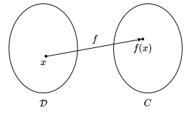

---
tags:
    - functional-analysis
    - analysis
    - mathematics
---

# Functions

>[!DEFINITION] Definition: Function
>
>Let $\mathcal{D}$ and $C$ be [sets](../../Set%20Theory/Sets.md).
>
>A **function** from $\mathcal{D}$ to $C$ is a [left total](TODO) [right-unique relation](../../Set%20Theory/Relations.md) $f \subseteq \mathcal{D} \times C$.
>
>>[!NOTATION]
>>
>>We write the [relation](../../Set%20Theory/Relations.md) $f$ as $f: \mathcal{D} \to C$ instead of $f \subseteq \mathcal{D} \times C$. Given some $x \in X$, we use $f(x)$ to denote its corresponding $y \in C$. Moreover, we write $y = f(x)$ instead of $x\, f \, y$.
>>
>
>
>
>
>>[!DEFINITION] Definition: Domain
>>
>>We call $\mathcal{D}$ the **domain** of $f$.
>>
>
>>[!DEFINITION] Definition: Codomain
>>
>>We call $C$ the **codomain** of $f$.
>>
>
>>[!DEFINITION] Definition: Image
>>
>>The **image** of $f$ is the [set](../../Set%20Theory/Sets.md) of all $y \in C$ for which there is at least one $x \in \mathcal{D}$ such that $y = f(x)$.
>>
>>$$
>>\{f(x) \mid x \in D\}
>>$$
>>
>>
>>
>>>[!NOTATION]
>>>
>>>$$
>>>f(\mathcal{D}) \qquad f[\mathcal{D}]
>>>$$
>>>
>>
>>>[!INTUITION]
>>>
>>>The image of a function is essentially the set of all values in $C$ which $f$ can produce.
>>>
>>
>
>>[!INTUITION]
>>
>>A function $f$ is just a rule which to each $x \in \mathcal{D}$ assigns a single $f(x) \in C$.
>>
>
>>[!EXAMPLE]- Example: The Identity Function
>>
>>Every [non-empty](../../Set%20Theory/Sets.md) [set](../../Set%20Theory/Sets.md) $X$ has at least one [function](./Functions.md) $\mathop{\operatorname{id}}: X \to X$, known as its **identity function**, which maps every element of $X$ to itself:
>>
>>$$
>>\mathop{\operatorname{id}}(x) \overset{\text{def}}{=} x \qquad \forall x \in X
>>$$
>>
>

>[!DEFINITION] Definition: Inverse Image
>
>Let $f: X \to Y$ be a [function](./Functions.md) and let $S$ be a [subset](../../Set%20Theory/Sets.md#Subsets) of $Y$.
>
>The **inverse image** of $S$ under $f$ is the [subset](../../Set%20Theory/Sets.md#Subsets) of $X$ defined as
>
>$$
>\{x \in X \mid f(x) \in S \}
>$$
>
>>[!NOTATION]
>>
>>$$
>>f^{-1} [S] \qquad f^{-1}(S) \qquad f^{-}(S)
>>$$
>>
>

>[!THEOREM] Theorem: Images and Pre-Images of Set Operations
>
>Let $f: A \to B$ be a [function](./Functions.md).
>
>For all [subsets](../../Set%20Theory/Sets.md) $M_1, M_2 \subseteq A$:
>
>$$
>\begin{aligned}
>f(M_1 \cup M_2) &= f(M_1) \cup f(M_2) \\ 
>f(M_1 \cap M_2) &\subseteq f(M_1) \cap f(M_2)
>\end{aligned}
>$$
>
>For all [subsets](../../Set%20Theory/Sets.md) $N_1, N_2 \subseteq B$:
>
>$$
>\begin{aligned}
>f^{-1}(N_1 \cup N_2) &= f^{-1}(N_1) \cup f^{-1}(N_2) \\
>f^{-1}(N_1 \cap N_2) &= f^{-1}(N_1) \cap f^{-1}(N_2) \\
>f^{-1}(N_1 \setminus N_2) &= f^{-1}(N_1) \setminus f^{-1}(N_2)
>\end{aligned}
>$$
>
>>[!PROOF]-
>>
>>We need to prove five things
>>- If $M_1, M_2 \subseteq A$, then $f(M_1 \cup M_2) = f(M_1) \cup f(M_2)$.
>>- If $M_1, M_2 \subseteq A$, then$f(M_1 \cap M_2) \subseteq f(M_1) \cap f(M_2)$.
>>- If $N_1, N_2 \subseteq B$, then $^{-1}(N_1 \cup N_2) = f^{-1}(N_1) \cup f^{-1}(N_2)$.
>>- If $N_1, N_2 \subseteq B$, then $f^{-1}(N_1 \cap N_2) = f^{-1}(N_1) \cap f^{-1}(N_2)$.
>>- If $N_1, N_2 \subseteq B$, then $f^{-1}(N_1 \setminus N_2) = f^{-1}(N_1) \setminus f^{-1}(N_2)$.
>>
>>**Proof of (1):**
>>
>>$$
>>y \in f(M_1 \cup M_2) \iff \exists x \in M_1 \cup M_2 \text{ mit } f(x) = y \Leftrightarrow \exists x \in M_1 \text{ mit } f(x) = y \text{ oder } \exists x \in M_2 \text{ mit } f(x) = y \iff y \in f(M_1) \cup f(M_2)
>>$$
>>
>>**Proof of (2):**
>>
>>$$
>>y \in f(M_1 \cap M_2) \iff \exists x \in M_1 \cap M_2 \text{ mit } f(x) = y \implies y = f(x) \in f(M_1) \land y = f(x) \in f(M_2) \implies y \in f(M_1) \cap f(M_2)
>>$$
>>
>>**Proof of (3):**
>>
>>$$
>>x \in f^{-1}(N_1 \cup N_2) \iff f(x) \in N_1 \cup N_2 \iff f(x) \in N_1 \text{ oder } f(x) \in N_2 \iff x \in f^{-1}(N_1) \text{ oder } x \in f^{-1}(N_2) \iff x \in f^{-1}(N_1) \cup f^{-1}(N_2)
>>$$
>>
>>**Proof of (4):**
>>
>>$$
>>x \in f^{-1}(N_1 \cap N_2) \iff f(x) \in N_1 \cap N_2 \iff f(x) \in N_1 \land f(x) \in N_2 \iff x \in f^{-1}(N_1) \land x \in f^{-1}(N_2) \iff x \in f^{-1}(N_1) \cap f^{-1}(N_2)
>>$$
>>
>>**Proof of (5):**
>>
>>$$
>>x \in f^{-1}(N_1 \setminus N_2) \iff f(x) \in N_1 \setminus N_2 \iff f(x) \in N_1 \text{ und } f(x) \notin N_2 \iff x \in f^{-1}(N_1) \text{ und } x \notin f^{-1}(N_2) \iff x \in f^{-1}(N_1) \setminus f^{-1}(N_2)
>>$$
>>
>

>[!DEFINITION] Definition: Restriction
>
>Let $f: X \to Y$ be a [function](./Functions.md) and let $S$ be a [subset](../../Set%20Theory/Sets.md#Subsets) of $X$.
>
>The **restriction** of $f$ on $S$ is the [function](./Functions.md) $f\big|_S: S \to Y$ defined as
>
>$$
>f\big|_S (x) = f(x) \qquad \forall x \in S
>$$
>

## Composition

>[!DEFINITION] Definition: Composition
>
>Let $g: \mathcal{D}_g \to C_g$ and $f: \mathcal{D}_f \to C_f$ be [functions](./Functions.md) such that the [image](./Functions.md) of $g$ is a [subset](../../Set%20Theory/Sets.md) of the [domain](./Functions.md) of $f$.
>
>The **composition** $f \circ g$ is the [function](./Functions.md) $f \circ g: \mathcal{D}_g \to C_f$ defined as
>
>$$
>(f\circ g) (x) \overset{\text{def}}{=} f(g(x)) \qquad \forall x \in \mathcal{D}_g
>$$
>

>[!THEOREM] Theorem: Injectivity of Composition
>
>Let $f: A \to B$ and $g: B \to C$ be [functions](./Functions.md).
>
>If the [composition](#Composition) $g \circ f$ is [injective](./Injections,%20Surjections%20and%20Bijections.md#Injections), then so is $f$.
>
>>[!PROOF]-
>>
>>Let $x_1, x_2 \in A$ such that $f(x_1) = f(x_2)$. We know that $(g \circ f)(x_1) = g(f(x_1))$ and $(g \circ f)(x_2) = g(f(x_2))$ by definition. Since $g \circ f$ is [injective](./Injections,%20Surjections%20and%20Bijections.md#Injections) and $f(x_1) = f(x_2)$, we know that $x_1 = x_2$.
>>
>>
>

>[!THEOREM] Theorem: Surjectivity of Composition
>
>Let $f: A \to B$ and $g: B \to C$ be [functions](./Functions.md).
>
>If the [composition](#Composition) $g \circ f$ is [surjective](./Injections,%20Surjections%20and%20Bijections.md#Injections), then so is $g$.
>
>>[!PROOF]-
>>
>>TODO
>>
>