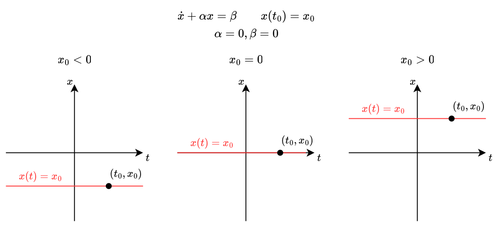
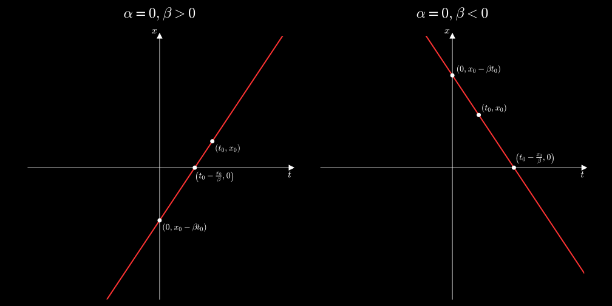
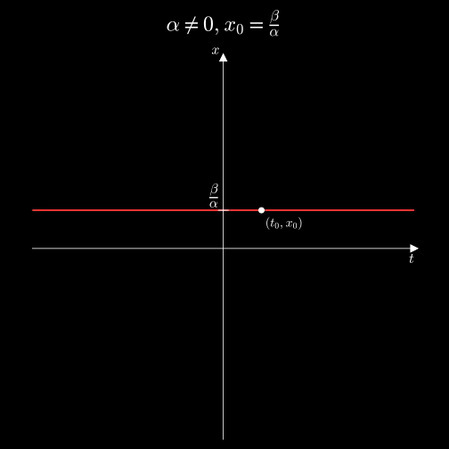
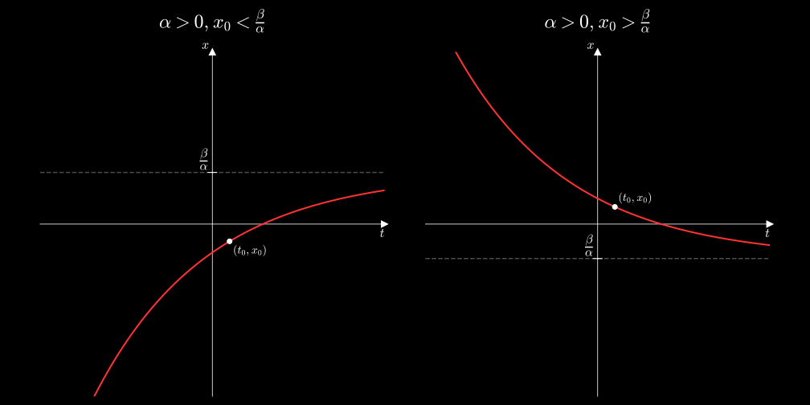
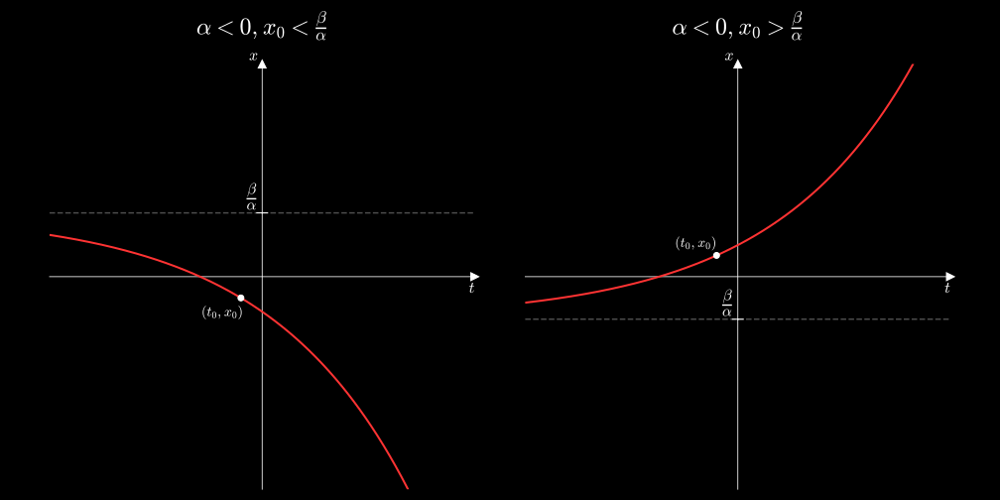
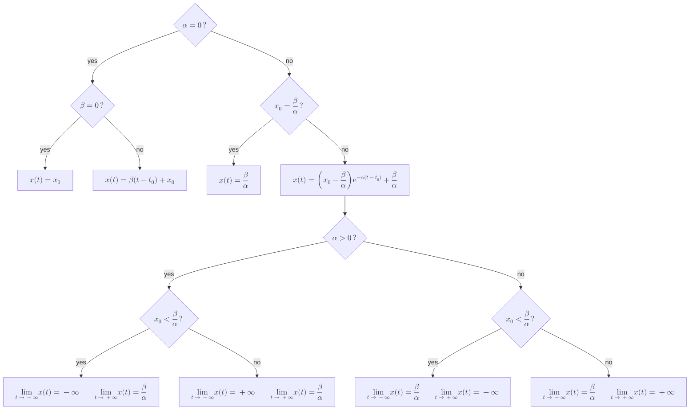

---
tags:
    - real-analysis
    - analysis
    - mathematics
---

# First-Order Linear Initial Value Problem

>[!DEFINITION] Definition: First-Order Linear Initial Value Problem
>
>A **first-order linear initial value problem** is an [initial value problem](./Initial%20Value%20Problems.md) with a [first-order linear ordinary differential equation](./First-Order%20Linear%20Ordinary%20Differential%20Equations.md):
>
>$$y' + p(x)y + q(x) = 0 \qquad y(x_0) = y_0$$
>

## Constant Coefficients

A [first-order linear initial value problem](./First-Order%20Linear%20Initial%20Value%20Problems.md) with constant coefficients can be written as

$$\dot{x} + \alpha x = f(t) \qquad x(t_0) = x_0$$

for some [real numbers](../../../../Algebra/Fields/The%20Real%20Numbers/The%20Real%20Numbers.md) $\alpha, t_0, x_0 \in \mathbb{R}$ and some [real function](../../Real%20Functions/Real%20Functions.md) $f: \mathcal{D}_f \subseteq \mathbb{R} \to \mathbb{R}$.

>[!DEFINITION] Definition: Time Constant
>
>If $\alpha \ne 0$, we call $\frac{1}{\alpha}$ the **time constant**.
>
>>[!NOTATION]
>>
>>$$\tau$$
>>
>

### General Solution

### Constant Input Solution

>[!THEOREM] Theorem: Constant Input Solution of First-Order Linear IVPs with Constant Coefficients
>
>Let $\alpha, \beta, x_0 \in \mathbb{R}$ be [real numbers](../../../../Algebra/Fields/The%20Real%20Numbers/The%20Real%20Numbers.md), let $\mathcal{I} \subseteq \mathbb{R}$ be an [interval](../../../../Set%20Theory/Orderings/Interval.md) and let $t_0 \in \mathcal{I}$.
>
>The [first-order linear initial value problem](./First-Order%20Linear%20Initial%20Value%20Problems.md)
>
>$$\dot{x} + \alpha x = \beta \qquad x(t_0) = x_0$$
>
>has exactly one [solution](./Initial%20Value%20Problems.md) on $\mathcal{I}$.
>
>If $\alpha = 0$, then this [solution](./Initial%20Value%20Problems.md) is the following:
>
>$$x(t) = \beta t + x_0 - \beta t_0$$
>
>If $\alpha \ne 0$, then this [solution](./Initial%20Value%20Problems.md) is the following:
>
>$$x(t) = \left(x_0 - \frac{\beta}{\alpha}\right)\mathrm{e}^{-\alpha (t-t_0)} + \frac{\beta}{\alpha} = \left(x_0 - \beta\tau \right)\mathrm{e}^{-\frac{(t-t_0)}{\tau}} + \beta\tau$$
>
>>[!PROOF]-
>>
>>TODO
>>
>

We explore only the [solutions](./Initial%20Value%20Problems.md) on $\mathbb{R}$, since [solutions](./Initial%20Value%20Problems.md) on other [intervals](../../../../Set%20Theory/Orderings/Interval.md) are just [restrictions](TODO) of the former.

For $\alpha = 0$, $x(t)$ is a straight line passing through $(t_0, x_0)$:
- If $\beta = 0$, then this is the horizontal line $x(t) = x_0$:

- If $\beta \ne 0$, the intersection of the line with the $t$-axis is $\left(t_0 - \frac{x_0}{\beta},0\right)$, its intersection with the $x$-axis is $(0, x_0 - \beta t_0)$ and its slope is $\beta$.

For $\alpha \ne 0$ and $x_0 = \frac{\beta}{\alpha}$, $x(t)$ is the constant $x(t) = \frac{\beta}{\alpha}$ and is just the horizontal line passing through $(t_0,x_0)$.

For $\alpha \ne 0$ and $x_0 \ne \frac{\beta}{\alpha}$, $x(t)$ is an exponential passing through $(t_0,x_0)$:

- For $\alpha \gt 0$: If $x_0 \lt \frac{\beta}{\alpha}$, then the [limit](../../Real%20Functions/Limits%20(Real%20Functions).md) of $x(t)$ for $t \to -\infty$ is $-\infty$. If $x_0 \gt \frac{\beta}{\alpha}$, then the [limit](../../Real%20Functions/Limits%20(Real%20Functions).md) of $x(t)$ for $t \to -\infty$ is $+\infty$. The [limit](../../Real%20Functions/Limits%20(Real%20Functions).md) of $x(t)$ for $t \to +\infty$ is $\frac{\beta}{\alpha}$. 

- For $\alpha \lt 0$: The [limit](../../Real%20Functions/Limits%20(Real%20Functions).md) of $x(t)$ for $t \to -\infty$ is $\frac{\beta}{\alpha}$. If $x_0 \lt \frac{\beta}{\alpha}$, then the [limit](../../Real%20Functions/Limits%20(Real%20Functions).md) of $x(t)$ for $t \to +\infty$ is $-\infty$. If $x_0 \gt \frac{\beta}{\alpha}$, then the [limit](../../Real%20Functions/Limits%20(Real%20Functions).md) of $x(t)$ for $t \to +\infty$ is $+\infty$.

### Sinusoidal Input Solution

>[!THEOREM] Theorem: Sinusoidal Input Solution of First-Order Linear IVPs with Constant Coefficients
>
>Let $\alpha, A, \omega, \varphi \in \mathbb{R}$ be [real numbers](../../../../Algebra/Fields/The%20Real%20Numbers/The%20Real%20Numbers.md) with $A \ne 0$ and $\omega \ne 0$, let $\mathcal{I} \subseteq \mathbb{R}$ be an [interval](../../../../Set%20Theory/Orderings/Interval.md), let $t_0 \in \mathcal{I}$ and let $x_0 \in \mathbb{R}$.
>
>The [first-order linear initial value problem](./First-Order%20Linear%20Initial%20Value%20Problems.md)
>
>$$\dot{x} + \alpha x = A \cos(\omega t + \varphi) \qquad x(t_0) = x_0$$
>
>has exactly one [solution](./Initial%20Value%20Problems.md) of the form $x: \mathcal{I} \to \mathbb{R}$.
>
>If $\alpha = 0$, then this [solution](./Initial%20Value%20Problems.md) is the following:
>
>$$x(t) = x_0  - \frac{A}{\omega}\sin(\omega t_0 + \varphi) + \frac{A}{\omega}\cos\left(\omega t + \varphi - \frac{\uppi}{2}\right)$$
>
>If $\alpha \ne 0$, then this [solution](./Initial%20Value%20Problems.md) is
>
>$$x(t) = \left( x_0 - \frac{A}{\sqrt{\alpha^2 + \omega^2}} \cos(\omega t_0 + \varphi - \delta) \right) \mathrm{e}^{-\alpha(t - t_0)} + \frac{A}{\sqrt{\alpha^2 + \omega^2}} \cos(\omega t + \varphi - \delta),$$
>
>where $\delta$ is given by the [real arctangent function](../../Real%20Functions/Real%20Trigonometric%20Functions/Real%20Arctangent%20Function.md) as follows:
>
>$$\delta = \begin{cases} \displaystyle \arctan\left(\frac{\omega}{\alpha}\right) & \text{if } \alpha > 0 \\ \displaystyle \arctan\left(\frac{\omega}{\alpha}\right) + \uppi & \text{if } \alpha < 0 \text{ and } \omega \ge 0 \\ \displaystyle \arctan\left(\frac{\omega}{\alpha}\right) - \uppi & \text{if } \alpha < 0 \text{ and } \omega < 0\end{cases}$$
>
>>[!PROOF]-
>>
>>TODO
>>
>

We explore only the [solutions](./Initial%20Value%20Problems.md) on $\mathbb{R}$, since [solutions](./Initial%20Value%20Problems.md) on other [intervals](../../../../Set%20Theory/Orderings/Interval.md) are just [restrictions](../../../Functions/Restriction%20(Functions).md) of the former.

For $\alpha = 0$, the [solution](./Initial%20Value%20Problems.md) is a phase-shifted, scaled and offset version of the [input](#Constant%20Coefficients). Specifically, the phase is shifted by $-\frac{\pi}{2}$ radians, the amplitude is scaled by a factor of $\frac{1}{\omega}$ and the wave itself is oscillates along the horizontal line $x = x_0  - \frac{A}{\omega}\sin(\omega t_0 + \varphi)$. 

TODO add diagram

The scaling by $\omega^{-1}$ means the frequency $\omega$ has either a supressing or an amplifying effect on the amplitude of the oscillations.

For $\alpha \neq 0$, the [solution](./Initial%20Value%20Problems.md) is the sum of an exponential term, known as the **transient response**, and a sinusoidal term, known as the **steady-state response**:

$$x(t) = \underset{\text{Transient Response } x_{\text{transient}}(t)}{\underbrace{\left( x_0 - \frac{A}{\sqrt{\alpha^2 + \omega^2}} \cos(\omega t_0 + \varphi - \delta) \right) \mathrm{e}^{-\alpha(t - t_0)}}} + \underset{\text{Steady-State Response } x_{\text{steady-state}}(t)}{\underbrace{\frac{A}{\sqrt{\alpha^2 + \omega^2}} \cos(\omega t + \varphi - \delta)}}$$
