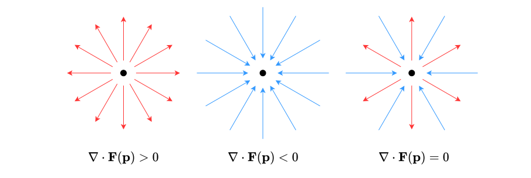

---
tags:
    - real-analysis
    - vector-analysis
    - analysis
    - mathematics
---

# Divergence (Real Vector Fields)

>[!DEFINITION]
>
>TODO
>
>>[!NOTATION]
>>
>>$$\operatorname{div} f(\boldsymbol{p}) \qquad \nabla \cdot f (\boldsymbol{p})$$
>>
>

>[!THEOREM] Theorem: Divergence and Partial Derivatives
>
>Let $f: \mathcal{D} \subseteq \mathbb{R}^n \to \mathbb{R}^n$ be a [real vector field](../Real%20Vector%20Fields.md).
>
>If $f$ is [totally differentiable](../../Real%20Vector%20Functions/Differentiation/Total%20Differentiability%20(Real%20Vector%20Functions).md) at $\boldsymbol{p} \in \operatorname{int} \mathcal{D}$, then its [divergence](./Divergence%20(Real%20Vector%20Fields).md) there is given by the [partial derivatives](../../Real-Valued%20Functions%20of%20Multiple%20Real%20Variables/Differentiation/Partial%20Differentiability%20(Real%20Scalar%20Fields).md) of its [component functions](../../Real%20Vector%20Functions/Real%20Vector%20Functions.md) $f_1, \dotsc, f_n$ as follows:
>
>$$\operatorname{div} f = \sum_{k = 1}^n \partial_{k} f_k (\boldsymbol{p})$$
>
>>[!EXAMPLE]- Example: $F(x,y,z) = \begin{bmatrix}xy & y^2 & xz \end{bmatrix}^{\mathsf{T}}$
>>
>>Consider the [real vector field](../Real%20Vector%20Fields.md) $F: \mathbb{R}^3 \to \mathbb{R}^3$ whose [coordinate representation](../../../Analysis%20on%20Manifolds/Coordinate%20Representations.md) w.r.t. [Cartesian coordinates](../../Euclidean%20Space/Cartesian%20Coordinate%20System.md) is the following:
>>
>>$$F(x,y,z) = \begin{bmatrix}xy \\ y^2 \\ xz\end{bmatrix}$$
>>
>>It is [totally differentiable](../../Real%20Vector%20Functions/Differentiation/Total%20Differentiability%20(Real%20Vector%20Functions).md) on $\mathbb{R}^3$ and its [divergence](./Divergence%20(Real%20Vector%20Fields).md) is given by the [partial derivatives](../../Real-Valued%20Functions%20of%20Multiple%20Real%20Variables/Differentiation/Partial%20Differentiability%20(Real%20Scalar%20Fields).md) of its [component functions](../../Real%20Vector%20Functions/Real%20Vector%20Functions.md) w.r.t. [Cartesian coordinates](../../Euclidean%20Space/Cartesian%20Coordinate%20System.md) as follows:
>>
>>$$\begin{aligned}\operatorname{div} F(x, y, z) & = \partial_x(xy) + \partial_y (y^2) + \partial_z (xz) \\ & = y + 2y + x \\ & = x + 3y\end{aligned}$$
>>
>
>>[!PROOF]-
>>
>>TODO
>>
>

>[!THEOREM] Theorem: Divergence of Product with Scalar Field
>
>Let $f: \mathcal{D} \subseteq \mathbb{R}^n \to \mathbb{R}$ be a [real scalar field](../../Real-Valued%20Functions%20of%20Multiple%20Real%20Variables/Real-Valued%20Functions%20of%20Multiple%20Real%20Variables.md) and let $g: \mathcal{D} \subseteq \mathbb{R}^n \to \mathbb{R}^n$ be a [real vector field](../Real%20Vector%20Fields.md).
>
>If $f$ and $g$ are [totally differentiable](../../Real%20Vector%20Functions/Differentiation/Total%20Differentiability%20(Real%20Vector%20Functions).md) at $\boldsymbol{x} \in \operatorname{int} \mathcal{D}$, then so is $fg$ and its [divergence](./Divergence%20(Real%20Vector%20Fields).md) there is given by $f$'s [gradient](../../Real-Valued%20Functions%20of%20Multiple%20Real%20Variables/Differentiation/Gradient%20(Real%20Scalar%20Fields).md) and $g$'s [divergence](./Divergence%20(Real%20Vector%20Fields).md) as follows:
>
>$$\operatorname{div} (fg)(\boldsymbol{x}) = f(\boldsymbol{x})\operatorname{div} g(\boldsymbol{x}) + g(\boldsymbol{x})^{\mathsf{T}} \nabla f(\boldsymbol{x})$$
>
>>[!PROOF]-
>>
>>Let $h: \mathcal{D} \subseteq \mathbb{R}^n \to \mathbb{R}^n$ be $fg$:
>>
>>$$h(\boldsymbol{x}) = f(\boldsymbol{x})g(\boldsymbol{x})$$
>>
>>Since both $f$ and $g$ are [totally differentiable](../../Real%20Vector%20Functions/Differentiation/Total%20Differentiability%20(Real%20Vector%20Functions).md) at $\boldsymbol{x}$, $h$ must also be [totally differentiable](../../Real%20Vector%20Functions/Differentiation/Total%20Differentiability%20(Real%20Vector%20Functions).md) at $\boldsymbol{x}$. The [divergence](./Divergence%20(Real%20Vector%20Fields).md) of $h$ is then given by the [partial derivatives](../../Real-Valued%20Functions%20of%20Multiple%20Real%20Variables/Differentiation/Partial%20Differentiability%20(Real%20Scalar%20Fields).md) of its [component functions](../../Real%20Vector-Valued%20Functions.md) as follows:
>>
>>$$\begin{aligned}\operatorname{div} h(\boldsymbol{x}) & = \sum_{i = 1}^n \partial_i h_i(\boldsymbol{x}) \\ & = \sum_{i=1}^n \partial_i (f g_i)(\boldsymbol{x}) \\ & = \sum_{i=1}^n (\partial_i f(\boldsymbol{x}) g_i(\boldsymbol{x}) + f(\boldsymbol{x}) \partial_i g_i(\boldsymbol{x})) \\ & = \sum_{i=1}^n \partial_i f(\boldsymbol{x}) g_i(\boldsymbol{x}) + \sum_{i=1}^n f(\boldsymbol{x}) \partial_i g_i(\boldsymbol{x}) \\ & = g(\boldsymbol{x})^{\mathsf{T}}\nabla f(\boldsymbol{x}) + f(\boldsymbol{x})\sum_{i=1}^n \partial_i g_i(\boldsymbol{x}) \\ & = g(\boldsymbol{x})^{\mathsf{T}}\nabla f(\boldsymbol{x}) + f(\boldsymbol{x})\operatorname{div} g(\boldsymbol{x}) \\ & = f(\boldsymbol{x})\operatorname{div} g(\boldsymbol{x}) + g(\boldsymbol{x})^{\mathsf{T}} \nabla f(\boldsymbol{x})\end{aligned}$$
>>
>

>[!THEOREM] Theorem: Divergence from Polar Coordinate Representation
>
>Let $f: \mathcal{D} \subseteq \mathbb{R}^2 \to \mathbb{R}^2$ be a [real vector field](../Real%20Vector%20Fields.md) and let $\mathcal{T}: (0, +\infty) \times (0, 2\uppi) \to \mathbb{R}^2$ be the [coordinate transformation](../../Euclidean%20Space/Coordinate%20Transformations.md) from [polar coordinates](../../Euclidean%20Space/Polar%20Coordinates.md):
>
>$$\mathcal{T}(\rho, \varphi) = \begin{bmatrix} \rho \cos \varphi \\ \rho \sin \varphi\end{bmatrix}$$
>
>Let $\tilde{f}$ be the [polar coordinate representation](../Polar%20Coordinate%20Representations%20(Real%20Vector%20Fields).md) of $f$:
>
>$$\tilde{f}(\rho, \varphi) = \begin{bmatrix}\cos \varphi & \sin \varphi \\ - \sin \varphi & \cos \varphi \end{bmatrix} (f \circ \mathcal{T})(\rho, \varphi)$$
>
>If $f$ is [totally differentiable](../../Real%20Vector%20Functions/Differentiation/Total%20Differentiability%20(Real%20Vector%20Functions).md) at $\mathcal{T}(\rho, \varphi)$, then its [divergence](./Divergence%20(Real%20Vector%20Fields).md) at $\mathcal{T}(\rho, \varphi)$ is expressed using [partial derivatives](../../Real-Valued%20Functions%20of%20Multiple%20Real%20Variables/Differentiation/Partial%20Differentiability%20(Real%20Scalar%20Fields).md) and $\tilde{f}$'s [component functions](../../Real%20Vector-Valued%20Functions.md) $\tilde{f}_1, \tilde{f}_2$ as follows:
>
>$$(\operatorname{div} f)(\mathcal{T}(\rho, \varphi)) = \partial_{\rho} \tilde{f}_1 (\rho, \varphi) + \frac{1}{\rho} \tilde{f}_1 (\rho, \varphi) + \frac{1}{\rho} \partial_{\varphi} \tilde{f}_2 (\rho, \varphi)$$
>
>>[!PROOF]-
>>
>>Let $x = \rho \cos \varphi$ and $y = \rho \sin \varphi$:
>>
>>$$\begin{bmatrix} x \\ y \end{bmatrix} = \mathcal{T}(\rho, \varphi) = \begin{bmatrix}\rho \cos \varphi \\ \rho \sin \varphi\end{bmatrix}$$
>>
>>The [divergence](./Divergence%20(Real%20Vector%20Fields).md) of $f$ is given by the [partial derivatives](../../Real-Valued%20Functions%20of%20Multiple%20Real%20Variables/Differentiation/Partial%20Differentiability%20(Real%20Scalar%20Fields).md) of $f$'s [component functions](../../Real%20Vector-Valued%20Functions.md) $f_1$ and $f_2$ as follows:
>>
>>$$\begin{aligned}(\operatorname{div} f)(x,y) & = (\partial_x f_1)(x, y) + (\partial_y f_1)(x,y) \\ & = \partial_x f_1 (\rho \cos \varphi, \rho \sin \varphi) + \partial_y f_2 (\rho \cos \varphi, \rho \cos \varphi) \\ \end{aligned}$$
>>
>>By definition:
>>
>>$$\begin{aligned}\tilde{f}(\rho, \varphi) & = \begin{bmatrix}\cos \varphi & \sin \varphi \\ - \sin \varphi & \cos \varphi \end{bmatrix} f(\mathcal{T}(\rho, \varphi)) \\ & = \begin{bmatrix}\cos \varphi & \sin \varphi \\ - \sin \varphi & \cos \varphi \end{bmatrix} f(x, y) \\ & = \begin{bmatrix}\cos \varphi & \sin \varphi \\ - \sin \varphi & \cos \varphi \end{bmatrix} f(\rho \cos \varphi, \rho \sin \varphi)\end{aligned}$$
>>
>>We [multiply](../../../../Algebra/Matrices/Matrix%20Product.md) on the left with the [inverse](../../../../Algebra/Matrices/Square%20Matrices/Matrix%20Invertibility.md):
>>
>>$$f(\rho \cos \varphi, \rho \sin \varphi) = \begin{bmatrix} \cos \varphi & - \sin \varphi \\ \sin \varphi & \cos \varphi\end{bmatrix} \tilde{f}(\rho, \varphi)$$
>>
>>We express this using the [component functions](../../Real%20Vector-Valued%20Functions.md):
>>
>>$$f_1(\rho \cos \varphi, \rho \sin \varphi) = \tilde{f}_1(\rho, \varphi) \cos \varphi - \tilde{f}_2 (\rho, \varphi) \sin \varphi$$
>>
>>$$f_2(\rho \cos \varphi, \rho \sin \varphi) = \tilde{f}_1(\rho, \varphi) \sin \varphi + \tilde{f}_2 (\rho, \varphi) \cos \varphi$$
>>
>>TODO
>>
>

>[!THEOREM] Theorem: Divergence from Cylindrical Coordinate Representation
>
>Let $f: \mathcal{D} \subseteq \mathbb{R}^3 \to \mathbb{R}^3$ be a [real vector field](../Real%20Vector%20Fields.md) and let $\mathcal{T}: (0, +\infty) \times (0, 2\uppi) \times \mathbb{R} \to \mathbb{R}^3$ be the [coordinate transformation](../../Euclidean%20Space/Coordinate%20Transformations.md) from [cylindrical coordinates](../../Euclidean%20Space/Cylindrical%20Coordinates.md):
>
>$$\mathcal{T}(\rho, \varphi, z) = \begin{bmatrix}\rho \cos \varphi \\ \rho \sin \varphi \\ z\end{bmatrix}$$
>
>Let $\tilde{f}$ be the [cylindrical coordinate representation](../Cylindrical%20Coordinate%20Representations%20(Real%20Vector%20Fields).md) of $f$:
>
>$$\tilde{f}(\rho, \varphi, z) = \begin{bmatrix}\cos \varphi & \sin \varphi & 0 \\ - \sin \varphi & \cos \varphi & 0 \\ 0 & 0 & 1 \end{bmatrix} (f \circ \mathcal{T})(\rho, \varphi, z)$$
>
>If $f$ is [totally differentiable](../../Real%20Vector%20Functions/Differentiation/Total%20Differentiability%20(Real%20Vector%20Functions).md) at $\mathcal{T}(\rho, \varphi, z)$, then its [divergence](./Divergence%20(Real%20Vector%20Fields).md) at $\mathcal{T}(\rho, \varphi, z)$ is expressed using [partial derivatives](../../Real-Valued%20Functions%20of%20Multiple%20Real%20Variables/Differentiation/Partial%20Differentiability%20(Real%20Scalar%20Fields).md) and $\tilde{f}$'s [component functions](../../Real%20Vector-Valued%20Functions.md) $\tilde{f}_1, \tilde{f}_2, \tilde{f}_3$ as follows:
>
>$$(\operatorname{div} f)(\mathcal{T}(\rho, \varphi, z)) = \frac{1}{\rho} \partial_\rho (\rho \tilde{f}_1) (\rho, \varphi, z) + \frac{1}{\rho} \partial_{\varphi} \tilde{f}_2 (\rho, \varphi, z) + \partial_z \tilde{f}_3 (\rho, \varphi, z)$$
>
>>[!PROOF]-
>>
>>TODO
>>
>

>[!THEOREM] Theorem: Divergence from Spherical Coordinate Representation
>
>Let $f: \mathcal{D} \subseteq \mathbb{R}^3 \to \mathbb{R}^3$ be a [real vector field](../Real%20Vector%20Fields.md) and let $\mathcal{T}: (0, +\infty) \times (0, \uppi) \times (0, 2\uppi) \to \mathbb{R}^3$ be the [coordinate transformation](../../Euclidean%20Space/Coordinate%20Transformations.md) from [spherical coordinates](../../Euclidean%20Space/Spherical%20Coordinates.md):
>
>$$\mathcal{T}(r, \theta, \varphi) = \begin{bmatrix}r \sin \theta \cos \varphi \\ r \sin \theta \sin \varphi \\ r \cos \theta\end{bmatrix}$$
>
>Let $\tilde{f}$ be the [spherical coordinate representation](../Spherical%20Coordinate%20Representations%20(Real%20Vector%20Fields).md) of $f$:
>
>$$\tilde{f}(r, \theta, \varphi) = \begin{bmatrix}\sin \theta \cos \varphi & \sin \theta \sin \varphi & \cos \theta \\ \cos \theta \cos \varphi & \cos \theta \sin \varphi & - \sin \theta \\ - \sin \varphi & \cos \varphi & 0 \end{bmatrix} (f \circ \mathcal{T})(r, \theta, \varphi)$$
>
>If $f$ is [totally differentiable](../../Real%20Vector%20Functions/Differentiation/Total%20Differentiability%20(Real%20Vector%20Functions).md) at $\mathcal{T}(r, \theta, \varphi)$, then its [divergence](./Divergence%20(Real%20Vector%20Fields).md) at $\mathcal{T}(r, \theta, \varphi)$ is expressed using [partial derivatives](../../Real-Valued%20Functions%20of%20Multiple%20Real%20Variables/Differentiation/Partial%20Differentiability%20(Real%20Scalar%20Fields).md) and $\tilde{f}$'s [component functions](../../Real%20Vector-Valued%20Functions.md) $\tilde{f}_1, \tilde{f}_2, \tilde{f}_3$ as follows:
>
>$$(\operatorname{div} f)(\mathcal{T}(r, \theta, \varphi)) = \frac{1}{r^2} \partial_r (r^2 \tilde{f}_1) (r, \theta, \varphi) + \frac{1}{r \sin \theta} \partial_{\theta} (\sin \theta \tilde{f}_2) (r, \theta, \varphi) + \frac{1}{r \sin \theta} \partial_{\varphi} \tilde{f}_3 (r, \theta, \varphi)$$
>
>>[!PROOF]-
>>
>>TODO
>>
>

>[!THEOREM] The Divergence Theorem in 2D (Gauß's Theorem in 2D)
>
>Let $\mathcal{D} \subseteq \mathbb{R}^2$ be [bounded](TODO) and [Lebesgue-measurable](../../../../Measure%20Theory/Lebesgue%20Measure.md) with a [boundary](../../../../Topology/Interior,%20Boundary,%20Exterior.md) which can be [parameterized](TODO) by a [piecewise regular](../../Real%20Vector-Valued%20Functions%20of%20a%20Real%20Variable/Differentiation/Differentiability%20(Real%20Parametric%20Curves).md) [simple](../../Real%20Vector-Valued%20Functions%20of%20a%20Real%20Variable/Real%20Vector-Valued%20Functions%20of%20a%20Real%20Variable.md) [closed](../../Real%20Vector-Valued%20Functions%20of%20a%20Real%20Variable/Real%20Vector-Valued%20Functions%20of%20a%20Real%20Variable.md) [parametric curve](../../Real%20Vector-Valued%20Functions%20of%20a%20Real%20Variable/Real%20Vector-Valued%20Functions%20of%20a%20Real%20Variable.md) $\gamma$. Let $f: \mathcal{D} \to \mathbb{R}^2$ be a [real vector field](../Real%20Vector%20Fields.md).
>
>If $f$ is [continuously differentiable](../../Real%20Vector%20Functions/Differentiation/Total%20Differentiability%20(Real%20Vector%20Functions).md), then the [integral](../../Real-Valued%20Functions%20of%20Multiple%20Real%20Variables/Integration/Lebesgue%20Integrals%20(Real%20Scalar%20Fields).md) of its [divergence](./Divergence%20(Real%20Vector%20Fields).md) on $\mathcal{D}$ is equal to the [line integral](../../Real-Valued%20Functions%20of%20Multiple%20Real%20Variables/Integration/Line%20Integrals%20(Real%20Scalar%20Fields).md) of the [dot product](../../../../Algebra/Linear%20Algebra/Real%20Vectors/Dot%20Product.md) between $f$ and $\gamma$'s [outwards-pointing unit normal vector](TODO) over $\gamma$:
>
>$$\iint_{\mathcal{D}} \operatorname{div} f \, \mathrm{d}A = \oint_{\gamma} f \cdot \boldsymbol{n} \, \mathrm{d}s$$
>
>>[!PROOF]-
>>
>>TODO
>>
>

>[!THEOREM] The Divergence Theorem in 3D (Gauß's Theorem in 3D)
>
>Let $\mathcal{D} \subseteq \mathbb{R}^3$ be [bounded](TODO) and [Lebesgue-measurable](../../../../Measure%20Theory/Lebesgue%20Measure.md) with a [boundary](../../../../Topology/Interior,%20Boundary,%20Exterior.md) which can be [parameterized](TODO) by a [piecewise regular](../../Real%20Parametric%20Surfaces/Differentiation/Differentiability%20(Real%20Parametric%20Surfaces).md) [simple](../../Real%20Parametric%20Surfaces/Parametric%20Surfaces.md) [closed](../../Real%20Parametric%20Surfaces/Parametric%20Surfaces.md) [parametric surface](../../Real%20Parametric%20Surfaces/Parametric%20Surfaces.md) $\mathcal{S}$. Let $f: \mathcal{D} \to \mathbb{R}^3$ be a [real vector field](../Real%20Vector%20Fields.md).
>
>If $f$ is [continuously differentiable](../../Real%20Vector%20Functions/Differentiation/Total%20Differentiability%20(Real%20Vector%20Functions).md), then the [integral](../../Real-Valued%20Functions%20of%20Multiple%20Real%20Variables/Integration/Lebesgue%20Integrals%20(Real%20Scalar%20Fields).md) of its [divergence](./Divergence%20(Real%20Vector%20Fields).md) on $\mathcal{D}$ is equal to the [surface integral](../../Real-Valued%20Functions%20of%20Multiple%20Real%20Variables/Integration/Surface%20Integrals%20(Real%20Scalar%20Fields).md) of the [dot product](../../../../Algebra/Linear%20Algebra/Real%20Vectors/Dot%20Product.md) between $f$ and $\mathcal{S}$'s [outwards-pointing unit normal vector](TODO) over $\mathcal{S}$:
>
>$$\iiint_{\mathcal{D}} \operatorname{div} f \, \mathrm{d}\mathcal{D} = \iint_{\mathcal{S}} f \cdot \boldsymbol{n} \, \mathrm{d}\mathcal{S}$$
>
>>[!PROOF]-
>>
>>TODO
>>
>