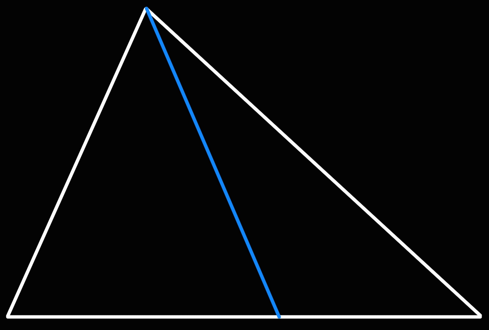

>[!DEFINITION] Definition: Cevian
>
>A **cevian** in a [triangle](../Triangle.md) is a [line segment](../../../../Curves/Line%20Segments/Line%20Segment.md) whose endpoints are a [vertex](../../Polygon.md) of the triangle and a [point](../../../../Points%20and%20Vectors/Points%20in%20Geometry.md) on the [side](../../Polygon.md) not containing it.
>
>
>