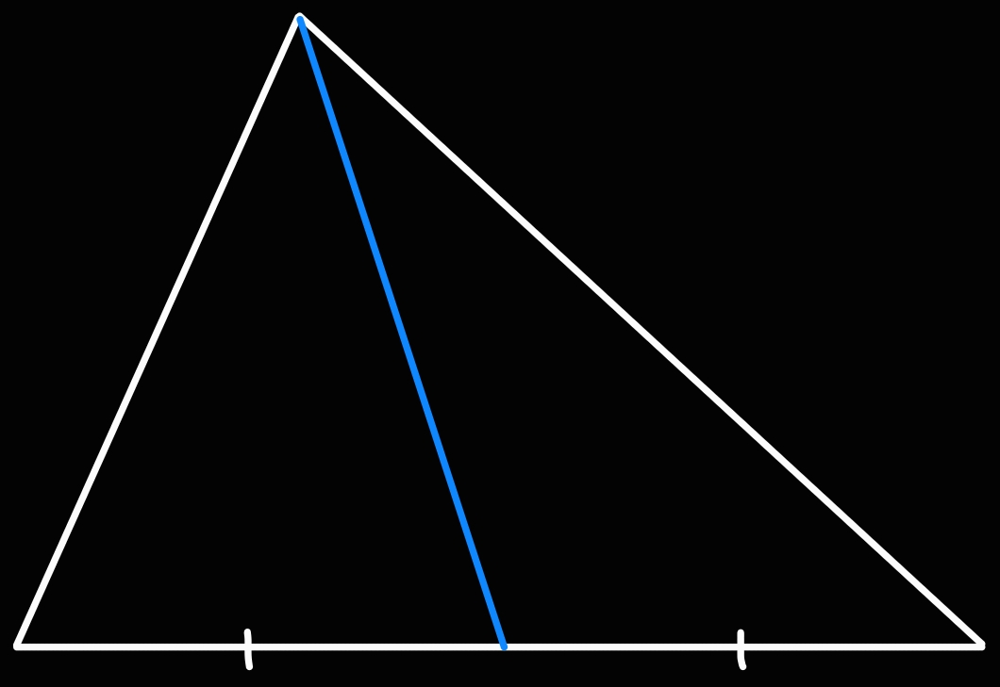

# Medians

>[!DEFINITION] Definition: Median
>
>A **median** in a [triangle](../index.md) is a [cevian](./index.md) which connects a [vertex](../../index.md) of the triangle to the [midpoint](../../../../Curves/Straight%20Lines/Line%20Segments.md) of the opposite [side](../../index.md).
>
>
>
>>[!NOTATION]-
>>
>>The median towards the side $s$ is usually denoted as $m_s$.
>>
>

## Properties

>[!THEOREM] Theorem: Concurrency of a Triangle's Medians
>
>The [medians](Medians.md) of a [triangle](../index.md) are all [concurrent](../../../../Curves/Straight%20Lines/Concurrent%20Lines.md) and intersect at its [centroid](../../../../Centroid.md).
>
>>[!PROOF]-
>>
>>TODO
>>
>

>[!THEOREM] Theorem: Median Lengths from Side Lengths (Apollonius's Theorem)
>
>If a [triangle](../index.md) has [sides](../../index.md) $a,b,c$, then their respective [medians](Medians.md) are given by
>
>$$\begin{align*} m_a &= \frac{1}{2}\sqrt{2b^2+2c^2-a^2} \\ m_b &= \frac{1}{2}\sqrt{2a^2+2c^2-b^2} \\ m_c &= \frac{1}{2}\sqrt{2a^2+2b^2-c^2}\end{align*}$$
>
>>[!PROOF]-
>>
>>TODO
>>
>

>[!THEOREM] Theorem: Side Lengths from Median Lengths
>
>If a [triangle](../index.md) has [medians](Medians.md) $m_a,m_b,m_c$, then their respective [sides](../../index.md) are given by
>
>$$\begin{align*} a &= \frac{2}{3}\sqrt{2m_b^2 + 2m_c^2 -m_a^2} \\ b &= \frac{2}{3}\sqrt{2m_a^2 + 2m_c^2 -m_b^2} \\ c &= \frac{2}{3}\sqrt{2m_a^2 + 2m_b^2 - m_c^2} \end{align*}$$
>
>>[!PROOF]-
>>
>>TODO
>>
>
>>[!NOTE]
>>
>>This means that a triangle is completely determined by its medians.
>>
>