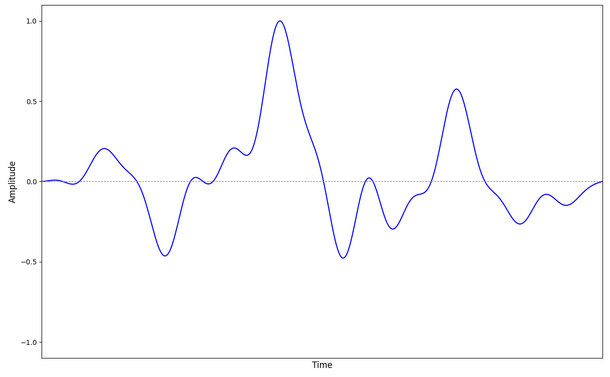

# Sound

**Sound** is what our brains experience when our ears detect variations in the pressure of the air surrounding us. As the pressure changes, it causes some parts of the inside of the ears to move. These movements are then turned into electric signals which propagate through the neurons inside the brain and are ultimately interpreted as sound.

How do we know that it is the changes which matter and not the pressure itself? Well, If this were not the case, then listening to a song at home would sound completely different from listening to the same song on a mountain peak, since the overall pressure of the air at the top of the mountain is less than the overall pressure of the air in your living room. However, we do not experience any significant difference in practice, indicating that our ears are primarily designed to detect pressure changes and not absolute pressure.

## Waveforms

The waveform of a sound is a graph which illustrates how air pressure varies in time as the sound is playing.

The term "amplitude" is pretty much synonymous with "pressure". However, the values shown in a waveform are not absolute, since what matters for our sound perception are the relative changes in pressure and not its absolute values. As such, the choice of what pressure corresponds to an amplitude of $-1.0$ and what pressure corresponds to an amplitude of $1.0$ is completely arbitrary. The only important thing is that lower pressure values are assigned lower amplitudes and higher pressure values are assigned higher amplitudes to make visualization more intuitive. Additionally, amplitudes must be assigned in such a way so as to never go above $1.0$ and below $-1.0$.

Another common convention is to assign an amplitude of $-1.0$ to the lowest value to which air pressure drops while the sound is playing and an amplitude of $1.0$ to the highest value to which air pressure rises while the sound is playing. An amplitude of $0.0$ is then assigned to the arithmetic mean of the minimum and the maximum, exactly halfway in-between the two values. This is a very common thing to do when visualizing sounds recorded in isolation. Nevertheless, there are also many cases in which this is not done.

The crucial thing to remember is that the actual pressure values behind the amplitudes are irrelevant, only the changes in the amplitude matter. Therefore, the way we perceive a sound is uniquely determined by the shape of its waveform.

# Volume

At its core, what we perceive as the volume or loudness of a sound corresponds to how drastic the changes in the pressure of the air are. Large variations are generally perceived as a loud sound, while small variations are perceived as quiet. Of course, the situation is not really that simple and there are many other factors such as humidity or temperature which can also influence how we perceive loudness, but, fundamentally, volume depends on how much the pressure changes.

# Pitch

For whatever reason, our brains and ears are very good at perceiving pressure changes in which the pressure rapidly oscillates. The frequency of these oscillations, i.e. the number times per second the pressure departs from and then returns back to some particular value, is what we perceive as pitch. Higher frequencies correspond to higher pitches and vice versa.

There are many ways in which pressure can oscillate, but the simplest way is in a sinusoidal wave, starting at some particular value, going up to a maximum, highest, value, then dropping down to a minimum, lowest, value and then returning to the original value. We perceive different pitches depending on how many times per second this cycle occurs. Here is a graphical representation of how pressure changes in a sine wave with a frequency of 220 Hz:

The blue line shows how the pressure of air varies in time around some particular value which has been labeled "0.0". Note that this is *not* the actual absolute value of the pressure - we have simply chosen a particular value as a reference and have decided to measure changes relative to it. Whenever the blue line goes below 0.0, this means that the pressure has dropped below the reference value. Whenever it goes above 0.0., the pressure has increased above the reference value. If the pressure of the air around you oscillated in the way illustrated by the graph, you would perceive the following sound:

As you are listening to the above sound, your headphones are causing the pressure of the air inside your ears to oscillate around the pressure of the room you are currently occupying in exactly the same way as illustrated by the graph. 

We can also illustrate the dependence of volume on how drastic the changes in pressure are. In the following graph, the pressure of the air still oscillates at the same frequency - if you count the number of peaks in both graphs, you will see that the number is the name, meaning that the frequency is the same. However, the peaks in the following graph are higher than the peaks in the previous graph and the troughs in the following graph are lower than the troughs in the previous graph which means that the pressure changes the same number of times per second but the change itself is more drastic in the second case - it reaches a higher maximum and a lower minimum pressure.

If the pressure of the air inside your ears changed in the way illustrated by the graph, then you would perceive the following sound:

Indeed, it sounds just as before but louder.

Now, lets see what happens when the number of oscillations, i.e. the frequency, changes. Following is the graph of a sine wave with a frequency of 110 Hz and how it sounds:

Therefore, lower frequencies are perceived as lower pitches, i.e. they sound more like a bass, and higher frequencies are perceived as higher pitches.

## Overtones

In practice, sounds are never 

## Timbre

The **timbre** (**tone quality** or **tone quality**) of a sound is what makes each sound unique and allows us distinguish between different sound sources such as a piano and a violin playing the same pitch.  