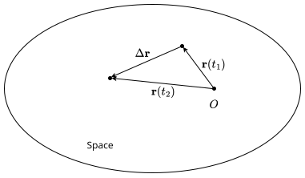

---
tags:
  - classical-mechanics
  - physics
---

# Kinematics

**Kinematics** is a branch of [classical mechanics](./Classical%20Mechanics.md) whose purpose is to describe *how* physical objects move without making any assumptions as to *why* they move the way they do. Essentially, it strives to give a description of how the position and motion of physical objects evolves through time.

## Position

Describe the motion of a physical object boils down to describing its position and how it changes over time. To do this, we seek to find an expression for its position as a function of time.

>[!DEFINITION] Definition: Position
>
>Let $\mathcal{R}$ be a [reference frame](./Reference%20Frames.md) with [origin](./Reference%20Frames.md) $O$. 
>
>At a given [moment](./Classical%20Mechanics.md) $t$, the **position** of a [point particle](./Point%20Particles.md) $p$ is the [vector](../../Mathematics/Algebra/Linear%20Algebra/Real%20Vectors/Real%20Vectors.md) assigned to the point in [space](./Classical%20Mechanics.md) where $p$ is located.
>
>>[!NOTATION]
>>
>>$$
>>\boldsymbol{r}(t) \qquad \boldsymbol{r}(t) \qquad \vec{r}(t)
>>$$
>>
>
>>[!TIP] Tip: Visualizing Position
>>
>>The [position](#Position) of $p$ can be visualized as an arrow extending from $O$ to its location.
>>
>>
>>
>
>
>>[!DEFINITION] Definition: Path
>>
>>As $p$ moves, its [position](#Position) draws out a curve in [space](./Classical%20Mechanics.md) which we call $p$'s **path**.
>>
>>>[!NOTE] Note: Position as Parametric Curve
>>>
>>>Thus the [function](../../Mathematics/Analysis/Real%20Analysis/Real%20Vector%20Functions/Real%20Vector%20Functions.md) $\boldsymbol{r}: [t_{\text{initial}}, t_{\text{final}}] \subset \mathbb{R} \to \mathbb{R}^3$ which to each [moment](./Classical%20Mechanics.md) $t$ assigns $p$'s [position](#Position) at $t$ is a [parametric curve](../../Mathematics/Analysis/Real%20Analysis/Real%20Vector-Valued%20Functions%20of%20a%20Real%20Variable/Real%20Vector-Valued%20Functions%20of%20a%20Real%20Variable.md) whose [endpoints](../../Mathematics/Analysis/Real%20Analysis/Real%20Vector-Valued%20Functions%20of%20a%20Real%20Variable/Real%20Vector-Valued%20Functions%20of%20a%20Real%20Variable.md) are the initial and final [position](#Position) of $p$ during its journey.
>>>
>>
>

From this definition, it follows that the position of a point particle depends on the reference frame. This is due to the fact that there are infinitely many possible reference frames and no single one is objectively superior to the rest. Physically, this manifests as the following phenomenon: Imagine two cars heading down the same road, right next to each other, with the same speed. We consider two reference frames:
- In the first one, you are standing on the side of the of road. This reference frame is such that you are at its origin. In this case, the positions of both cars appear to be changing, while the objects in the background appear stationary.
- In the second one, you are you sitting in one of the cars. In this case, the origin of the reference frame is attached to you. If looked out the window, the other car would appear stationary, while the positions of the objects in the background would appear to be changing.

### Displacement

>[!DEFINITION] Definition: Displacement
>
>Let $\mathcal{R}$ be a [reference frame](./Reference%20Frames.md) with [origin](./Reference%20Frames.md) $O$ and let $t_1$ and $t_2 \ge t_1$ be two [moments in time](./Classical%20Mechanics.md). 
>
>The **displacement** of a [point particle](./Point%20Particles.md) $p$ during the interval between $t_1$ and $t_2$ is the difference in $p$'s [position](#Position) at the latter moment ($t_2$) and at the earlier moment ($t_1$):
>
>$$
>\boldsymbol{r}(t_2) - \boldsymbol{r}(t_1)
>$$
>
>>[!NOTATION]
>>
>>$$
>>\Delta \boldsymbol{r} \qquad \Delta \boldsymbol{r} \qquad \Delta \vec{r}
>>$$
>>
>
>>[!TIP] Tip: Visualizing Displacement
>>
>>Displacement can be visualized as an arrow pointing from $p$'s location at the moment $t_1$ to $p$'s location at the moment $t_2$.
>>
>>
>>
>

[Displacement](#Displacement) gives us a very rough idea of the overall direction in which $p$ has moved from time $t_1$ to time $t_2$ and the distance between its starting and end locations.

Just like [position](#Position), [displacement](#Displacement) depends on the [reference frame](./Reference%20Frames.md).  Imagine again the two cars heading down the same road, right next to each other, with the same speed:
- In the reference frame where you are on the side of the road, if you looked at the cars at one moment and then at a later moment, they would both appear to have a displacement pointing in the direction of their motion. Meanwhile, the objects in the background will appear to have no displacement, since they are stationary.
- In the reference frame where you are in one of the cars, if you looked outside the window at one moment and then at a later moment, the other car would appear to have no displacement, while the objects in the background would appear to have a displacement in the direction *opposite* the direction of the displacement of the cars in the other reference frame.

## Velocity

[Displacement](#Displacement) gives us a rough description of how a [point particle](./Point%20Particles.md)'s [position](#Position) differs between two moments. However, it does not factor in the amount of time between these two moments. In other words, it tells us nothing about how *fast* the [particle](./Classical%20Mechanics.md#Point%20Particles)'s [position](#Position) changes. This is why we need the notion of velocity.

>[!DEFINITION] Definition: Average Velocity
>
>Let $\mathcal{R}$ be a [reference frame](./Reference%20Frames.md) and let $t_1$ and $t_2 \ge t_1$ be two [moments in time](./Classical%20Mechanics.md). 
>
>The **average velocity** of a [point particle](./Point%20Particles.md) $p$ during the interval $\Delta t$ between $t_1$ and $t_2 \gt t_1$ is the [displacement](#Displacement) of $p$ during $\Delta t$ divided by the length of the interval:
>
>$$
>\boldsymbol{v}_{\text{avg}} \overset{\text{def}}{=} \frac{\Delta \boldsymbol{r}}{\Delta t} = \frac{1}{t_2 - t_1} \Delta \boldsymbol{r}
>$$
>
>>[!NOTATION]
>>
>>$$
>>\bar{\boldsymbol{v}} \qquad \boldsymbol{v}_{\text{avg}} \qquad \boldsymbol{v}_{\text{avg}} \qquad \vec{v}_{\text{avg}}
>>$$
>>
>
>>[!DEFINITION] Definition: Average Speed
>>
>>The **average speed** of $p$ is the [magnitude](../../Mathematics/Algebra/Vector%20Spaces/Norms.md) of its [average velocity](#Velocity).
>>
>>>[!NOTATION]
>>>
>>>$$
>>>\bar{v}
>>>$$
>>>
>>
>

[Average velocity](#Velocity) gives us a rough idea of how rapid the change in $p$'s [position](#Position) between $t_1$ and $t_2$, but we are often interested in how fast this change is during very short intervals.

>[!DEFINITION] Definition: Instantaneous Velocity
>
>Let $\mathcal{R}$ be a [reference frame](./Reference%20Frames.md) with [origin](./Reference%20Frames.md) $O$ and let $t^{\ast}$ be a [moment in time](./Classical%20Mechanics.md). 
>
>The **instantaneous velocity** of a [point particle](./Point%20Particles.md) $p$ at $t^{\ast}$  is the [derivative](../../Mathematics/Analysis/Real%20Analysis/Real%20Vector-Valued%20Functions%20of%20a%20Real%20Variable/Differentiation/Differentiability%20(Real%20Parametric%20Curves).md) of its [position](#Position) at $t^{\ast}$ with respect to time:
>
>$$
>\boldsymbol{v}(t^{\ast}) \overset{\text{def}}{=} \frac{\mathrm{d}\boldsymbol{r}}{\mathrm{d}t}(t^{\ast})
>$$
>
>>[!TIP] Tip: Instantaneous Velocity and Average Velocity
>>
>>Using the definition of the  [derivative](../../Mathematics/Analysis/Real%20Analysis/Real%20Vector-Valued%20Functions%20of%20a%20Real%20Variable/Differentiation/Differentiability%20(Real%20Parametric%20Curves).md), we see that the [instantaneous](#Velocity) of $p$ at $t^{\ast}$ is just its [average velocity](#Velocity) within an infinitesimally small interval after $t^{\ast}$:
>>
>>$$
>>\boldsymbol{v}(t^{\ast}) = \frac{\mathrm{d}\boldsymbol{r}}{\mathrm{d}t}(t^{\ast}) = \lim_{\Delta t\to 0} \frac{\boldsymbol{r}(t^{\ast} + \Delta t) - \boldsymbol{r}(t^{\ast})}{\Delta t}
>>$$
>>
>
>>[!DEFINITION] Definition: Instantaneous Speed
>>
>>The **instantaneous speed** of $p$ is the [magnitude](../../Mathematics/Algebra/Vector%20Spaces/Norms.md) of its [instantaneous velocity](#Velocity).
>>
>
>>[!NOTE]
>>
>>When one says "velocity", they usually mean the instantaneous velocity.
>>
>

[Velocity](#Velocity) (both average and instantaneous) is dependent on the [reference frame](./Reference%20Frames.md), just like [position](#Position) and [displacement](#Displacement). Using the previous example:
- In the reference frame where you are on the side of the road, both cars will appear to have the same non-zero velocity. Meanwhile, the objects in the background will appear to have no velocity, since they are stationary.
- In the reference frame where you are in one of the cars, the other car would appear to have no velocity, while the objects in the background would appear to have the same non-zero velocity in the direction *opposite* the direction of the velocity of the cars in the other reference frame.

>[!THEOREM] Theorem: Position from Velocity
>
>Let $\mathcal{R}$ be a [reference frame](./Reference%20Frames.md) and let $t_0$ and $t^{\ast} \ge t_0$ be two [moments in time](./Classical%20Mechanics.md). 
>
>The [position](#Position) of a [point particle](./Point%20Particles.md) $p$ at $t^{\ast}$ is given by the [integral](../../Mathematics/Analysis/Real%20Analysis/Real%20Parametric%20Curves/Integration%20of%20Parametric%20Curves.md) of $p$'s [instantaneous velocity](#Velocity) from $t_0$ to $t^{\ast}$:
>
>$$
>\boldsymbol{r}(t^{\ast}) = \int_{t_0}^{t^{\ast}} \boldsymbol{v}(t) \mathop{\mathrm{d}t}
>$$
>
>>[!PROOF]-
>>
>>TODO
>>
>

### Path Length

Knowing the [speed](#Velocity) of a [point particle](./Point%20Particles.md) at each moment during a specific time interval allows us to give a sensible definition of the total distance through space it has covered within said interval.

>[!DEFINITION] Definition: Path Length
>
>Let $\mathcal{R}$ be a [reference frame](./Reference%20Frames.md) with [origin](./Reference%20Frames.md) $O$ and let $t_1$ and $t_2 \ge t_1$ be two [moments in time](./Classical%20Mechanics.md). 
>
>The **path length** which a [point particle](./Point%20Particles.md) $p$ covers during the interval between $t_1$ and $t_2$ is the value of the [Riemann integral](../../Mathematics/Analysis/Real%20Analysis/Real%20Functions/Integration/Riemann%20Integrals%20(Real%20Functions).md) of its [instantaneous speed](#Velocity) from $t_1$ to $t_2$:
>
>$$
>\int_{t_1}^{t_2} ||\boldsymbol{v}(t)|| \mathop{\mathrm{d}t}
>$$
>

[Path length](#Path%20Length) is also dependent on the [reference frame](./Reference%20Frames.md). Again, using the previous example:
- In the reference frame where you are on the side of the road, both cars would traverse the same path length in a given time interval because they are moving with the same non-zero velocity. Meanwhile, the objects in the background would appear have zero path length, since they would be stationary.
- In the reference frame where you are in one of the cars, the other car would appear to have cover zero path length, while the objects in the background would appear to cover some non-zero path length, since they would appear to be moving with the same non-zero velocity. In this case, the path length covered by the background objects would be the same as the path length covered by the cars in the other reference frame.

## Acceleration

Just in the same way we use [velocity](#Velocity) to get an idea of how the [position](#Position) of a [point particle](./Point%20Particles.md) changes, we almost always need a description of how [velocity](#Velocity) itself changes as well.

>[!DEFINITION] Definition: Average Acceleration
>
>Let $\mathcal{R}$ be a [reference frame](./Reference%20Frames.md) with [origin](./Reference%20Frames.md) $O$ and let $t_1$ and $t_2 \ge t_1$ be two [moments in time](./Classical%20Mechanics.md). 
>
>The **average acceleration** of a [point particle](./Point%20Particles.md) $p$ during the interval $\Delta t$ between $t_1$ and $t_2 \gt t_1$ is the difference in the [instantaneous velocity](#Velocity) of $p$ between $t_1$ and $t_2 \gt t_1$ divided by the duration of $\Delta t$:
>
>$$
>\boldsymbol{a}_{\text{avg}} \overset{\text{def}}{=} \frac{\Delta \boldsymbol{v}}{\Delta t} = \frac{\boldsymbol{v}(t_2) - \boldsymbol{v}(t_1)}{t_2 - t_1}
>$$
>
>>[!NOTATION]
>>
>>$$
>>\boldsymbol{a}_{\text{avg}} \qquad \boldsymbol{a}_{\text{avg}} \qquad \vec{a}_{\text{avg}} \qquad \bar{\boldsymbol{a}}
>>$$
>>
>

>[!DEFINITION] Definition: Instantaneous Acceleration
>
>Let $\mathcal{R}$ be a [reference frame](./Reference%20Frames.md) and let $t^{\ast}$ be a [moment in time](./Classical%20Mechanics.md). 
>
>The **instantaneous Acceleration** of a [point particle](./Point%20Particles.md) $p$ $p$ at $t^{\ast}$ is the [derivative](../../Mathematics/Analysis/Real%20Analysis/Real%20Vector-Valued%20Functions%20of%20a%20Real%20Variable/Differentiation/Differentiability%20(Real%20Parametric%20Curves).md) of $p$'s [instantaneous velocity](#Velocity) at $t^{\ast}$ with respect to time:
>
>$$
>\boldsymbol{a}(t^{\ast}) \overset{\text{def}}{=} \frac{\mathrm{d}\boldsymbol{v}}{\mathrm{d}t}(t^{\ast})
>$$
>
>>[!TIP] Tip: Instantaneous Acceleration and Average Acceleration
>>
>>Using the definition of the [derivative](../../Mathematics/Analysis/Real%20Analysis/Real%20Vector-Valued%20Functions%20of%20a%20Real%20Variable/Differentiation/Differentiability%20(Real%20Parametric%20Curves).md), we see that the [instantaneous acceleration](#Acceleration) of $p$ at the moment $t^{\ast}$ is just its [average acceleration](#Acceleration) within an infinitesimally small interval after $t^{\ast}$:
>>
>>$$
>>\boldsymbol{a}(t^{\ast}) = \frac{\mathrm{d}\boldsymbol{v}}{\mathrm{d}t}(t^{\ast}) = \lim_{\Delta t\to 0} \frac{\boldsymbol{v}(t^{\ast} + \Delta t) - \boldsymbol{v}(t^{\ast})}{\Delta t}
>>$$
>>
>
>>[!NOTE]
>>
>>When one says "acceleration", they usually mean the instantaneous acceleration.
>>
>

Although it is possible to consider changes in [acceleration](#Acceleration) and changes in the changes in [acceleration](#Acceleration) and so on, we rarely need to concern ourselves with them.

>[!THEOREM] Theorem: Velocity from Acceleration
>
>Let $\mathcal{R}$ be a [reference frame](./Reference%20Frames.md) and let $t_0$ and $t^{\ast} \ge t_0$ be two [moments in time](./Classical%20Mechanics.md). 
>
>The [velocity](#Velocity) of a [point particle](./Point%20Particles.md) $p$ at $t^{\ast}$ is given by the [integral](../../Mathematics/Analysis/Real%20Analysis/Real%20Parametric%20Curves/Integration%20of%20Parametric%20Curves.md) of $p$'s [instantaneous acceleration](#Acceleration) from $t_0$ to $t^{\ast}$:
>
>$$
>\boldsymbol{v}(t^{\ast}) = \int_{t_0}^{t^{\ast}} \boldsymbol{a}(t) \mathop{\mathrm{d}t}
>$$
>
>>[!PROOF]-
>>
>>TODO
>>
>

>[!THEOREM] Theorem: Motion with Constant Acceleration
>
>Let $\mathcal{R}$ be a [reference frame](./Reference%20Frames.md) and let $t_0$ and $t \ge t_0$ be two [moments in time](./Classical%20Mechanics.md).
>
>If a [point particle](./Point%20Particles.md) $p$'s [instantaneous acceleration](#Acceleration) $\mathbf{a}$ does not change as $p$ moves, then the [velocity](#Velocity) and [position](#Position) of $p$ at $t$ are given by the following equations:
>
>$$
>\begin{aligned}
>&\boldsymbol{v}(t) = \boldsymbol{v}(t_0) + t\mathbf{a} \\ 
>&\boldsymbol{r}(t) = \boldsymbol{r}(t_0) + t\boldsymbol{v}(t_0) + \frac{1}{2}t^2\boldsymbol{a}
>\end{aligned}
>$$
>
>Moreover:
>
>$$
>\begin{aligned}
>&\boldsymbol{v}_{\text{avg}} = \frac{\boldsymbol{v}(t_0) + \boldsymbol{v}(t)}{2} \\ 
>&\boldsymbol{r}(t) = \boldsymbol{r}(t_0) + (t - t_0)\boldsymbol{v}_{\text{avg}} \\ 
>&||\boldsymbol{v}(t)||^2 = ||\boldsymbol{v}(t_0)||^2 + 2\boldsymbol{a}\cdot(\boldsymbol{r}(t)-\boldsymbol{r}(t_0))
>\end{aligned}
>$$
>
>>[!PROOF]-
>>
>>We need to prove five things:
>>- (1) $\boldsymbol{v}(t) = \boldsymbol{v}(t_0) + t\mathbf{a}$
>>- (2) $\boldsymbol{r}(t) = \boldsymbol{r}(t_0) + t\boldsymbol{v}(t_0) + \frac{1}{2}t^2\boldsymbol{a}$
>>- (3) $\boldsymbol{v}_{\text{avg}} = \frac{\boldsymbol{v}(t_0) + \boldsymbol{v}(t)}{2}$
>>- (4) $\boldsymbol{r}(t) = \boldsymbol{r}(t_0) + (t - t_0)\boldsymbol{v}_{\text{avg}}$
>>- (5) $||\boldsymbol{v}(t)||^2 = ||\boldsymbol{v}(t_0)||^2 + 2\boldsymbol{a}\cdot(\boldsymbol{r}(t)-\boldsymbol{r}(t_0))$
>>
>>**Proof of (1):** TODO
>> 
>>**Proof of (2):** TODO
>>
>>**Proof of (3):** TODO
>>
>>**Proof of (4):** TODO
>>
>>**Proof of (5):** TODO
>>
>