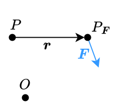

---
tags:
    - classical-mechanics
    - physics
---

# Torque

>[!DEFINITION] Definition: Torque
>
>Let $\mathcal{R}(O)$ be a [reference frame](./Reference%20Frames.md), let $P$ be a [point](TODO) and let $\boldsymbol{F}$ be a [force](./Newtonian%20Formalism.md) acting at a [point](TODO) $P_{\boldsymbol{F}}$.
>
>The **torque** of $\boldsymbol{F}$ w.r.t. $P$ is the [cross product](../../Mathematics/Algebra/Linear%20Algebra/Real%20Vectors/Cross%20Product.md) of the [vector](TODO) $\boldsymbol{r}$ from $P$ to $P_{\boldsymbol{F}}$ with $\boldsymbol{F}$:
>
>$$\boldsymbol{r} \times \boldsymbol{F}$$
>
>
>
>>[!NOTATION]
>>
>>$$\boldsymbol{\tau} \qquad \vec{\tau} \qquad \boldsymbol{M} \qquad \vec{M}$$
>>
>