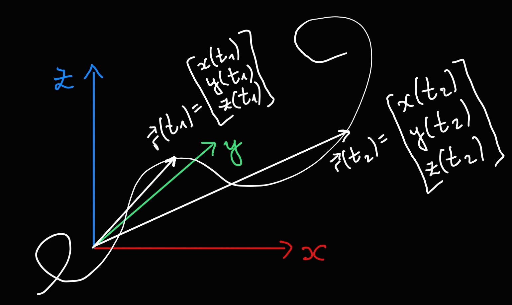

# 

>[!DEFINITION] Definition: Position
>
>The **position** of a [point mass](../../Physical%20Systems/Point%20Masses/Point%20Mass.md) at any given moment $t$ is represented by a vector $\boldsymbol{r}(t) = \begin{bmatrix}x(t) & y(t) & z(t)\end{bmatrix}^\mathsf{T}$ which points from the start of the coordinate system to the point $(x(t), y(t), z(t))$ in 3D-space.
>
>>[!DEFINITION] Definition: Path
>>
>>The **path** of a [point mass](../../Physical%20Systems/Point%20Masses/Point%20Mass.md) is the curve in $\mathbb{R}^3$ which its position draws as the [point mass](../../Physical%20Systems/Point%20Masses/Point%20Mass.md) moves through space.
>>
>>
>>
>