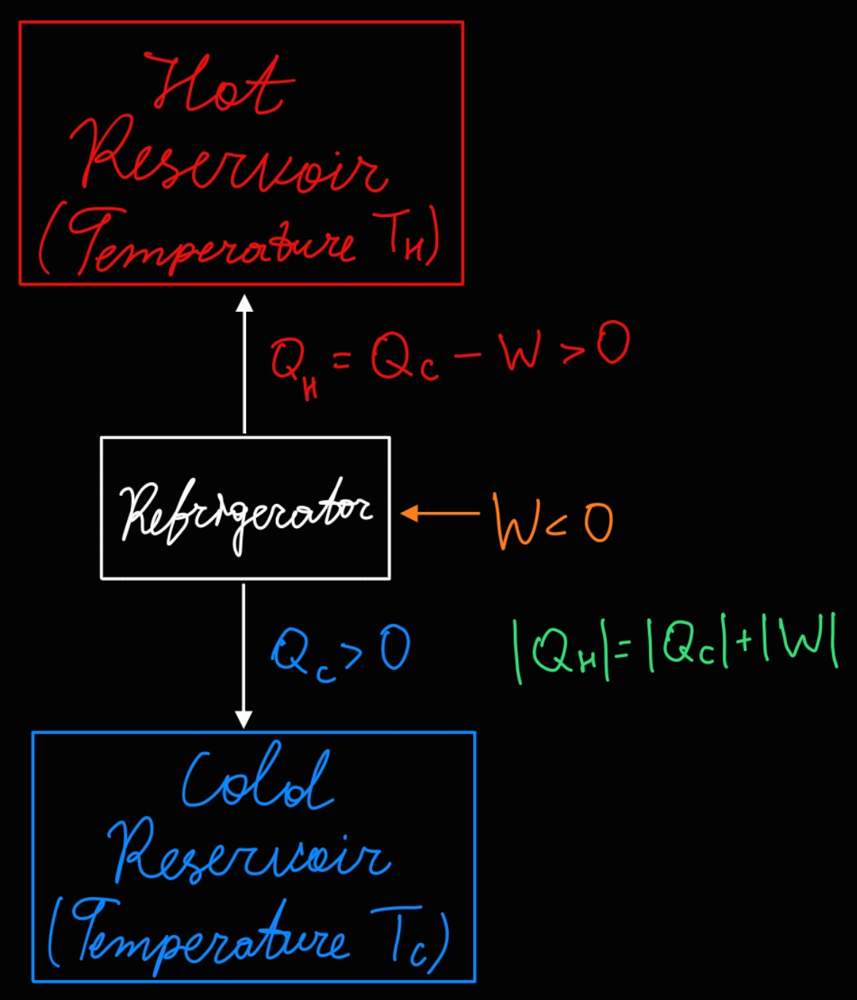

>[!DEFINITION] Definition: Refrigerator
>
>A **refrigerator** is a device which syphons [heat](../Heat.md) $Q_\text{C}$ and uses [work](../../Mechanics/Classical%20Mechanics/Newtonian%20Formalism/Energy/Work.md) $W$ in order to output more heat $Q_\text{H}$.
>
>>[!DEFINITION] Definition: Hot Reservoir
>>
>>The **hot reservoir** is the place where the heat $Q_\text{H}$ is sent to.
>>
>
>>[!DEFINITION] Definition: Cold Reservoir
>>
>>The **cold reservoir** is the place where the heat $Q_\text{C}$ comes from.
>>
>
>
>